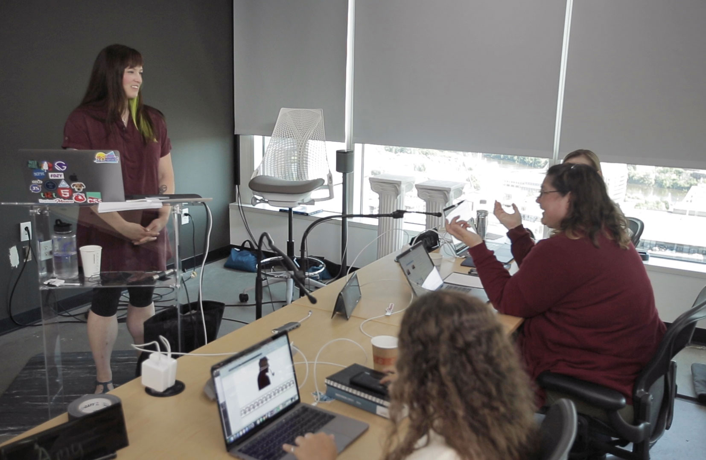

    

In July 2019, I traveled to Minneapolis to teach a workshop on [Accessibility in JavaScript Applications](https://frontendmasters.com/workshops/javascript-accessibility/), now available on the Frontend Masters website with a subscription. I wanted to show web developers how to work accessibility into modern JavaScript apps since they commonly have accessibility issues that present barriers to people with disabilities. It is also my opinion that JavaScript isn't going anywhere, so we might as well talk about how to make digital experiences built with it more accessible.

My slides are available on GitHub, along with a demo application with examples and a homepage full of resources:

- Slides: https://marcysutton.github.io/js-a11y-workshop/slides
- Demo app: https://marcysutton.github.io/js-a11y-workshop
- Repo: https://github.com/marcysutton/js-a11y-workshop

## Accessibility debugging

In the workshop, we started off with some accessibility debugging techniques including keyboard testing, color contrast debugging, using accessibility browser extensions like axe and Accessibility Insights, zoom and magnification, and screen reader testing. This part went by fast, and it felt like it could have been a whole day workshop by itself!

Accessibility debugging skills are useful no matter what kind of website or web application you're working on, so it was (hopefully) a useful introduction regardless of each student's JavaScript app experience. This section also set up the rest of the workshop material by providing techniques to test code along the way and prevent some of the technical debt typically committed when accessibility is continually deprioritized. 

> When developers take charge of basic accessibility testing in each commit or pull request, they often ship less technical debt and free up time for specialists to evaluate more complex and nuanced accessibility issues.

## Intro to accessibility in JavaScript applications

After debugging, the course went on to cover the unique parts of accessibility in modern web-apps built with JavaScript. I focused mostly on accessibility in React.js and Gatsby but I also worked very hard to include vanilla JavaScript examples for every section (quite ambitious, now that I look back on it).

In this section, we covered:

- Focus management requirements and patterns
- Announcements using ARIA Live Regions
- Semantic HTML
- Unobtrusive animation with `prefers-reduced-motion`
- Progressive Enhancement

## Automated accessibility testing

To wrap up the day, we went on a foray into automated testing of pages and units using Cypress, Jest, and Testing Library. I've taught on this subject for a few years and it's been really cool to see the tools evolve–no more struggling with test frameworks to test for accessible events! I couldn't believe how smoothly this went, it made me fall in love with automated accessibility testing even more.

Any time you're building accessibility into a web application, ensuring test coverage for custom functionality can provide a contract with your fellow developers (and even your future self) so if a code update breaks accessibility, you'll know about it. Tests asserting keyboard focus management and UI mechanics are so powerful! And with tools for various parts of the testing lifecycle, you can build in accessibility coverage for both the nitty-gritty details (unit testing) and the bigger picture (integration or end-to-end tests). 

Adding an accessibility test API like `cypress-axe` on top of your custom tests can add another layer of test coverage without a huge investment, as writing your own color contrast rules is a very steep learning curve, as I learned from experience working on the axe-core team.

It's worth pointing out that automated testing can only go so far, however; you still need to test sites manually for accessibility to ensure you're not unknowingly shipping barriers for people with disabilities. I also recommended working with organizations that specialize in accessibility user testing, such as Fable Tech Labs or Knowbility's Access Works. Someone in the room in Minneapolis mentioned a similar group in their city, which was a good reminder to check your local area for accessibility test specialists with disabilities. It's very much worth the investment and effort to make accessibility testing part of your regular process!

## A gift to the future

Writing a workshop for Frontend Masters was as big of an undertaking as I thought it would be–perhaps even more–but I'm so glad I did it based on the comments from viewers around the world. I'm a bit of a perfectionist so I coded and tested and worked late into the night on material for months to be ready for the live workshop streamed and recorded for learners across the world. I may have given up most of my summer to get this workshop off the ground but now you can all watch it and hopefully embed accessibility into your development workflow.

Since publishing this course, I've also been notified that any accessibility workshop or talk of mine qualifies for Continuing Education Credits for the IAAP accessibility certification, and this course is part of that! If my materials helped you in some way, I'd love to hear about it [on Twitter](https://twitter.com/marcysutton). What accessibility wins have you been able to achieve?

---

Previous feature: [Smashing Book 6, New Frontiers in Web Design](/smashing-book-6)