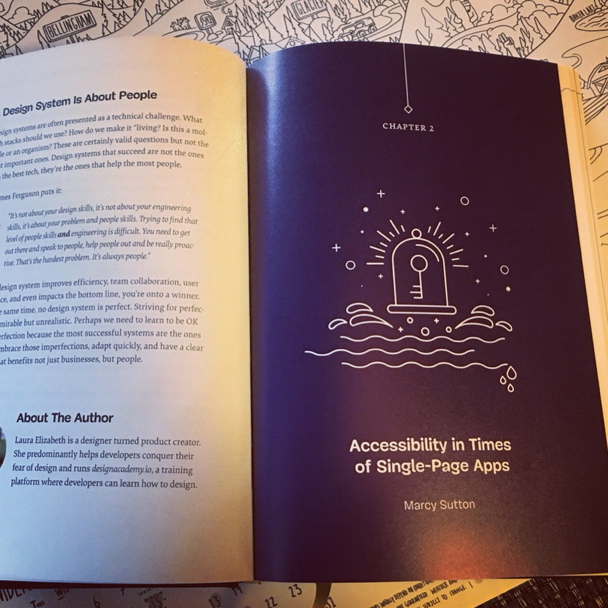

    

    

I wrote a book chapter on Accessibility in JavaScript Apps in the latest hardcover book from Smashing Magazine, <a target="_blank" rel="noopener noreferrer" href="https://www.smashingmagazine.com/2018/09/smashing-book-6-release/">New Frontiers in Web Design</a>. I'm thrilled to have been included as an author in this beautiful hardcover book! My chapter sits amongst others on modern web development topics, such as using CSS Grid, Service Workers and Progressive Web Apps, Asset Loading, Conversational UIs, and more.

In my chapter, I wrote about the specific aspects of accessibility to consider when developing a predominantly <a target="_blank" rel="noopener noreferrer" href="https://www.smashingmagazine.com/2015/05/client-rendered-accessibility/">client-rendered</a> website or application. I covered things like focus management, HTML semantics, announcements, and testing. There are a few different code examples in the chapter written in React.js, Vue, jQuery, vanilla JavaScript, HTML and CSS. But this topic is bigger than any one framework or library, so I intentionally focused on the user impact when the DOM is rendered and manipulated dynamically with JavaScript. It's worth remembering that users don't typically notice or care how a website was built; they only care if they can use it.
            
These are subjects I'm very passionate about, as accessible web applications are often critically lacking accessibility to a point where they cannot be used by people with disabilities. We can do so much better. I sincerely believe that with more information, developers can make a huge impact in our users' lives.

To read some of my tips "in a nutshell" for JavaScript app accessibility included in the chapter–plus a few more that I wish I'd published–check out my blog post on Deque.com: <a target="_blank" rel="noopener noreferrer" href="https://www.deque.com/blog/accessibility-tips-in-single-page-applications/">https://www.deque.com/blog/accessibility-tips-in-single-page-applications/</a>
            
I also wrote about this subject for Smashing Magazine a few years back, when I was working on the Angular team. The framework code might be a little dated, but the concepts still apply: <a target="_blank" rel="noopener noreferrer" href="https://www.smashingmagazine.com/2015/05/client-rendered-accessibility/">https://www.smashingmagazine.com/2015/05/client-rendered-accessibility/</a>

Accessibility is an evergreen topic that persists regardless of the JavaScript framework flavor or feature of the month. Accessibility basics matter, as do inclusive JavaScript development skills; we can serve more users by incorporating accessibility into every application and website we put out into the world, and I'm delighted to show you how.

You can purchase a hardcover copy from Smashing for $39 US, or $19 US for a digital copy. Do yourself a favor and pick up a copy today! <a target="_blank" rel="noopener noreferrer" href="https://www.smashingmagazine.com/2018/09/smashing-book-6-release/">https://www.smashingmagazine.com/2018/09/smashing-book-6-release/</a>

---

Next feature: [Frontend Masters Workshop: Accessibility in JavaScript Web Applications](/frontend-masters-javascript-accessibility)