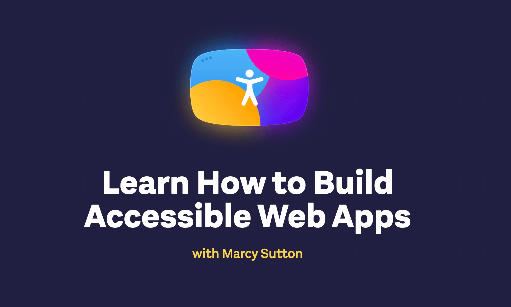

    

Coming in 2021: [TestingAccessibility.com](https://testingaccessibility.com), a series of learning resources about web accessibility for developers.

With Testing Accessibility, I'll provide you with workshops, courses, and more to improve your technical _and_ people skills around accessibility. I'm putting 12 years of experience as a web developer and educator into this project, including the few years at the beginning when I didn't know _anything_ about accessibility. We all have to start somewhere!

This project was partly inspired by Kent C. Dodds' [testingjavascript.com](https://testingjavascript.com), which included an interview with me from a few years ago. I also recorded an [accessibility course](https://egghead.io/courses/start-building-accessible-web-applications-today) for [Egghead.io](https://egghead.io), my Testing Accessibility project partners, and I've been wanting to do more ever since.

But most importantly, I see a continual need for education about accessibility among developers. Industry giants like Apple, Google, Microsoft, and Pinterest have sought out my training for accessibility, as they needed help just like everyone else.

My goal is to teach you how to use HTML, CSS, and JavaScript for good. You’ll make the digital world a better place, particularly for people with disabilities who might not be able to use your sites and apps otherwise.

Subscribe for email updates from this site's homepage or on the Testing Accessibility landing page to be notified when things drop: [https://testingaccessibility.com/](https://testingaccessibility.com/)

---

Previous feature: [Frontend Masters Workshop: Accessibility in JavaScript Web Applications](/frontend-masters-javascript-accessibility)