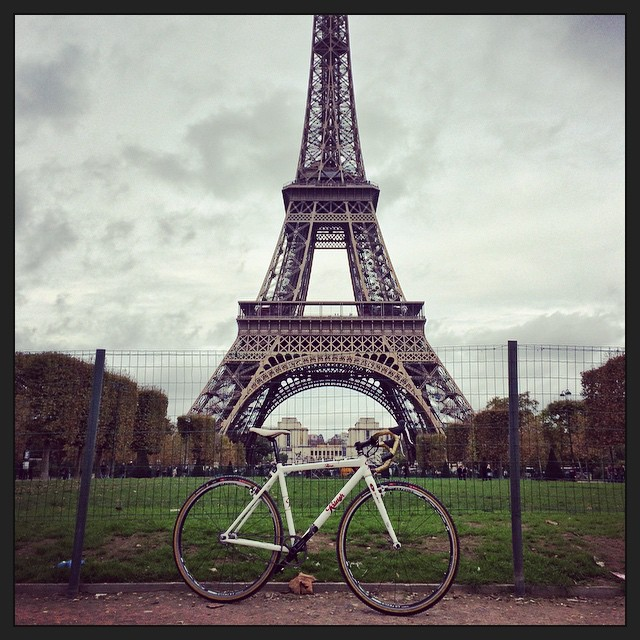
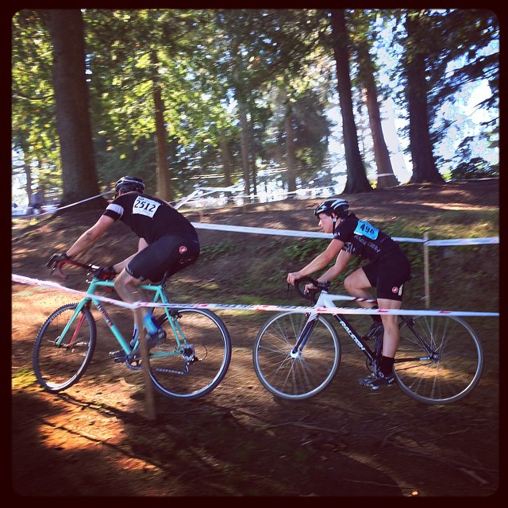
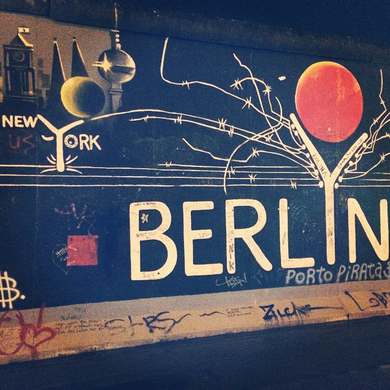
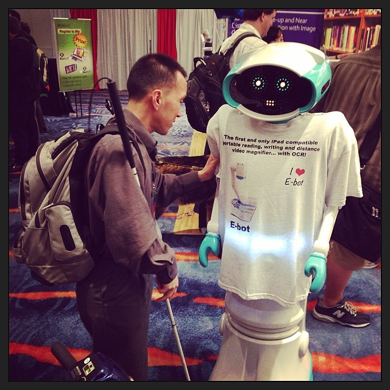
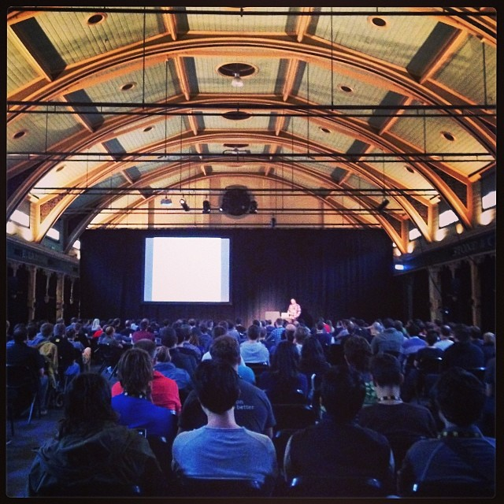
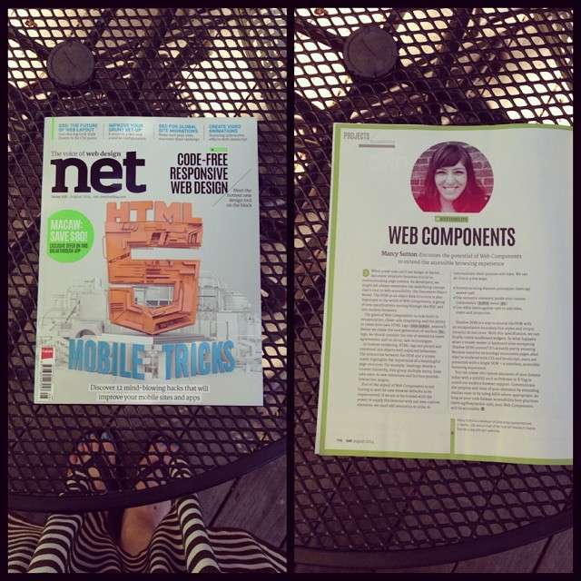
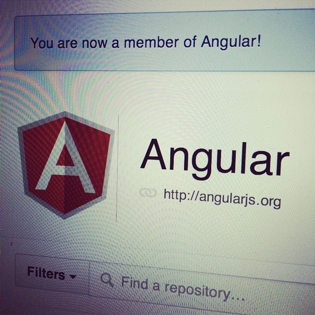
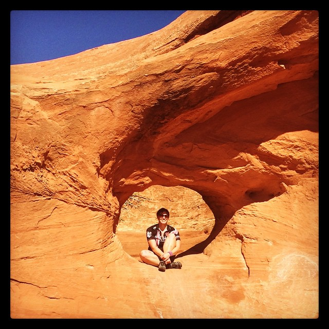
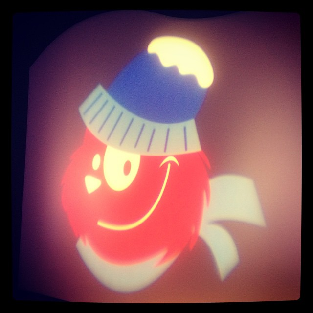

Other than my yearly [favorite music posts](http://marcysutton.com/opentape/ "Link opens in a new window"), I don't usually write anything to recap each year. But 2014 was HUGE. My career exploded in the best of ways. I started traveling internationally to speak at conferences. I became an authority on web accessibility and personally got to know many people I look up to in the industry (quite a few I talk and laugh with almost every day). To capture what an amazing year felt like, I started writing down stats and immediately, in bullet-form, saw why this year meant so much.

- Published original research on [Accessibility and the Shadow DOM](/accessibility-and-the-shadow-dom/ "Link opens in a new window")
- [Attended my first CSUN](/csun-accessibility-conference-recap/ "Link opens in a new window") and made a bunch of friends
- Saw a nutritionist and a therapist, learned about self-compassion
- Taught 5 [GDI Seattle](http://www.meetup.com/Girl-Develop-It-Seattle/ "Link opens in a new window") classes (Intro to HTML & CSS, Intro to JavaScript, Intro to Sass, Intro to jQuery, Web Accessibility)
- Flew 53,673 miles on 20 travel days
- Rebuilt [substantial.com](http://substantial.com "Link opens in a new window") in Jekyll with a small team
- Started working on [Angular Material Design](https://material.angularjs.org "Link opens in a new window") for accessibility
- Got a custom [Art Deco shoulder tattoo](http://instagram.com/p/v2Qd9myXtB/ "Link opens in a new window") inspired by nature and my love of mountain biking
- Spoke at 2 meetups and 8 conferences (4 international) and made a bunch of friends
- [Rode my bike around Paris](http://instagram.com/p/uX-nn-yXqY/ "Link opens in a new window") before flying to Louisville, KY for the [Singlespeed Cyclocross World Championships](http://sscxwc14ky.com/ "Link opens in a new window")
- Redesigned and built this website in 4 long but fun nights
- Spent much of my free time studying computer science (still in progress)

In 2015, my goals are to ride bikes more and study my "most-hated" subjects: math and computer science. Although "most-hated" isn't really an accurate phrase, because I've been in love with computers [since middle-school](http://instagram.com/p/hRieihyXor/ "Link opens in a new window"). It's more that math and new programming languages do not come easy for me. But I know that working hard to catch up on everything I missed while focusing on a career in photojournalism will help me become a more effective software engineer.  At 30 years old, stubborn me finally refuses to accept being bad at math; I'd rather devote the time to getting better at it. I'm already seeing connections between seemingly unrelated subjects, such as math and nature or binary code and braille. Which reminds me, I need a braille business card. I can't go back to [speak at CSUN](http://www.csun.edu/cod/conference/2015/sessions/index.php/public/presentations/view/172 "Link opens in a new window") looking like a newb two years in a row!

So, 2014, thanks for all the things–both good and bad. I'm grateful for life's ups and downs for keeping me energized and challenged. I feel like I'm at the bottom of a mountain looking up sometimes (maybe you feel the same way), but reflecting & appreciating all the good things in life gives you the perspective necessary to keep on charging forward every single day. I'm excited to see what the future brings, because moving forward is fun.

