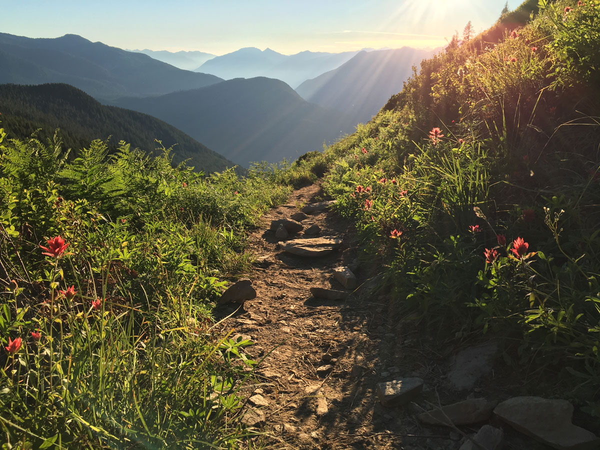
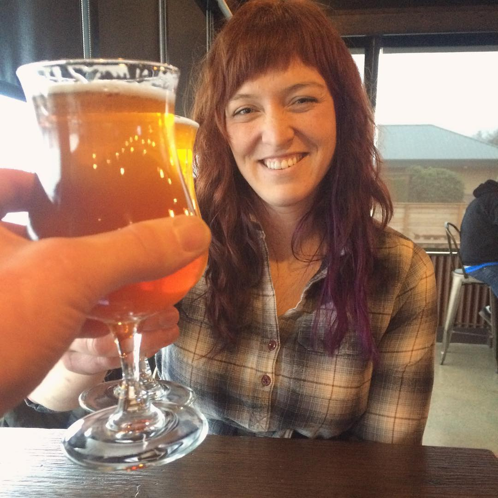
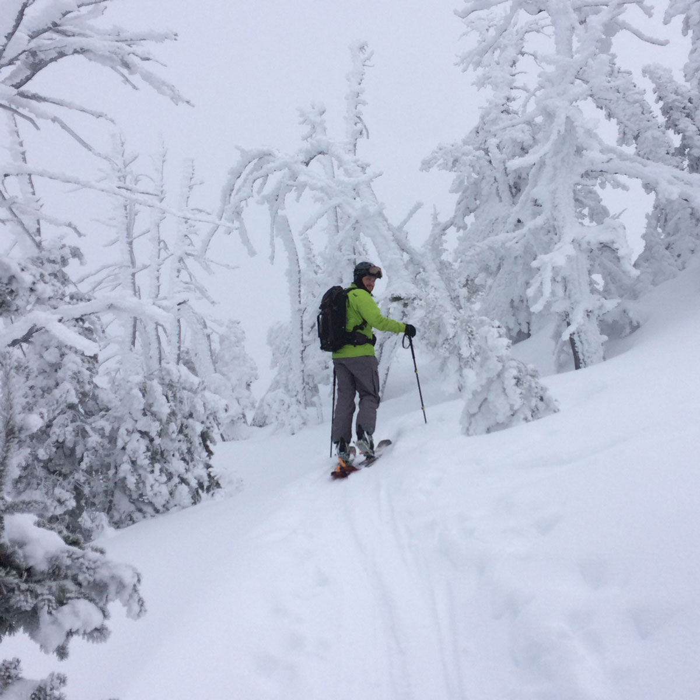
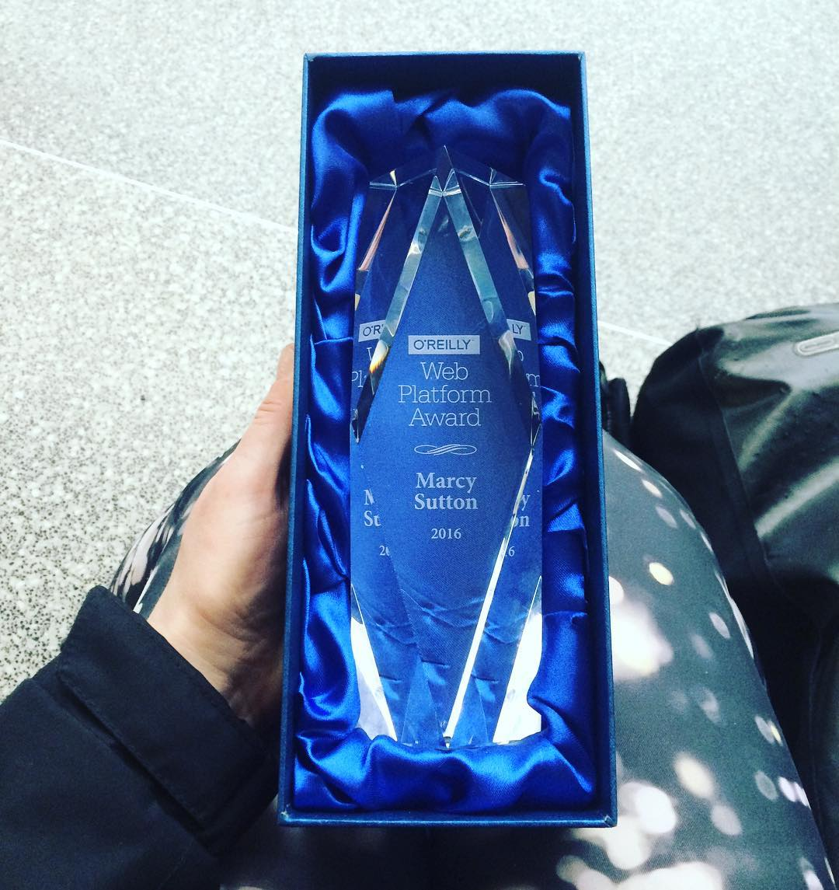
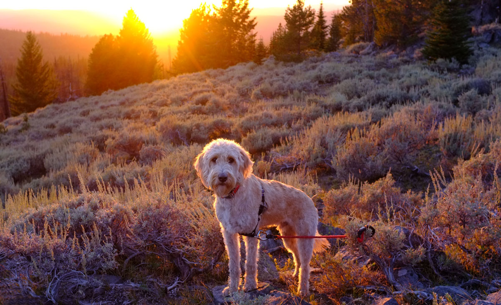
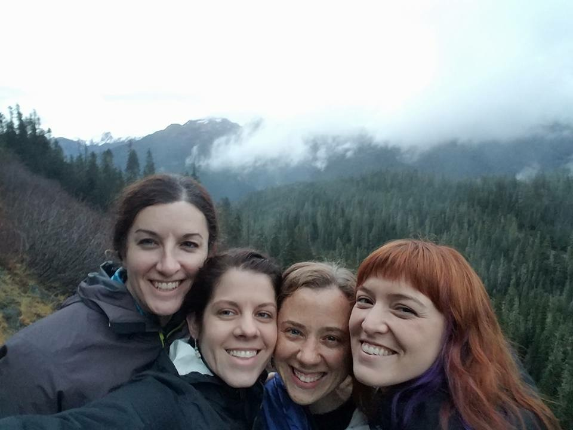

As this year winds to a close, I'm thinking back on a few significant changes I made in life in the past 12 months. I've really come to see the value in writing them down, as they might seem obvious now. But as time passes, inevitably, the details start to fade away. It also feels good to focus on the positive things and hang on to them as we face challenges in our changing world.

## What were the biggest changes in your life this year?

In early January 2016 I left my job on the Adobe Accessibility team to work on accessibility developer tools at Deque Systems (pronounced DQ–say it loud!). This was, of course, after taking some glorious winter time off with my partner in which we fell deeply in love…speaking to the importance of following your heart!

Now, typically I'd prefer to be at a job longer than 6 months–but early into it I found myself unhappy with the projects and admittedly impatient about seeing an impact. I saw "moving the needle" at Adobe with my skills and interests potentially taking years to accomplish, yet I needed positive feedback much sooner to feel like I'd done my best work. When I was offered a position at Deque working on product development and evangelism for accessibility, I jumped at the chance.

Although working on a small distributed team has its communication challenges, I'm doing exactly what I want to be doing: working on accessibility tools for other developers, writing and speaking about it. The engineering work is very challenging, which I love a lot even though I feel like an imposter sometimes. I saw a great tweet the other day from my friend Alice Boxhall that summed it up precisely:

<blockquote class="twitter-tweet" data-lang="en">
One of the key realisations I've had in my career is that you can feel like a fraud and be doing your best work at the exact same time. <a href="https://t.co/cwj7ZDf6PK">https://t.co/cwj7ZDf6PK</a>
— Alice Boxhall (@sundress) <a href="https://twitter.com/sundress/status/814260082812665856">December 29, 2016</a></blockquote>

I did 16 talks at conferences and meetups across the world in my new position as a senior front-end engineer and accessibility evangelist:

- **GemCity.js**, Dayton Ohio
- **CSUN**, a practice run for Fronteers
- **[Fronteers Spring Thing](https://marcysutton.com/talk/fronteers-accessibility-and-performance/)**–Marcus's first trip to Europe and Amsterdam!
- **Mountain View AngularJS Meetup**
- **Seattle JS**
- **[Generate](https://marcysutton.com/talk/accessibility-and-performance-generate-nyc/)**, NYC
- **Seattle U Web Developers Meetup**
- **Hillary For America**–where I showed a Presidential campaign team how to test for accessibility with aXe
- **[npm camp](https://marcysutton.com/talk/testing-for-accessibility-with-axe-npm-camp/)**, Oakland
- **[CascadiaFest](https://marcysutton.com/talk/cascadiafest-where-in-the-stack-is-carmen-sanfrancisco/)**, Washington State–where I did a talk inspired by Carmen Sandiego
- **[React Rally](https://marcysutton.com/talk/where-in-the-stack-is-carmen-sanfrancisco-react-rally-edition/)**, SLC–where we drove from Bellingham and camped in a tent on the way to and from
- **Online Accessibility Summit**
- **[WebExpo](https://marcysutton.com/talk/webexpo-2016-testing-for-accessibility-with-angular/)**, Prague–where we became friends with Harry Roberts and fell in love with Prague
- **[Angular Connect](https://marcysutton.com/talk/angular-connect-2016-testing-for-accessibility-with-angular/)**, London
- **Accessibility DC**
- **Accessibility Camp Toronto**–where I finally got to attend one of the best accessibility camps around.

I thoroughly enjoyed meeting many of you out there this year, and seeing friends I've made in the community. I really look forward to seeing what develops in 2017!

### Winning an O'Reilly Web Platform Award

If I'm ever having a bad day or I feel like I'm incapable of something, I try to think back to April 2016 when O'Reilly was kind enough to give me an award. I still can't quite believe that is a thing that happened. But there is a reminder sitting on my desk, and I [wrote about it](/oreilly-web-platform-award-omg/) to hang onto those memories. Still, wow.

### Publishing an Accessibility Course

I produced a lot less written content overall in 2016, something I'd like to change next year. But my efforts didn't escape into thin air (even if I spent more time on trails outside and away from the computer): I produced 12 video screencasts as part of an accessibility course for Egghead.io: [Start Building Accessible Web Applications Today](https://egghead.io/courses/start-building-accessible-web-applications-today). It literally took me years from receiving the screencasting equipment from Egghead in fall 2014 to get the lessons out. But they were patient and saw my potential early on, which I appreciate very much! The timeline of this came together with another big change in my life: finally getting a home and dedicated office of my own.

### Leaving the Seattle Rat Race

My partner Marcus and I like to go out to dinner sometimes and talk about our big dreams. In 2016 we talked a lot about wanting to take longer trips to go skiing, snowboarding, mountain biking and motorcycling; buying property near one of our favorite ski areas; making progress in our careers. We were living together in a house belonging to my family, which had been a safety net for me for the past 4 years as I built my career and financial independence. We frequently talked about city life not being our favorite thing, and I found myself depressed on Saturdays if I hadn't escaped to the mountains.

It was on a trip to Revelstoke, BC in March that it happened–we found our dream house online in Bellingham, WA, and the wheels started turning. What if we combined our dream of owning property near a ski area with the practicality of moving to a smaller city with commerce, breweries, nearby airports and a rad mountain bike trail system? It seemed like a no brainer: ditch the traffic and the restaurants and the tech scene and escape to our new home 20 minutes from Canada and adjacent to our beloved North Cascades mountains. I figured I could always go visit Seattle if I needed a tech or Mom fix, and fly through Bellingham or Vancouver to conferences around the world. And I'm so happy we did.

## Fostering community and relationships

One of the biggest highlights for me this year was getting a Bellingham visit from my friends Alice Boxhall, Jesse Beach and Ally Lent: the strong accessibility lady crew that I admire so much. The weather was pretty crappy but we made pie and roasted squash, ran around Lake Padden and chased the waning daylight driving up to Mt. Baker. I was so happy to spend quality time together with friends. Thanks again for visiting, ladies!

Jesse, Ally, Alice and Marcy on Highway 542 near Mt. Baker

As I've gotten older I've started to look back at friendships that I let fizzle, and found it much easier to spot new opportunities to kindle relationships. I'm proud that my heart was open enough to make a new lady friend one day on a trail at Galbraith this year (and we went skiing yesterday!), and I also connected with a few amazing ladies here in Bellingham at a women in tech luncheon. Community is so important to remain connected in remote job isolation and to gain perspective from other people. I'll miss Girl Develop It Seattle since I had to resign from chapter leadership to move up here. But I'm cooking up something in 2017 that should provide an opportunity to give back in my new community, too.

## Setting goals and making them happen

We accomplished our big goal of moving somewhere more remote in 2016 (Bellingham, WA). My partner Marcus is currently working on our next big goal for 2017: an adventure van that will take us to a lifetime of trailheads and mountain passes. I have my sights set on living our best years together, yet it feels like we're already here now. Getting a remote job and moving to be in closer proximity to recreation were the best decisions I ever could have made (sorry, Bay Area!). We'll continue to put energy into our free time passions and let that happiness flow through our lives and careers. Take time off, y'all, it's worth it.

For work goals in 2017, I want to do more writing and a few more side projects, and start Girl Develop It Bellingham. I'm excited to take energy from our personal life fulfillment to dig deep and produce some of my best work yet. So far I've booked speaking engagements in Utah, San Diego, San Francisco and Barcelona, with more to come. That is a previous life goal come to fruition–I wanted to be a public speaker and I spent the past three years building my life around it. Speaking is absolutely a thing you can do, if the idea gives you butterflies like it did for me.

Thanks for listening to me ramble, if you've read this far. :) I'd love to hear about your goals for next year! How are you balancing work and your passions? Any big things you're excited about?

_Happy new year!_
