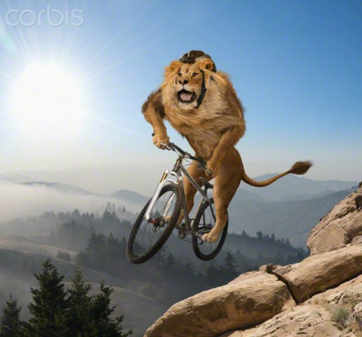
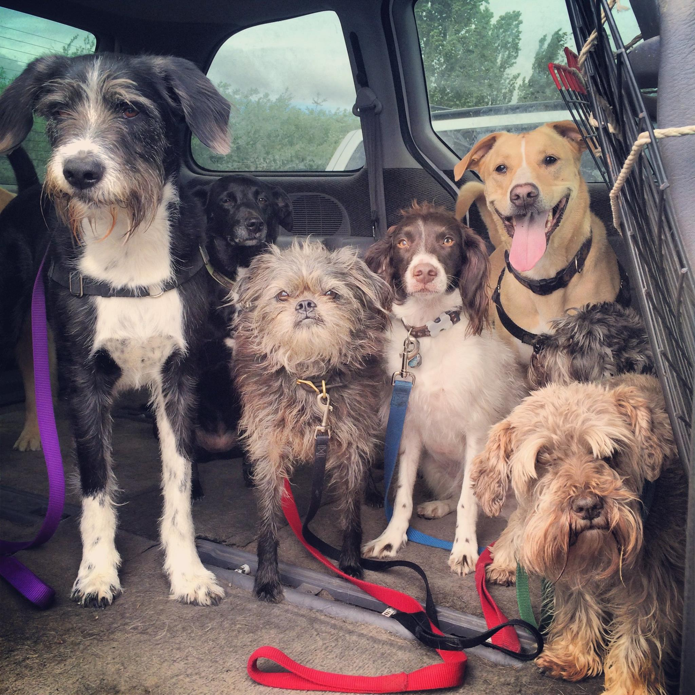

## A picture is worth a thousand words

_Originally published on The Pastry Box Project on [June 23, 2015](https://the-pastry-box-project.net/marcy-sutton/2015-June-23)._

Even with the best of intentions, when writing captions, it’s easy to forget important details for people who can’t see an image.

Some of the most successful captions I’ve read recently were by my fellow graduates of Brooks Institute of Photography, where I studied photojournalism before becoming a web developer. In the photojournalism field, you are required to gather details about any subject filling your frame: first and last name, occupation or education, and any other critical details. It’s essential reporting: a photograph without a caption would be an incomplete story.

When writing a caption, how much detail is enough for an image? Well, it depends on the image. Some images are used only as space filler, contributing nothing to an article or webpage. They could be marked up in HTML with an empty `alt` attribute and no one would miss anything, because for some reason people pay money to put terrible stock photography into prime online real estate.

How does one write a caption for a stock photo? Should you comment on why a grown lion is shredding the gnar on a mountain bike or is it irrelevant to the rest of the webpage? How does a cat shift with no thumbs?

In comparison, images can also provide important details. A tweet containing only image data could visually present a most hilarious joke or an infographic from the White House showing the current unemployment rate. Without captions, will visually impaired people be able to understand what was in the tweet? What if an image doesn't load–is there any metadata attached about what was in it? Will search engines have to rely on computer vision to caption images where humans with working eyes but out-of-practice empathy muscles didn't do it?

I will admit it takes a disciplined person to always provide detailed captions for image content. I like to think of myself as compassionate and committed to this practice, but even I mess up sometimes, or I'll selfishly tweet something vague where the important detail is in the image. I always come back to wanting to share complete information with all my friends, some of whom are blind or vision-impaired. I don't want to leave them out of jokes or visual delights.

Turns out, writing captions when the information is fresh in your mind not only benefits your friends with disabilities, it can also help you in the future by providing a written record in more detail. In your amazing travel photo, was it a good day? At what bridge did you find that important scene, and what was that local food again? Assembling more of a complete story comes easier when you do it right away, and the text can provide additional data later.

For a detailed caption, how much information is “enough”? Let’s look at a photograph I received from my dog walker, Ian, of his group on their way to the park, seen above. My dog Wally stands in the left side of the frame, surrounded by six other dogs. When I shared the photo on Facebook, I tried to write a really good caption. The thing is, an image like this one contains infinite detail: each dog is a different breed, in a certain position, making a face with their eyebrows blowing in one direction, and one is plotting to escape. Colored leashes appear in the foreground with windows in the background looking through to other vehicles and trees. Here’s the caption I wrote at the time, requiring a few edits as I noticed details I'd missed (including an entire dog):

> I can't get enough of this picture of Wally and his pals riding in the van to the park Ian sent me, titled "Class Photo". Wally is on the left with his ridiculous eyebrows, beard and scruffy tuxedo, a black lab photobombing in the back, a little brown Chewbacca dog with the cutest face and black feet (stomping in the mud?), a sweet Brittany spaniel who looks like it wants to escape, an extremely photogenic pitt/lab mix (?), and two adorable little brown terriers also with amazing eyebrows—one I almost missed. I'm happy moments like this happen.

I could easily write an essay about how much I love this photograph. But do people want to read all that? Maybe. There’s a balance between writing _enough_ information and _too much_ information. We have to strike the right balance, taking into account our readers’ time as well as ours, as writers. You could spend all day writing the wittiest caption but will the value of the photo balance out the time spent? That better be one hilarious image.

The medium in which we write also has an impact–it's impossible to jam that much detail into a tweet without relying on 3rd party services, which have their pros and cons. For the visually impaired, services like Easy Chirp fill gaps where the interfaces we use to publish media don't give us the necessary options to share information in more equal formats.

As content creators, social media butterflies and communicators on planet Earth, we are capable of describing ourselves in more than just the visual sense. Let us use our talents to describe what's in our photographs–not only will it preserve text data, it will make our jokes and shared memories more inclusive to all.
