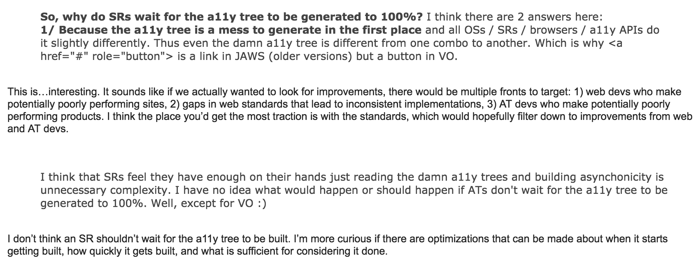
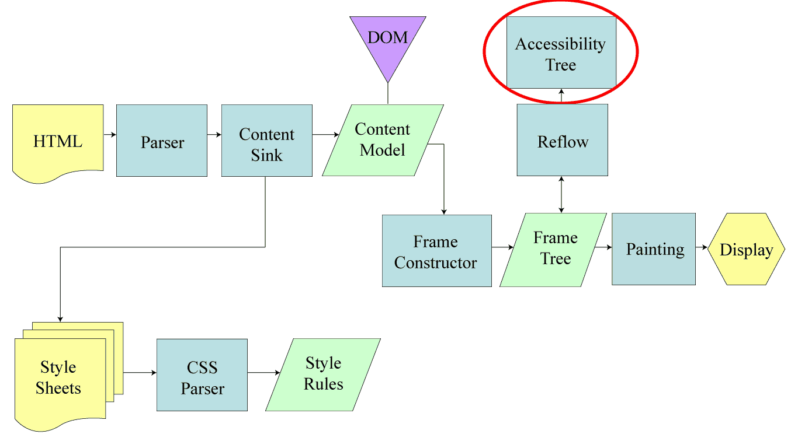
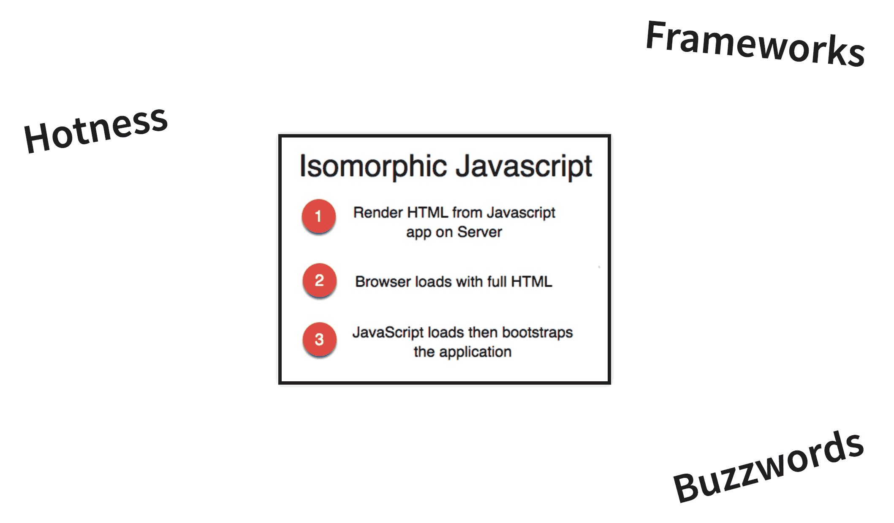
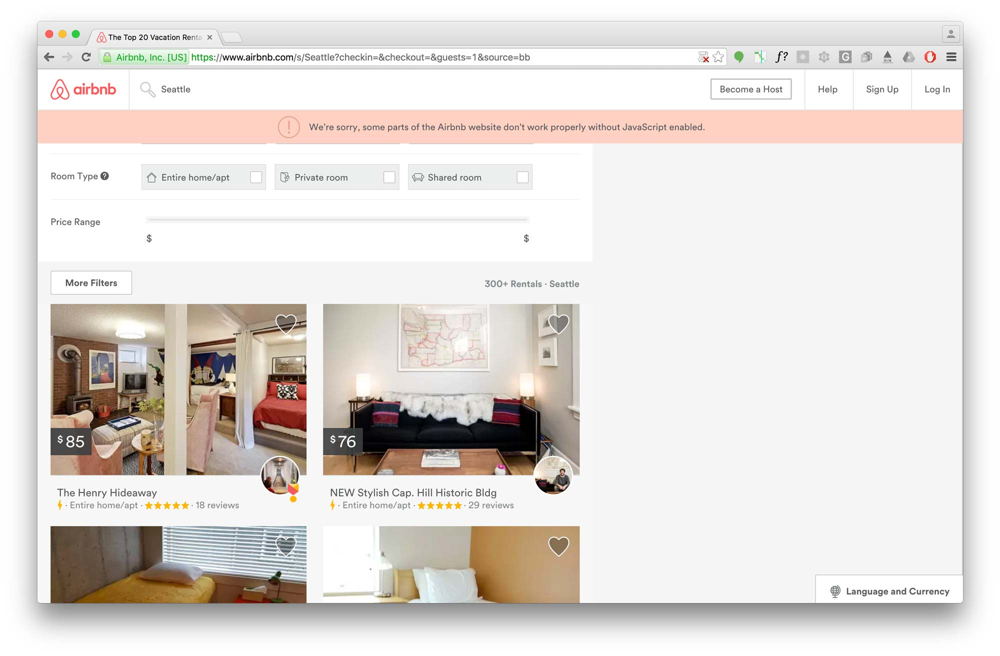

_This post represents a final distillation of my talks given on Accessibility and Performance at [Fronteers](https://marcysutton.com/talk/fronteers-accessibility-and-performance/), Seattle JS and [Generate NYC](https://marcysutton.com/talk/accessibility-and-performance-generate-nyc/) in April 2016._

<iframe width="420" height="315" src="https://www.youtube-nocookie.com/embed/EnmWUj4XKGg?rel=0&amp;showinfo=0" frameborder="0" allowfullscreen title="Accessibility and performance: CNN"></iframe>

When pages heavy with content and ads load in web browsers, such as CNN.com ([Youtube video](https://www.youtube-nocookie.com/embed/EnmWUj4XKGg)), the experience can be very clunky and unpleasant for all users; not to mention how much of their monthly allotted data is used up loading all those resources. For screen reader users, it's exacerbated: visual content streams in while an auditory progress counter struggles to reach 100% so the page can be consumed.

As someone who likes fixing user experience problems, I wondered: for all the time and energy spent improving web performance, could we do more to improve the experience for users of assistive technologies (AT) as well?

## A11y and Performance Sitting in a Tree

The underlying mechanics driving this assistive technology issue came up in an email thread over a year ago amongst some accessibility/web professionals, kind enough to loop me in: George Zamfir, David Newton, Monika Piotrowicz, Henri Helvetica, Alice Boxhall and Tim Kadlec. A really great conversation went around regarding how the accessibility tree works, where the performance slowdowns are in regards to accessibility, and what could be done about it.

After nearly a year had gone by I kept thinking about the thread, which was filled with interesting accessibility questions and answers from some very thoughtful folks. I asked if anyone had given a technical talk on it so I wouldn't steal anyone's thunder. It turns out they hadn't, so I researched the topic further. What follows is my attempt to add accessibility to the #webperf conversation dominating the mainstream conference circuit.

## Known User Impacts

Two things I noted right away were **sluggish interactivity for keyboard users** and the **screen reader loading progress** issue mentioned above. Delayed user input because the browser is struggling to download and execute a ton of scripts, styles and resources doesn't just pose an annoyance: users could give up on using your website entirely and never come back!

I felt validated that this was a problem when I read [Maybe We Could Tone Down the JavaScript](https://eev.ee/blog/2016/03/06/maybe-we-could-tone-down-the-javascript/) by Eevee, an article that didn't gain me a whole lot of fans in the official Angular Slack channel. In the post, Eevee talks about how bad her experience was with slow-loading interfaces across the web. My takeaway from this: not everyone has a lightning fast connection and a brand new browsing device, and the problems she wrote about were not unique to her. Too often we rely on JavaScript and ARIA to be responsible for creating the entire state of the world when default HTML tags we get would work a lot better (hello, `<select>` element). I will come back to this idea with regards to ARIA a little later on.

A keyboard and a screen reader are very closely linked: generally you can't operate a screen reader without a keyboard (I will leave touch devices out of this conversation for now). Therefore, any of the things that impact a dedicated keyboard user will most likely affect a screen reader user, as well: sluggish usability, delayed input, focus being dropped as the page is upgraded with JavaScript. However, there is something unique about the experience for a screen reader user: the fact that accessibility information is derived not only from the Document Object Model but also the [Accessibility Tree](https://www.paciellogroup.com/blog/2015/01/the-browser-accessibility-tree/), a parallel structure to the DOM kept up-to-date with accessibility information for a given HTML page.

### What impacts the accessibility tree?

I talked with [Marco Zehe](https://www.marcozehe.de) from Mozilla about this subject, and he told me some very interesting things about accessibility in browsers. The tree created from the DOM (and sometimes CSS) changes a lot. When the tree changes, the browser sends events to assistive technology saying a portion of the tree has changed or updated. Making a change to the DOM with JavaScript that causes a [reflow or layout](http://www.html5rocks.com/en/tutorials/internals/howbrowserswork/ "How Browsers Work") (Gecko and Blink terms for the same thing, respectively) will most likely create or recreate an accessible object for it. ARIA state changes don't recreate objects, but they do send events. Many events are combined together to reduce performance impact: see [Event Coalescing](https://wiki.mozilla.org/Accessibility/EventCoalescing).

The takeaway is to avoid expensive operations where the browser has to recalculate how to position and display objects in a webpage, such as `display: none;`, `window.getComputedStyle()` and `elem.scrollTop`, to name a few. (A longer list can be found in this [handy gist from Paul Irish](https://gist.github.com/paulirish/5d52fb081b3570c81e3a).) For accessibility as well as performance, you should limit costly lookups and operations all the time, but especially when a page is loading.

A note on performance metrics: there currently isn't any method for measuring performance of the Accessibility Tree (as far as I know; [here are some ideas from Paul Irish](https://twitter.com/paul_irish/status/731682736843280384)). Many people have [privacy concerns surrounding accessibility tracking](https://www.marcozehe.de/2014/02/27/why-screen-reader-detection-on-the-web-is-a-bad-thing/), which impacts any conversation on the topic. You could look at the [Navigation Timing API](https://developer.mozilla.org/en-US/docs/Web/API/Navigation_timing_API) and check when the DOM is interactive and ready, but that only covers the DOM. I would love to see something like "Accessibility Tree Ready" in the Navigation Timing API but gaining consensus would be a challenge. I'm also not sure how practical it would be…but as [web performance fundamentals](https://developers.google.com/web/fundamentals/performance/critical-rendering-path/measure-crp?hl=en) love to say "you can't optimize what you can't measure", it would provide us with something interesting!

## Optimizations

Originally at Fronteers I made 3 recommendations for front-end developers to optimize for accessibility and performance; things I learned after [working on Angular Material](https://marcysutton.com/what-ive-learned-working-on-a-large-open-source-framework/) and years of building websites and web applications:

- Use the browser default HTML elements and CSS wherever possible.
- Include default ARIA and tabindex values in HTML rendered from the server.
- Prioritize accessible actions in the [critical rendering path](https://developers.google.com/web/fundamentals/performance/critical-rendering-path/?hl=en).

These were well received except for number 2: for the reasons of [progressive enhancement](https://www.w3.org/wiki/Graceful_degradation_versus_progressive_enhancement) and [ARIA rule #1](https://www.w3.org/TR/aria-in-html/#first-rule-of-aria-use), serving `<md-checkbox role="checkbox" tabindex="0" aria-checked="false"></md-checkbox>` gave some people the willies. Although this sample was taken directly from Angular Material, it highlighted two conflicts:

- Use default HTML elements first before using ARIA (contradicting one of my optimizations).
- A span element with these attributes but no JavaScript to support it would be unusable.

Although it was tough to hear that day, I was really grateful to get feedback from [Mallory](https://twitter.com/stommepoes/status/715843693870260224) about NOT setting ARIA defaults in HTML in case JS doesn't load: **eliminating optimization #2**. I had even done a practice run of the talk before and no one mentioned it, however this kind of feedback is very important to listen to. Progressive enhancement, accessibility and web performance are very closely related: they are all about serving the best possible experience to the widest range of people, who sometimes don't have the latest technology or fastest connection.

## Universal/Isomorphic JavaScript

Being a member of the Angular team for a while meant I was often confronted with an elephant in the room: what if something goes wrong with JS when your entire application depends on it? (see `<md-checkbox>` above.) Without client-side JavaScript to load content and bootstrap the UI, users would face a blank screen. When I heard about Universal JavaScript apps (a.k.a. isomorphic JavaScript), despite the "framework hotness", I saw real value for accessibility and performance together. With this technique, a JavaScript app is rendered as a complete HTML payload from the server using Node.js, which is then upgraded as client resources download and execute. All of a sudden your Angular app could be usable a lot sooner, even without browser JS. Bells started going off in my head: _"this could help accessible user experience, too!"_

Now, I never thought I'd be in the [Sigh, JavaScript](http://sighjavascript.tumblr.com/) camp, but here we are. I started paying more attention to core functions of websites since the [Air Carrier Access Act](http://www.deque.com/air-carrier-access-act-update/) came about–requiring core functions of airline websites to be accessible–and similarly hoping sites would rely less on JavaScript to deliver EVERYTHING, such as Twitter's tweet detail page or Tumblr's JavaScript-heavy sign-in modal.

_A modal-related tangent: I want to see more default elements such as the native `<dialog>`, a customizable `<select>` or even a tablist in all the major browsers. This would put less of a burden on developers to always reinvent–for example using JavaScript to create custom elements–and help us execute fast, accessible and beautiful web designs using powerful default elements._

As pioneers of isomorphic JavaScript (for which I will always remember hacking on slides during lunch alongside Spike Brehm at [JSConf 2014](https://www.youtube-nocookie.com/embed/CH6icJbLhlI)), [Airbnb](http://airbnb.com) does good by enabling search as a core function without JavaScript. If JS fails to load, as a user you can still do the most important thing on their site: search for places to rest your weary head. With JS, the full experience is enhanced and you can use the full site. We could argue Airbnb should still do more for non-JS users, but it's better than nothing at all. Every feature has tradeoffs.

One promising thing I discovered in researching Universal apps is the [Preboot module by Jeff Whelpley](https://github.com/jeffwhelpley/preboot). Although I had some difficulty keeping up with the many revisions before ng-conf, the promise of Preboot with Angular Universal is that it can track user input before a JavaScript app is fully initialized, replaying anything they typed and keeping track of their focus point in case they tabbed into the page before it fully loaded. I'm excited to see more happen with this module and I hope to see it in other universal app solutions for Ember or React. It is supposed to work with frameworks other than Angular 2, after all. (Just not Angular 1.)

## Conclusion

Building websites and web applications involves a huge number of tradeoffs, sometimes viciously at odds with each other due to limited time and resources, as well as browser capabilities. For example: "do we establish a sophisticated online brand or promote accessible user interfaces?" "Do we take on the responsibility of building and maintaining core backend services to support no-JavaScript users or make it work better on mobile?" These are tough decisions to make with competing priorities throughout UX, design and development–before you even factor in requirements from business executives.

For performance, you will have to compromise how many default HTML widgets you reinvent and restyle, how many assets you load and when, or how much you depend on a JavaScript framework. Each of these concerns can add a significant burden to your users. Try to limit how much you send over the wire, since that cost is very real for each person who visits your site.

Don't forget that people rely on keyboards and assistive technologies to interact with the Web. They need [basic accessibility support](https://marcysutton.com/how-i-audit-a-website-for-accessibility/) before you even get to performance tuning. So if you haven't done that yet, start there!
