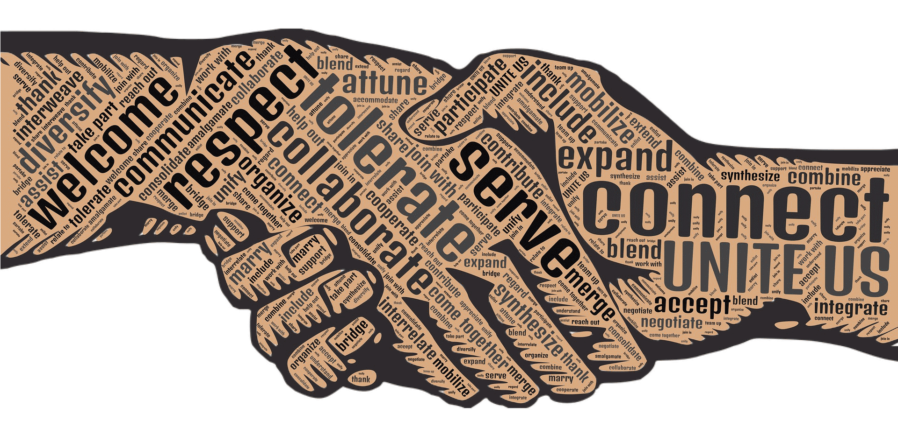

On Martin Luther King, Jr. Day this year, amidst a giant shift in U.S. politics and societal norms, I want to take a moment to discuss accessibility as a civil right, something I learned from disability rights attorney [Lainey Feingold](http://www.lflegal.com/ "Link opens in a new window"). Starting with inspiration from [The King Center](http://www.thekingcenter.org/meaning-king-holiday "Link opens in a new window"):

> Every King Holiday has been a national “teach-in” on the values of nonviolence, including unconditional love, tolerance, forgiveness and reconciliation, which are so desperately-needed to unify America. It is a day of intensive education and training in Martin’s philosophy and methods of nonviolent social change and conflict-reconciliation. The Holiday provides a unique opportunity to teach young people to fight evil, not people, to get in the habit of asking themselves, “what is the most loving way I can resolve this conflict?”

Let's be real: despite 8 years of inclusive U.S. leadership under Barack Obama, upon Inauguration Day 2017, it feels now as if we have gone backwards as a species. It's an ugly scene out there for many groups of people in our current political climate. However, we have Dr. King to thank for giving us enduring inspiration for moving forward in spite of the ugliness and evil in the world.

While most widely remembered for his efforts toward racial equality and economic justice, Dr. King pushed forward the values of unconditional love and tolerance for all people. He was also an advocate of performing service for others. We can take in this philosophy of acceptance and give empathy back to the world in many ways.

Take accessibility, for example: the design and development of inclusive spaces for all people, but especially those with disabilities. Many of our fellow humans are locked out of digital and real-life experiences due to barriers they cannot overcome. If you are a web designer or developer concerned about making a difference and putting your values to work, you have an opportunity to remove barriers to access and provide people with more independence.

You can support diverse people–including people with disabilities–by hiring diverse teams. Incorporate their [user stories](http://searchsoftwarequality.techtarget.com/definition/user-story "Link opens in a new window") in your work. Apply inclusive values on the Web by improving visual contrast, building in support for keyboards and screen readers, providing captions and media transcripts, simplifying language and localizing content. Making accessibility improvements to further our users' civil rights can improve the Web for people of all abilities, across the world, by removing barriers and providing features everyone can use.

I'm proud to work for [Deque Systems](http://www.deque.com/ "Link opens in a new window"), a company whose mission is, simply, _digital equality_. There are other great companies pushing accessibility forward, too. Knowing there are other humans out there standing up for diversity and inclusion gives me comfort at a difficult time. I refuse to accept the "forget you, I got mine" culture going around, and I encourage you to do the same. By applying values of love and acceptance at work and in life every single day, we can make a difference.

_Thank you to Brian Kardell for input on this post._
