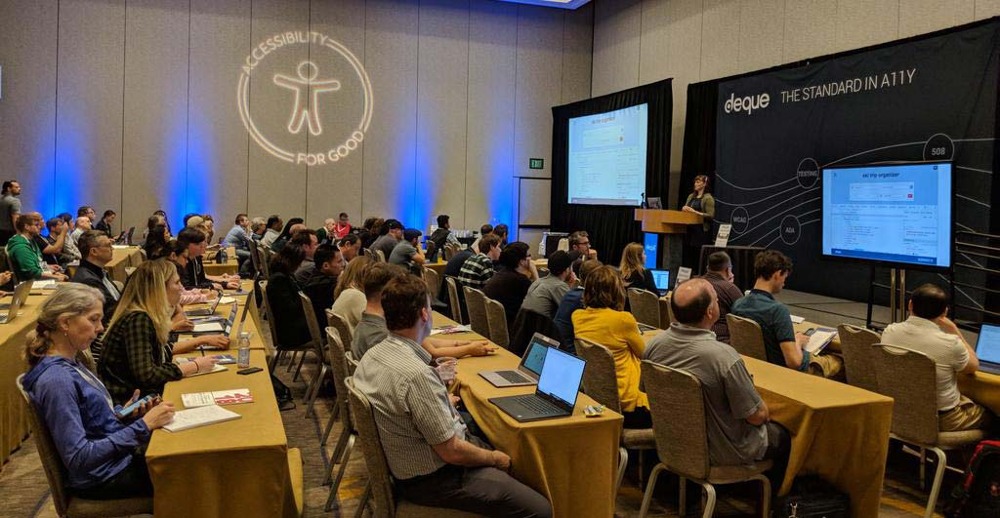

_Updated November 25, 2022_

In the field of web development, having accessibility expertise can set you apart from other candidates. I see a lot of questions about jobs from people with a passion for accessibility and inclusive design, so I wrote this blog post to share insights I’ve formed over 11 years of working in the digital accessibility community (13 years as a full-time web developer in total).

In contrast to my last post on making an impact as an independent [“accessibility outsider”](/outsider-leverage-accessibility/), this one is about working full-time in a job with digital accessibility tasks in some fashion. You have some decisions to make about the type of company you work for and the type of role. My aim is to help you ask the right questions and set up your career for success.

_Note: a talk of mine for A11yNYC covered some of these career development aspects, you can catch the replay including Q&A on YouTube: https://www.youtube.com/watch?v=ExNPlxmuwBE_

## Deciding on a company

To work on digital accessibility full-time, you have quite a few options when it comes to deciding on a company. This post is focused on comparing accessibility-specific companies to mainstream companies, since that’s where my experience has been–but there are also accessibility opportunities in governmental organizations, higher-education, and nonprofits to consider.

You could work on accessibility at a startup, a small, medium, or large-sized company. Enterprises tend to have enterprise-level concerns, where you’d work to move a big ship through lots of potential red tape but also have a gigantic accessibility impact. At a startup it might be easier to move fast and (hopefully not) break things, but you’ll have less of the necessary checks and balances for long term quality. Your experience and ability to make a lasting impact will vary.

Picking which type of company is right for you will be a deeply personal decision based on the opportunity, your experience, career direction, personality, and network connections. It could also really depend on who’s hiring when you're looking for a job. Do you want to work with a range of clients as a subject matter expert, or on a product full time? Do you want to work on the front-end for a product that the general public will use, or accessibility tools for industry professionals?

What is the team, organization, and work culture like? Are there power dynamics at play which can impact your ability to advocate for access and product quality?

### Upsides and downsides of accessibility companies

Accessibility-specific companies like Deque Systems, TPGi, and Level Access are focused for the most part on selling accessibility services and testing products. A really great part of working at an accessibility company is you can learn a lot from industry leaders through internal discussions about accessibility matters like understanding and applying WCAG, global legal ramifications, and techniques for auditing and remediating accessibility issues. You can also gain valuable accessibility network connections for the future. You’ll very often find alignment about accessibility’s importance at the company, so you’ll spend less time trying to convince colleagues to do the right thing.

Accessibility companies are a small world. Many of us have worked with each other and seen folks switch from one company to another for various reasons. There are  success stories and a wide range of opportunities from UX/Design to Software Engineering, Management, and QA. Some folks work on web, mobile, and accessibility standards. However, there are also less glowing company reviews.

Despite the upside of an accessibility-aligned workplace, these companies can have potential downsides causing employees to compromise other values: diversity, psychological safety, the ability to make contributions without hearing “stay in your lane”. Toxic leadership can drive good people out of any type of company, sure. But it’s better to know the full picture when forming your impression of a “do good” working environment.

My advice is to interview people who work there currently and have worked there in the past to know what the culture is like. See some bonus questions at the end of this post for techniques on sniffing out problems in the interview stage.

### Making an impact on accessibility at “mainstream” companies

My working definition of a mainstream company is one whose mission does not specifically include accessibility. It could land anywhere on the spectrum of “we don‘t do anything for accessibility” to “we’re pretty proactive about it”, as a whole or in small pockets.

If you have the right support system and culture, working at a mainstream company can be a big accessibility opportunity. You could work on sites, frameworks, and products that impact thousands of users with disabilities. You could contribute to a product’s accessibility over time and potentially* take ownership of the results: great experience to put on your resumé. You might also have higher pay and better benefits. Perhaps these things could become leverage in negotiations with an accessibility company should you have two competing offers.

Some mainstream companies may already have accessibility specialists or teams, and hopefully those specialists aren‘t [volunteers like Twitter up until two years ago](https://www.theverge.com/2020/6/18/21296032/twitter-audio-tweets-accessibility-volunteers). Without company alignment or accountability for accessibility you might find yourself fighting hard and encountering a lot of friction and red tape to do the right thing for users. (Like Twitter currently, whose accessibility team was [let go under problematic new ownership](https://time.com/6230469/disability-users-twitter-elon-musk/).) It‘s frustrating as a champion to see products and sites launched or maintained without accessibility. It harms people with disabilities, first and foremost. But it can also lower your trust in a company and a lack of agency can contribute to burnout over time.

In mainstream companies you might encounter more friction when trying to make something accessible. There may be reluctance to enable accessibility lint rules because they're misunderstood, or choices made in frontend architecture that disregard the latest user feedback even with concerns brought to their attention. You might be brushed off when pushing for accessibility to be included in a _definition of done_ or have to wait for the next sprint. This is a painful way to work when you see design and technical debt piling up among your peers.

Accessibility efforts at mainstream companies can definitely work, though. There are many potential allies across the company you could befriend to foster an accessibility culture. Create an accessibility guild and have recurring hangouts. Push for accessibility in onboarding, product development, documentation, and training. Nudge HR, Operations, and Legal teams to procure and build accessible software products for an inclusive workplace. As a lone expert you may miss out on meaningful peer review of your accessibility work, so this building up of an inclusive culture could alleviate that over time as institutional expertise grows.

*On potentially taking ownership of results: this will really depend on your role. Is accessibility part of your official job duties or something you’re doing on the side? Be careful not to get stuck in a position where your efforts go unappreciated or reflected in performance reviews, as that can be a dead end or path to bad times.

## Deciding on an accessibility role

You can bring passion and expertise for accessibility to any role, and in fact we need it represented across the industry to truly move the needle for people with disabilities.

### Accessibility client-service roles

Common roles in full-time digital accessibility include Accessibility Specialists / Subject Matter Experts (SMEs) who audit and remediate websites and applications through service agreements. These folks are the bread and butter of accessibility companies as they pull in a bunch of revenue from clients. Automated tools only wish they could be as nuanced and accurate as these compassionate human computers are.

I personally never opted for an accessibility SME role even though I had the deep technical and design knowledge required because I don’t particularly enjoy the process of auditing and filling out spreadsheets or JIRA. I’ve also heard SME friends say they’ve felt their development skills atrophy, so for anyone wanting to stay technical you should ask about specific job duties in an interview. How much of a role is research vs. development will vary, but accessibility specialists are usually not coders full-time. It really helps to be a technical SME though, as you can make more informed recommendations and prototypes with working code to keep your skills sharp and provide customer value.

As a SME at an accessibility company you may get to work with big-name, mainstream clients and therefore have an opportunity to make an impact on the lives of thousands of people with disabilities. But you might also have less ownership over a project, and feel like you have less to show for your experience in the end–especially if you’ve had to sign an NDA or something and are unable to share your work in a portfolio.

### Accessibility product and advocacy roles

There are also roles dedicated to the creation of accessibility products including public speaking and advocacy. In my experience as an accessibility evangelist and engineer, niche companies and accessibility testing products [don't typically have the same reach as the mainstream](/encouraging-contributions-with-docs). Look at GitHub stars for industry tools: accessibility tooling has a fraction of the popularity as mainstream tools unless bundled with something else (like eslint-plugin-jsx-a11y). It’s also a crowded market with new accessibility tools popping up all the time, often for free. To stay competitive, it’s important to have supportive leadership that enables experiments from anyone at the company with an idea, as well as acting on user feedback in a timely manner.

## Accessibility and persuasion

Whether you’re at a mainstream company or an accessibility company with mainstream clients, not everyone will understand or appreciate the need for accessibility so you’ll have to persuade them of its importance and feasibility with risk assessments and estimates. Occasionally you’ll want to “stay late and do the work anyway” to actually make an impact, and hopefully you’ll be rewarded for it–but you might not.

Some techniques I’ve found that can work for being persuasive are highlighting quick wins, coming to the table with suggestions and estimates for how to fix within a reasonable scope, and adjusting your approach for specific personalities and roles (are they more inclined to care about risk/legal management or technical debt and cost?). You can experiment with “the carrot vs. the stick”: using kindness when it works and making friends with the legal/compliance team for when that isn’t cutting it.

Use feedback to your advantage: surface accessibility issues to PMs and leadership as leverage to get time to work on it. Celebrate wins by collecting positive feedback as confirmation that accessibility is worth it, especially from users with disabilities. Find ways to get user feedback if it doesn’t already exist. Add an [accessibility statement](https://www.w3.org/WAI/planning/statements/) to request feedback, get leadership invested and involved.

## Setting yourself up for success

If you’re considering a new role in accessibility–no matter the type of company–it would be very worthwhile to interview people who work there currently and have worked there in the past to uncover things like:

*   How does the company make their money, and does accessibility factor into that?
*   What’s the best part about working there?
*   What’s the worst part about working there?
*   What does a day in the life of someone in this role look like?
*   How is disability representation, diversity, and inclusion at the company?
*   How competitive are the pay and benefits?
*   For product development, what’s the tech stack like?
*   How are product decisions made; who has the final say?
*   What kind of friction do people encounter in their jobs?

Marketing yourself as an accessibility specialist can open doors to opportunities all across the tech industry. Identify what’s important to you in terms of values, so you can ask about those things in interviews. To showcase your work, highlight examples of problems you’ve enjoyed solving (including side projects), and what skills you contributed that you could bring to your next team. What do you want to do more of? What kind of work would help you shine as an accessibility specialist, and what have you done so far that can make someone confident in hiring you?
