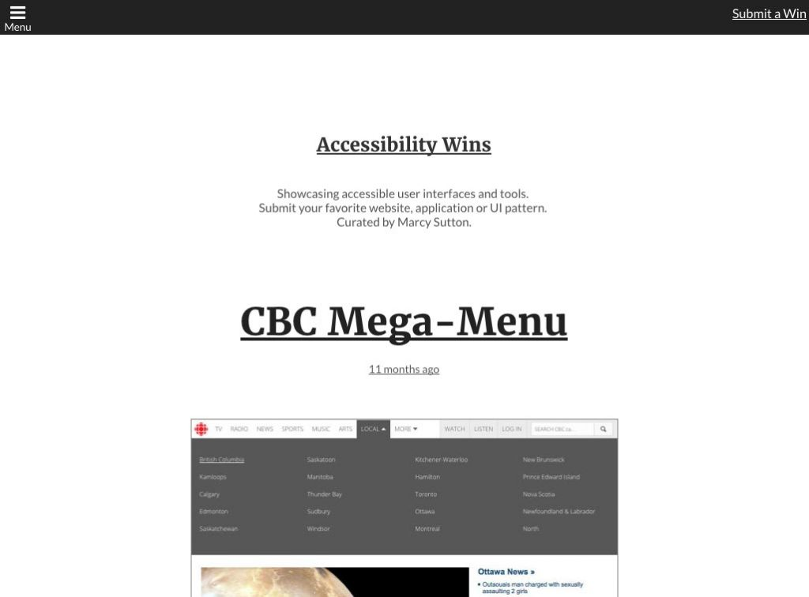

In 2015, I started writing for [The Pastry Box Project](https://the-pastry-box-project.net/ "Link opens in a new window"), a platform for web creators that gives you a bunch of random publish dates and the freedom to write about whatever you want. I jotted down ideas to make writing in the coming months easier, so I wouldn't have it looming over me. A few of those ideas were:

- _Ways we could help people with the Web (dream big)_
- _How can we get more people to care about accessibility?_
- _Being patient vs. being loud_
- _Riding a bike to an accessibility conference_

That last one I decided to [write first](/riding-a-bicycle-to-an-accessibility-conference/), since it was about the upcoming CSUN conference. My next publish date wasn't until April 26, but it was really comforting knowing that I had other ideas written down.

When it came time to start writing my second Pastry Box post, I looked through my list and decided to go with _Being patient vs. being loud_. It just seemed like something I could write about in that moment. So, I started writing down bullet points, my typical writing process. My first few bullet points looked like this:

- _Tension between pointing out accessibility failures and waiting for things to get fixed_
- _I really wish there were more accessibility wins to showcase. Less Debbie Downer, more Happy Hippo?_
- _Maybe I’ll just start a Tumblr. But people will need to send me stuff!_

I stopped writing and went over to Tumblr, thinking, _this could be a cool experiment._ I decided to [create a blog](https://a11ywins.tumblr.com/ "Link opens in a new window") showcasing good accessibility. I had quite a few examples to start, but I also reached out to my network on Twitter and got some responses, most of which were about native mobile applications.

Admittedly, native app toolkits make it easier to get accessibility right, so that's why those apps are used more frequently by people with disabilities ([related article by Marco Zehe](https://www.marcozehe.de/2012/12/10/why-do-native-mobile-apps-seem-to-win-all-the-time/ "Link opens in a new window")). But I knew the audience was going to be Web people, so I wanted the blog to showcase Web stuff. I wanted to encourage building accessibility into the Web because projects built for it can be made to last, working across multiple platforms. Mobile web accessibility might be hard right now, but I want us to make it better.

I hacked at a Tumblr theme for a day or two to make more it accessible by adjusting the heading structure, adding labels to icon buttons, adding link text underlines and focus styles. I posted a few things, focusing on a positive point of view. When I was ready (and I replaced my laptop that went down thanks to a clumsy cup of water), I [let Twitter know](https://twitter.com/marcysutton/status/582418630844891137 "Link opens in a new window") about the blog, [_Accessibility Wins_](https://a11ywins.tumblr.com "Link opens in a new window").

Within an hour, it started taking off. People were _really_ clamoring for accessibility examples with a positive spin. Some very nice people said nice things, including:

- “Now that’s using Tumblr for good.”
- “Accessibility, the missing showcase.”
- “We don’t celebrate the good stuff enough. This rocks.”
- “Please tell me again that you have to choose between an awesome UI and Accessibility.”
- “Digging a11ywins and its positive point of view. Drawing attention to well-built, accessible interfaces.”
- “Finally and much-needed.”
- “Accessibility Wins is a goldmine!

Taking a cue from [WTFMobileWeb](http://wtfmobileweb.com/ "Link opens in a new window") by Brad Frost, I created a page for you to submit wins in web accessibility–stuff you've seen or worked on yourself. I've gotten a few, but I [always need more](https://a11ywins.tumblr.com/submit "Link opens in a new window")–good accessibility is hard to find. I am especially looking for mobile responsive web examples, which is even more challenging. I have faith we can find them (or make them!).

In a very short week, Accessibility Wins gained 850 followers on Tumblr, mentions in Smashing Magazine, CSS Tricks and SidebarIO, and so many tweets I need an analytics service to count them all (thank you!). I've never launched that successful of a project, and it's all thanks to you for reading and sharing it.

Accessibility Wins told me that people want to learn about accessibility when it comes with a positive point of view (actually hitting two of my Pastry Box bullet points). No one wants to be shamed and told they're doing it wrong…it's just not an effective strategy. I learned this myself in the past year, and I cringe at how loud I was with my pitchfork, at times.

In my [next Pastry Box article](https://the-pastry-box-project.net/marcy-sutton/2015-april-20), I wrote about the tension between being loud and being patient. There are times when speaking up is necessary, but we need people to want to work with us for the real change to happen. Because there are _people_ building the sites we use, just like you or me. I want to believe we can do better with the right encouragement.
