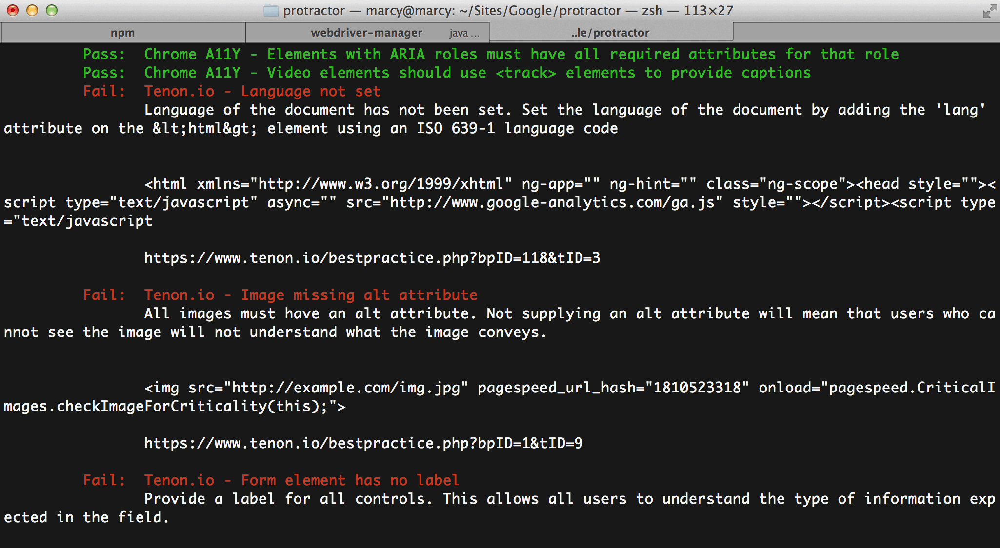

Automated testing is a valuable tool for identifying common accessibility issues with a minimum amount of effort. As part of my work on the Angular core team, I got to spend a week and a half writing an accessibility plugin for [Protractor](http://protractortest.org "Link opens in a new window"), the end-to-end testing framework for [Angular](http://angular.io "Link opens in a new window"). It ended up being super awesome that Julie Ralph, the lead developer on Protractor, works in the Google Seattle office because we were able to pair in person a few times which helped me out a LOT. Julie created the plugin architecture and hooks I needed to integrate Protractor with accessibility auditing tools.



Protractor output on the console

As an accessibility specialist and developer, I was in a good position to make decisions about how the testing should work in Protractor. I looked at a ton of accessibility testing solutions, including the basic [React-a11y](https://github.com/rackt/react-a11y "Link opens in a new window") assertion library some of my teammates at Substantial are using on a React project. I had used the [Chrome Accessibility Developer Tools](https://chrome.google.com/webstore/detail/accessibility-developer-t/fpkknkljclfencbdbgkenhalefipecmb?hl=en "Link opens in a new window") browser extension almost daily in the past few years and I knew there was an [open source audit library](https://github.com/GoogleChrome/accessibility-developer-tools "Link opens in a new window"). (Addy Osmani's [a11y module](https://github.com/addyosmani/a11y "Link opens in a new window") was the closest starting point I could find.) My friend Karl Groves also just launched [Tenon.io](http://tenon.io "Link opens in a new window") with his partner Asa Baylus, providing the community with a Javascript-aware API with some of the most robust accessibility tests around. I knew there were licensing restrictions for Tenon, though, and it required you to send source code over the wire to their API, which wouldn't work for teams at Google. I could see value in providing both options so that developers could decide for themselves.

I had no idea how to do these integrations at first, but like any good challenge, I faced it head on. I sought out to support both integrations right away. Here are some of the things I learned in creating an accessibility plugin for Protractor, a Node.js command-line application:

## Working with promises

You will get very comfortable with return statements. Without them, nothing works (I know this is basic, but I was new to [promises](https://www.promisejs.org/ "Link opens in a new window")). If you need to return more than one thing–like two accessibility audits–you can push the values to be returned into an array and use `q.all` to return after everything has run.

## Executing scripts in a WebDriver page context

If you don't have control over the script you're injecting, like an open source audit library, you won't be able to modify it to expose methods. This might make it difficult to interact with the script. To get around it with Protractor, we had to get a bit hacky and return a function call tacked onto the end of data returned from `fs.readFileSync`.

```
var data = fs.readFileSync(AUDIT_FILE, 'utf-8');
  data = data + ' return axs.Audit.run();';

  return browser.executeScript_(data, 'a11y developer tool rules').then(function(results) {
      // process results 
      ....

```

Getting hacky with readFileSync

## Auditing with WebDriver element objects

Using the Accessibility Developer Tools, an audit script goes through the executing page and tests the elements on that page. When those elements are returned back to you as part of the results, they are WebDriver objects, not regular nodes. This was tricky to figure out–to get any identifying information about those elements, I had to do some more work. (See next section.)

## Waiting for WebDriver element objects to be returned

Because the "elements" returned by the Devtools audit were WebDriver objects and not nodes, I had to iterate over them, fetch their outer HTML and return them as simple node strings using promises. I'm hoping to return a line number in the future or even a simple node tree in case you had two identical elements, but the current version will still help you find the offending nodes in your code.

```
DOMElements.forEach(function(elem) {
  // get elements from WebDriver, add to promises array
  elementPromises.push(
    elem.getOuterHtml().then(function(text) {
      return {
        code: result.rule.code,
        list: text.substring(0, elementStringLength)
      };
    })
  );
});
```

Iterating over WebDriver objects to fetch their HTML

## Associating them with their test failures

Even after I'd fetched the WebDriver element's HTML as strings, because they were returned later in their own array using promises, I had to match them with their associated test failures. It was pretty easy once I added a test code to identify which failing test the element came from.

## Passing Tenon page source without scripts running from CDNs

Tenon has two options for sending your code to them: `url` or `src`. Protractor is handling the page source during each test, so naturally we would send the source to Tenon as a string. This means for Tenon to do it's "JavaScript-aware" testing, scripts have to be loaded remotely from CDNs. If you're testing functionality related to routing, page rendering, or anything remotely Angular-like, you'll have to load scripts from CDNs.

## Treating warnings as passes or failures

In this kind of testing, there is no concept of "warnings"–only pass or fail. In your configuration, you can decide whether warnings should pass or fail your build. We figured this would be useful if you wanted to use a more stringent set of tests if you were pushing code to production, or visa versa.

## In conclusion

This was one of the most challenging things I've ever worked on, as well as the most rewarding. What helped me to get up to speed and deliver something quickly was the fact that people could actually use something I built to create a more accessible web. It also helped that Julie was presenting on it at [ng-conf](http://ng-conf.org "Link opens in a new window") in a few short weeks when I started on it. I ended up really enjoying working in Node.js, and I hope to take on more tasks like this in the future.
