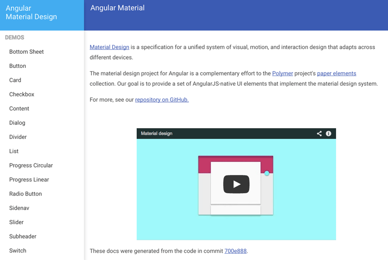
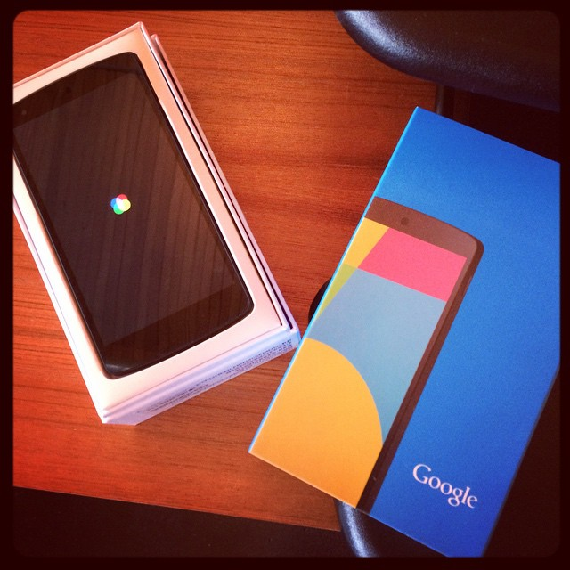

When [Material Design](http://www.google.com/design/spec/material-design/introduction.html "Link opens in a new window") was launched, many of us in the accessibility community noticed that both the [Polymer](https://www.polymer-project.org/ "Link opens in a new window") and [Angular.js](https://angularjs.org/ "Link opens in a new window") Material Design component demos hadn't been built with accessibility in mind. I remember saying out loud, "companies can't continue to do this." Designers and developers must set an example with prototypes that work for everyone, especially at that scale.

Somehow through the magic of Twitter, a.k.a. my big accessibility megaphone, Brad Green from the Angular team at Google invited me to speak at [ngEurope](http://ngeurope.org/ "Link opens in a new window") in Paris. He also expressed a need for some accessibility work to be done on the [Angular Material](https://material.angularjs.org "Link opens in a new window") project. [Substantial](http://substantial.com "Link opens in a new window") was willing to let me bring in that project and work as a solo accessibility engineer. I'm still pretty amazed by all that. (It probably helped that I presented on Accessibility of MVC frameworks at [CascadiaJS](https://www.youtube-nocookie.com/embed/50o_Ig3lk08 "Link opens in a new window") and [JSConf EU](https://www.youtube-nocookie.com/embed/04DOp1F9Od4 "Link opens in a new window").)

Since August, I've been fortunate enough to work remotely with members of the [Ionic Framework](http://ionicframework.com/ "Link opens in a new window") team and the Angular.js core team, all from different parts of the country. I've participated in team meetings on Google Hangouts (sometimes a hot mess from biking up Capitol Hill), audited almost everything on the Angular Material website, opened and closed issues on [Github](https://github.com/angular/material/ "Link opens in a new window"), contributed pull requests to improve accessibility in components and in the docs themselves. I love suggesting accessibility ideas to the team because they're receptive, smart people: they run with the ideas and improve on them. As a designer/developer hybrid, interpreting a gorgeous design spec to create accessible framework components has been my happy place.

Thanks Google for the Nexus 5 test device!

Aside from Material Design, I was asked to give feedback on a community-contributed module for accessibility, [ngAria](https://docs.angularjs.org/api/ngAria "Link opens in a new window"). ngAria's goal is to improve Angular's default accessibility by hooking into directives and dynamically adding [ARIA](http://www.w3.org/TR/aria-in-html/ "Link opens in a new window") attributes for common scenarios. I had worked with Angular before, but not written a module for the core framework. It was a bit daunting, at first! After I had some time to review and comment, Brian Ford and Tobias Bosch made some useful architecture changes and ngAria was merged into Angular.js. It took using ngAria on the Material Design project for me to really evaluate it and find ways to make it better, which is currently an ongoing process. I rewrote the [Angular.js Developer Guide on accessibility](https://docs.angularjs.org/guide/accessibility "Link opens in a new window") and also the [API docs](https://docs.angularjs.org/api/ngAria "Link opens in a new window") for ngAria to explain the module better and to show examples. To accomplish this and much of my Material work with ngAria, I've spent time creating [Codepens](http://codepen.io/marcysutton/public/ "Link opens in a new window") and [Plunkers](http://plnkr.co/users/marcysutton "Link opens in a new window") to test assumptions about the module and see how it could evolve to be more useful. I've absolutely loved this mix of accessibility and UX research, development and communication.

It was [announced at ngEurope](https://www.youtube-nocookie.com/embed/gNmWybAyBHI "Link opens in a new window") that Angular 2.0 will use Web Components and native DOM APIs instead of directives, controllers, and the jqLite DOM wrapper. This has great implications for accessibility, since we'll be able to extend native elements, which is better than bolting on a bajillion ARIA attributes (see [Bruce Lawson & Karl Groves' Web Components talk](http://www.paris-web.fr/2014/conferences/web-components-the-right-way.php "Link opens in a new window") discussing "built-in vs. bolt-on"). Angular evolving in this new direction to me seems necessary for it to stay relevant and useful. I was happy to hear they are going for Web Components, since I've already seen them in Ember.js and Polymer. Frameworks should do everything they can to help people code responsibly–in Angular, the ease with which you could create inaccessible markup has produced a bunch of inaccessible websites (there are [inaccessible examples](https://twitter.com/pauljadam/status/550822616898863106 "Link opens in a new window") in books, too). In the future, I'm hoping I'll get to work on Angular 2.0 since Web Components are of particular interest as an accessibility researcher and [presenter](/jsconf-2014-australia-accessibility-shadow-dom/ "JSConf 2014") on the subject.

By getting out there and talking about the need for accessibility, writing useful docs, and improving the utility of frameworks, I've seen accessibility become a mainstream topic. ngAria is listed next to ngAnimate, after all. It's cool to see a framework take on more responsibility and do some heavy lifting for marginalized users. I'll just keep bringing my energy and optimism even though I know realistically developers forget accessibility quite often. I can still try to _boil the ocean_ one talk or pull request at a time.

In November, I was a guest blogger on the official AngularJS blog about [Using ngAria](http://angularjs.blogspot.com/2014/11/using-ngaria.html "Link opens in a new window"), the accessibility module. It was a really great opportunity to talk about accessibility to a wide, mainstream audience and I'm grateful I had the chance.

I am also speaking about Angular Accessibility at [Fluent Conf](http://fluentconf.com/javascript-html-2015/public/schedule/speaker/189759 "Link opens in a new window") and the [CSUN 30th Annual International Technology and Persons with Disabilities Conference](http://www.csun.edu/cod/conference/2015/sessions/index.php/public/website_pages/view/1 "Link opens in a new window"). I learned so much at CSUN last year (that's how we refer to the incredibly long conference name), I'm excited to give back on a topic that I started thinking about my first time there. I wrote about that wonderful experience on the [Substantial blog](/csun-accessibility-conference-recap/ "Link opens in a new window").
