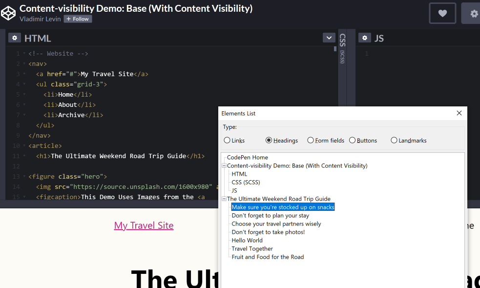
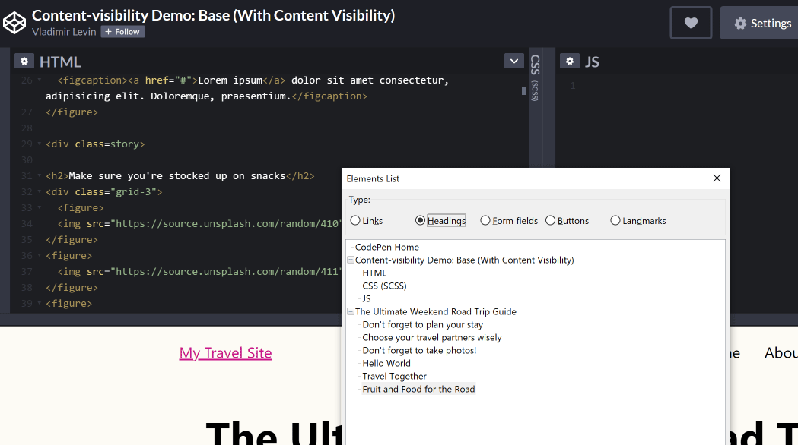

> **Updated April 1, 2021:** The situation as I originally described is no longer an issue, it seems! Read on for more details. The lessons still stand: test in assistive technologies, report bugs to browser and AT makers. Makes the world a better place.

While working with the team at [DEV](https://dev.to) this past quarter on their open source community platform, [Forem](https://www.forem.com/), they requested I review a Pull Request for accessibility on GitHub that introduced a new Chrome-only CSS feature: `content-visibility`. I'd missed the announcement of this feature months earlier by Chrome advocates, so my first step was to read up on it to understand the potential accessibility impact.

## What is `content-visibility`?

According to a post on [Web.dev](https://web.dev/content-visibility/):

> `content-visibility` enables the user agent to skip an element's rendering work, including layout and painting, until it is needed. Because rendering is skipped, if a large portion of your content is off-screen, leveraging the content-visibility property makes the initial user load much faster. It also allows for faster interactions with the on-screen content.

This feature is meant to improve page load performance by skipping over content detected as being "off-screen", or outside of the viewport. There are two possible values for `content-visibility`: `auto` and `hidden`.

The [Forem PR](https://github.com/forem/forem/pull/11560) from Ben Halpern included `content-visiblity: auto`, which marks content as off-screen that will become visible in the viewport through scrolling, telling the browser to skip it in the initial rendering phase. The `hidden` value tells the browser to skip content that shouldn't ever automatically render on-screen through scrolling, more akin to CSS `display: none` or `visibility: hidden` but with extra performance benefits. Potential use cases cited are advanced virtual scrollers and measuring layout.

Neat. But my spidey accessibility senses went off as soon as I read those words: **off-screen** and **rendering**. We use off-screen content in the accessibility world to render content for the purpose of exposing to screen readers, such as visually-hidden headings or `` elements inside buttons. Screen readers typically utilize the [Accessibility Tree](https://www.smashingmagazine.com/2015/03/web-accessibility-with-accessibility-api/), a parallel structure to the DOM that contains only what is rendered on screen and is affected by things like CSS `display: none` and `aria-hidden: true`.

My initial thought was that `content-visibility: auto` could pose an access problem on initial load by suppressing part of the page outline from screen readers, so I set out to test it.

The Web.dev team included a [nice demo on Codepen](https://codepen.io/vmpstr/pen/xxZoyMb) that I used right away, since a local Forem instance requires a more involved setup to mimic the live [Dev.to](https://dev.to) site. I noticed the Codepen authors had marked up `.story` DIV elements with CSS `content-visibility: auto` applied, with headings preceding those DIVs (so therefore outside). They'd possibly anticipated an accessibility issue, but didn't originally write about it* in the post.

<figure>
    
</figure>

A Google search turned up two posts from [CSS Tricks](https://css-tricks.com/more-on-content-visibility/) and [Steve Faulkner](https://html5accessibility.com/stuff/2020/08/25/short-note-on-content-visibility-hidden/), but neither touched on the impacts of `content-visibility: auto` on semantic structure. So here I go, writing about it!

> ***Update, March 12, 2021:** Google has updated how `content-visiblity` works in Chrome 90 (see below). Una Kravets also notified me she updated the page on [Web.dev](https://web.dev/content-visibility/#a-note-on-accessibility) to include a note about accessibility.

## Accessibility impact on semantic structure

In earlier versions of `content-visibility` (Chrome 85-89), headings and other content were suppressed by `content-visibility` if considered off-screen. That meant content would be hidden on load from the Elements List in NVDA and rotor in Voiceover, impacting the overall page outline and summary read aloud.

To test this, I moved an h2 in and out of a DIV with `content-visibility: auto` applied. When the heading was outside of the DIV like they set it up in the demo, it was rendered. Here's a screenshot of the Elements List in NVDA:

<figure class="border">
    
    <figcaption>
    NVDA Elements List showing all headings, including being "stocked up on snacks"
    </figcaption>
</figure>

When moved inside of the `.story` DIV with `content-visibility: auto`, the heading was suppressed by screen readers including NVDA (as expected):

<figure class="border">
    
    <figcaption>
    NVDA Elements List missing a heading
    </figcaption>
</figure>

This meant that if you were trying out `content-visibility` on sections of content including headings and semantic structure in Chrome 85-89, screen reader users would't be able to benefit from that structure on load. This unfortunately degraded accessibility in favor of loading performance until it was fixed, [partially due to this post](https://twitter.com/sundress/status/1346685692974284800).

**Based on my testing, I initially recommended keeping headings and landmark elements outside of regions styled with `content-visibility: auto`.**

Without this approach of crafting semantic markup for rendering on load, `content-visibility` as initially implemented would have negated the purpose of including semantic structure to begin with. It would have required scrolling the page for a complete and accurate outline read aloud; likely not what developers would intend by using it! Fortunately this behavior was marked as a bug and fixed.

From the sounds of it, the Chrome team had some discussions along the way about accessibility in `content-visibility` but the production implementation had some issues. I'm glad to see they've fixed it and are [improving their QA process according to Alice Boxhall](https://twitter.com/sundress/status/1368757783210827784). It makes me feel for accessibility folks, though. If you don't watch features like a hawk for accessibility, the ball is very often dropped.

--- 

Note: the PR from Forem ended up marking only the footer content with `content-visibility: auto` since it's at the bottom of the page and would theoretically benefit from deferred rendering. But one caveat to the Forem usage was the site's infinite scrolling, where users couldn't reach the footer anyway...so whether that content would be accessible on page load in assistive technology was moot. See the [PR](https://github.com/forem/forem/pull/11560#issuecomment-733223791) for more discussion if you're curious!

