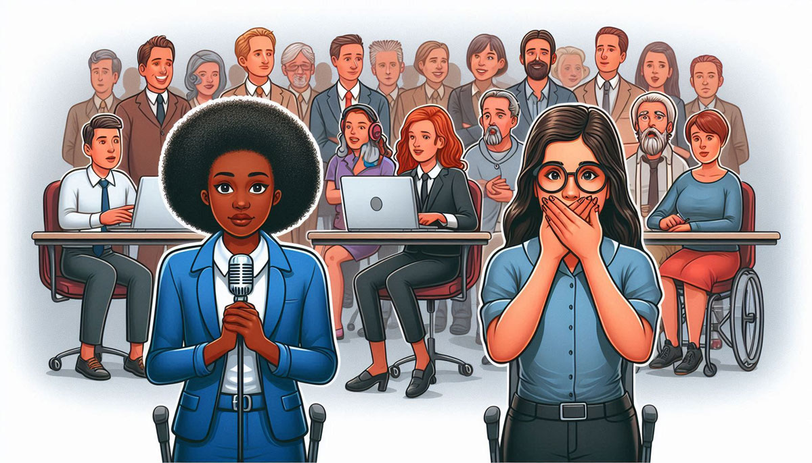
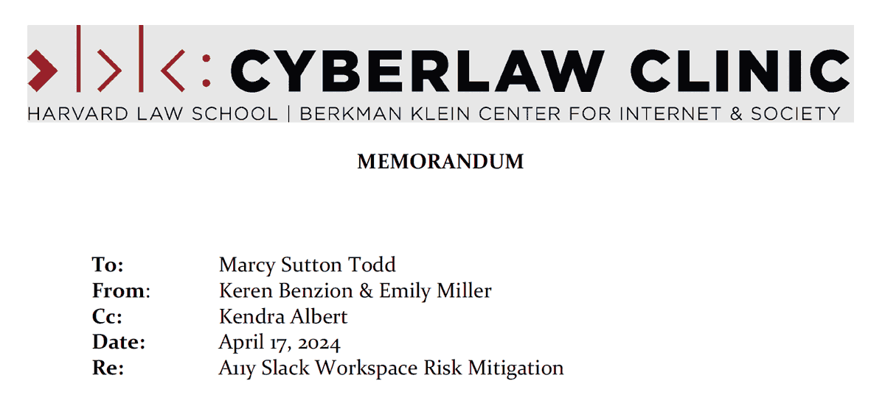

## By Marcy Sutton Todd, Workspace Owner and lead Slack group admin

## Supporting the Accessibility Slack community with legal guidance on avoiding potential SLAPP suits (Strategic Lawsuit Against Public Participation)

_**Summary:** I developed policy recommendations for the A11y Slack workspace with the Harvard Cyberlaw Clinic in 2024 to protect our accessibility practitioner members against the type of SLAPP lawsuits brought by accessibility overlay companies. In this post, I summarize the takeaways and legal advice from Harvard Cyberlaw's Web A11y Memorandum on defamation lawsuits._

Since March 2015, the A11y Slack community has been a rich space for accessibility practitioners, designers, developers, managers, analysts, and more to share insights and learn from each other. The invite-only group has grown to over 14,000 members and includes people who build web browsers, screen readers, develop technical standards including WCAG, ARIA, and HTML, alongside people just getting into the industry.

Naturally, members in a group of this size will have a wide range of interests and motivations. As an admin group, we monitor communications to ensure they align with our [Code of Conduct](https://accessibility.github.io/a11yslack/code-of-conduct.html) and foster a safe, friendly, and welcoming atmosphere. While A11y Slack is a private group where members can invite other members, so communications should be considered somewhat public.

As accessibility professionals, most of us in the group agree that constructive criticism on techniques and tools are an essential part of providing feedback and improving digital access.

One controversial aspect of digital accessibility has been the rise of Overlay technology, where vendors sell products that claim to improve accessibility with one line of code by using JavaScript to inject tools on top of the existing website with no other changes from the site owner. Many of us in the industry feel these products go the wrong direction when trying to improve access. When teams are left out of the accessibility process in favor of a "bolted on solution", they miss the opportunity to improve their craft. We would rather improve a website or application from the start so that access for people with disabilities is baked into the DNA of the experience. There are many benefits to creating inclusive designs that are beyond the scope of this post, but are truly important to us as a community.

> You can learn more about overlays from the perspective of digital accessibility professionals on the Overlay Fact Sheet, signed by over 880 people in the industry as of September 2024 (disclaimer: I also signed the fact sheet, as signer number 172). https://overlayfactsheet.com/en/

## Accessibility overlays and SLAPP suits

Unfortunately, overlay companies have brought at least two lawsuits against members of the accessibility community for criticizing their products on Twitter (X) and elsewhere. These were definitely noticed:

- AudioEye, Inc. v. Adrian Roselli, known as "the SLAPP lawsuit heard around the world." May 2023 - Dropped in January 2024
  - https://adrianroselli.com/2023/05/audioeye-is-suing-me.html
  - https://www.lflegal.com/2023/07/adrian-roselli-slapp-lawsuit/
- French accessibility advocates sued by FACIl’iti, a French overlay company in November 2023
  - https://www.lflegal.com/2021/11/overlay-legal-update/#French-Overlay-Company-Sues-Advocates-for-Their-Role-in-the-Global-Overlay-Conversation

_Note: a previous version of this article mistakenly wrote the French suit was towards a company, while it is actually towards individuals._

These lawsuits are considered SLAPP suits, intending to stifle criticism and debate by dissuading the accessibility community from producing negative publicity on overlay technology. They create a "chilling effect," where people hesitate to exercise a right, such as freedom of speech, due to the fear of legal repercussions.

From Google AI:

> SLAPPs have several characteristics that contribute to their chilling effect, including:
>
> - **Frivolous lawsuits**: SLAPPs are often based on meritless, exaggerated, or frivolous claims.
> - **Disproportionate solutions**: The solutions demanded by the plaintiff are usually disproportionate to the situation.
> - **Power imbalance**: There is a disparity in power and resources between the plaintiff and the defendant.
> - **Extended litigation**: SLAPPs are often lengthy and can exhaust the defendant's resources.
> - **Obscured intent**: Plaintiffs often try to obfuscate their intent to censor or silence critics.
>
> SLAPPs can have a damaging effect on those who have not yet been targeted, as people may be reluctant to participate in public debate out of fear of being sued.

This article focuses on SLAPP suits in the United States, where each state has different laws. Obviously, suits can also be brought in other countries where the legal situation will vary widely. If you are in a jurisdiction with weak or no SLAPP laws, you might change your defense strategy.

## Our community and SLAPP suits

As the largest accessibility Slack group with some of the same members who had been sued and people from companies doing the suing, we definitely worried about our safety and liability from SLAPP lawsuits. I [asked about it on Twitter (X)](https://x.com/marcysutton/status/1636801846433177600) but no one responded on this specific issue.

I heard from members loud and clear that we needed to do something proactive to protect ourselves from these kinds of lawsuits. It was particularly obvious when a member from an overlay company promoted their efforts to gain legitimacy through the W3C and the community's response was highly skeptical and critical.

Did we have anything to worry about with regards to our communications in the group being used in accessibility SLAPP lawsuits for alleged defamation?

> **Defamation**: the action of damaging the good reputation of someone; slander or libel.

Further, the community wanted to know if members from overlay companies could be kicked out from the group. Would we want to do that, given overlay companies had been acquired by known and respected accessibility vendors? It seemed complicated.

## Working with Harvard Cyberlaw Clinic

To figure out what to do next, I reached out to my network to see who we could engage to get legal advice.

Slack's Terms of Service weren't super clear on the topic of lawsuits. As a volunteer community group and not an employer, we often deal with Slack not being designed for our purpose and we find moderation to be challenging in many ways. As a primary goal, I wanted advice on the specifics of our legal situation for digital communications on accessibility in Slack.

One of the leads I got last January was [Harvard Cyberlaw Clinic](https://hls.harvard.edu/clinics/in-house-clinics/cyberlaw-clinic/), a group within Harvard that "provides high-quality, pro-bono legal services to appropriate clients on issues relating to the Internet, new technology, and intellectual property." They were just solidifying their docket for the semester so my timing was perfect. I thought our topic would be an interesting one from a legal analysis perspective and they agreed. They had done some disability work in the past, some discovery response, some anti-SLAPP work, and some law-enforcement request work. We got onto their docket and began meeting in February 2024.

Something I'll always remember about Harvard Cyberlaw's approach was something Kendra Albert, the director of the program said:

> They are good and they are cheap, but they are not fast.

We wanted quality representation as a community group with no budget, so taking a bit of time was fine for us.

After I gave them all the information I had, they did their work and provided us with a Web A11y Memorandum PDF ("the memo") in April 2024. We met virtually to go over it and I mulled over the options they gave as suggestions, noting their observed trade-offs.

<figure style="margin-bottom: 2em;">
  

    

  <figcaption style="text-align: center;">The Harvard Memo on A11y Slack Workspace Risk Mitigation (Full doc confidential)</figcaption>
</figure>

On the subject of defamation, the Memo had this to say (lightly edited for this blog post):

> To meet the criteria for defamation, a plaintiff (the "suer") must show that the
defendant has made:
>
> 1) a false statement purporting to be fact;
> 2) publication or communication of that statement to a third person;
> 3) standard of fault amounting to at least negligence; and
> 4) damages, or some harm caused to the reputation of the person or entity
who is the subject of the statement.
>
> Publication to one party satisfies the second prong, and
> that the Slack group is private would not negate publication.
> Damages can include a demonstrated pecuniary loss, like a loss of business.
> Therefore, this analysis will focus on prongs one and three.

The standard of fault outlined in the Memo described how liability can vary depending on the subject of the defamatory statement, as well as by state (note this advice is geared toward people in the United States). States with anti-SLAPP lawsuits give plaintiffs some legal protections in lawsuits that lack merit and are intended to silence critics.

In Adrian Roselli's lawsuit, his attorney filed a motion to dismiss pursuant to New York's anti-SLAPP law, but the case settled before the court rendered a decision on that issue.

## My takeaways from The Memo

After going through the process with Harvard Cyberlaw and digesting their analysis, my takeaways included:

- **Ultimately, we can't completely prevent a defamation lawsuit.** We can help to educate our members about statements of facts versus opinions and advise them about legal liability and some of the other takeaways in the memo. I felt the most delicate way of handling this and not further chilling speech was to make some recommendations in the Code of Conduct (under "Content Suggestions"). Then, if someone is worried or curious about this they can seek out the information.
- As admins/moderators, we are covered under [Section 230](https://www.eff.org/issues/cda230) and likely not liable for defamation claims made by members in the group or elsewhere. As posters ("speaking personally here..."), we don't have this same legal protection.
- Banning members from overlay companies was described as a "nuclear option", and not something we wanted to do. So we didn't do it, but we continue to monitor communications to ensure they adhere to our guidelines.
- We could consider changing the content retention/deletion settings for specific channels to limit legal exposure for members. This approach could give a bit of a safer space where people can vent but not worry about Discovery turning up those conversations in a lawsuit.
  - Note: We haven't done this as the big trade-off is that helpful content would no longer be searchable to members for safe and legitimate purposes.
- If someone does find themself at the center of a defamation lawsuit, the recommendation was to contact the EFF or the other suggested law firms/resources at the end.

We outlined a Solicitation policy in our Code of Conduct as a result of this work and at the request of our community, as people were tired of feeling like they were being heavily advertised to in a professional networking space. The intent was to draw more clear lines between company advertising and community discussions by streamlining them into a specific channel. We also suggest that members document their company and role in their Slack profile so their motivations are clear. The Solicitation policy is something we've developed further with community feedback, so we can strike the right balance for safety and professional development.

## Going forward as a community

We may make additional recommendations or changes based on these findings as time goes on. As a digital accessibility community leadership group, we volunteer on things as time and energy permits. Like Harvard Cyberlaw, we tend to move a bit slower – this helps us try and get things right for community moderation in a sustainable way. We've recently expanded our admin / moderation team from a group of 3, which was extremely necessary for a Slack group of our size (14,184 as of this writing). So I'm sure that further discussion will continue as our leadership team grows and this article is shared.

My best advice to anyone concerned about SLAPP lawsuits and accessibility is to choose your words carefully when providing criticism in public(ish) spaces. It's unfortunate that we have to do that – it is somewhat of a chilling effect of these lawsuits in action. But there is still a way to provide constructive criticism by ensuring your factual statements are provably true and/or literally presenting them as personal opinions ("It is my opinion that…"). If you are concerned about your legal liability from overlay companies when discussing products online, this advice might apply to you.

As technology professionals who spend a lot of time online, we should keep in mind that there are real people on the other end of our communications. This includes people we consider to be taking the wrong steps for accessibility and technology. Would you say something the same way if they were in front of you, in person? Perhaps you would. Or, maybe you would frame your feedback differently with this idea in mind. As we always say in accessibility, it depends.
