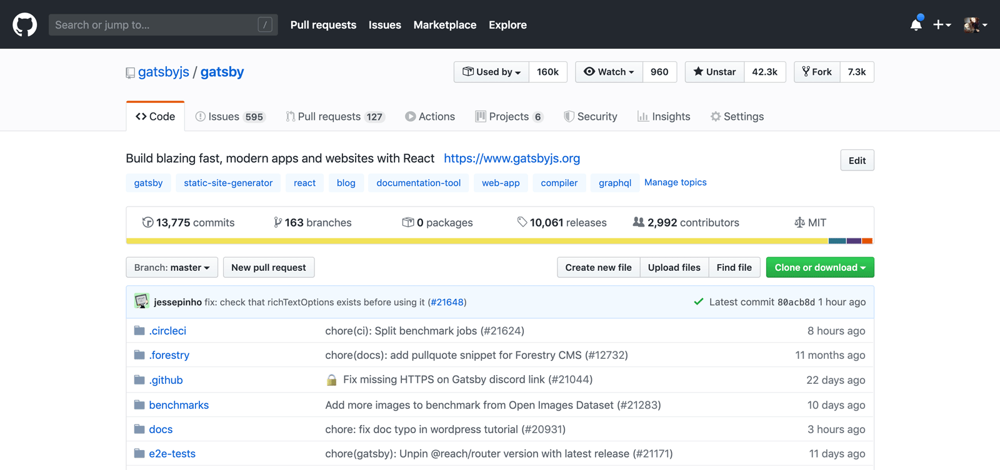

Open source is all about making software available to everyone to use. But there's a bit of a paradox: create something that developers really need and want, and they'll use it so much that the burden to support and maintain it becomes overwhelming. To overcome this and make a popular open source project more sustainable, it's essential to write discoverable documentation for people to contribute so they can help shoulder some of the effort. [Funding](https://www.gatsbyjs.org/blog/2020-02-11-founding-organizations/) is also a factor in open source sustainability, but that's beyond the scope of this post.

**Lacking documentation in open source is a self-fulfilling prophecy** that prevents users from contributing and inhibits project growth. By investing in docs and processes for contributors, they'll feel more welcome and able to participate in developing the project. You'll also have a higher likelihood of increasing project popularity, as developers legitimately become more invested in following it.

Without an [inclusive system for contributions](https://www.gatsbyjs.org/blog/2020-02-17-changing-the-oss-status-quo/), you'll limit who participates in an open source project to those with insider access or the time and resources to figure it out. This can affect the project itself, as open source contributors are almost always users as well. If they can't build the project or run tests to make improvements to it, they'll need to rely on maintainers to implement their use case. With misaligned priorities and a lack of action in a project, users may move on to something else that actively supports their needs.

Software decisions are about trade-offs, yet different developers, teams, or companies might have their own priorities that impact how (or when) decisions are made. When open source consumers submit an issue for a feature request or improvement that isn't part of a roadmap, it gets placed far down the list of things for core maintainers to work on ("parking lot" issues, if you will). This is where contributions can make a difference: if those with wish-list issues are enabled to independently submit pull requests (PRs) that meet project standards, it can expand that project's ability to grow even with limited bandwidth.

## Contributing in Gatsby.js

For the past year, I worked as the Head of Learning for the open source website framework [Gatsby](https://gatsbyjs.org), in charge of its documentation and learning experience. I'm now a Lead Engineer on the Developer Relations and Community team, so my role in creating docs is different but my expertise and passion for developer education and community remains.

When I joined as Head of Learning, I inherited a solid foundation of [documentation](https://gatsbyjs.org/docs/) and [contributor processes](https://gatsbyjs.org/contributing/). I've seen how Gatsby's investment into docs as a company has translated into big numbers: nearly 3200 contributors to the documentation and source code, and over 43k GitHub stars at the time of writing. During Hacktoberfest in October 2019, we merged over 630 PRs!

Having an independent docs site with extensive user and contributor documentation, including a [Code of Conduct](https://www.gatsbyjs.org/contributing/code-of-conduct/) and [Style Guide](https://www.gatsbyjs.org/contributing/gatsby-style-guide/), as well as an [active GitHub repo](https://github.com/gatsbyjs/gatsby) and [docs translation process](https://www.gatsbyjs.org/contributing/translation) supports growth of those numbers. It also helps that Gatsby is a mainstream project as opposed to more niche tooling; not a judgement of smaller projects, but a quantifiable reality I've observed coming from the accessibility community.

I'll never tire of reading tweets from developers celebrating their [first open source contribution](https://twitter.com/kimberrypi/status/1162444570501607424) in Gatsby. I can see the project growing stronger and supporting more people's use cases every day by enabling and encouraging them to contribute, and that's super cool.

## Tracking and metrics in open source docs

Tracking and quantifying growth is often a component of managing an OSS project. In my time leading Gatsby Learning, we were more concerned with the amount of content coverage and accuracy for common user workflows than growing the number of contributors. But having a healthy contributor base helps us provide better docs, as a large content surface area and a small internal team means we need all the help we can get to support more use cases.

This also enters into the realm of Developer Relations, where metrics are chosen to measure specific growth areas. With separate teams and ownership of different objectives like we have at Gatsby, we need to be highly collaborative to experiment and produce meaningful outcomes that support the project's overall goals and priorities. DevRel at Gatsby will collaborate closely with the Product Marketing team that now produces documentation, for example, to ensure they have the latest information from our open source community.

### Keeping the work going

It's worth saying that you also need a culture open to experimentation that encourages trying new things in the first place: that's a cornerstone of Developer Relations. If your advocates have their ideas shut down repeatedly, especially when they're surfacing feedback from users and contributors to grow the project, frankly, they'll burn out and stop trying after a while.

To keep your project from appearing stale and losing steam, issues and PR contributions need to be addressed and not left hanging. Support this effort by tracking metrics that matter: the number of external contributors (including repeat contributions!), number of open issues and PRs, age of those open issues and PRs, and more.

What exactly you should measure will depend on what you want to achieve with your project. Maybe you don't _really_ care about open source growth because it's a marketing/influencer tool for your paid software, and you aren't going to prioritize the open source community's needs at your paid software's expense so you can keep operating. It's still worth considering how you'll grow and sustain your open source project to keep it from growing stale, before a competitor slides in and better supports users and contributors, eventually taking your place.

It's also worth mentioning that users don't care about metrics. They care about whether they can do something using your open source software, so a process to resolve issues and PRs for your community at regular intervals is essential. Metrics are a means to doing that more effectively and making a business case for open source growth, reach, and value.

### Living your values and priorities

A previous role of mine at a different company for an open source accessibility testing tool involved tracking metrics for its GitHub repo. This experience gave me a lot to think about as I moved on to a larger, more mainstream project.

One of my "rocks" in that role included growing the repo's GitHub stars, and at the time it seemed to naturally grow with the number of high-profile accessibility conference talks and blog posts I delivered. Looking back, I believe stars were a vanity metric that I'm now unclear what value they truly added (I didn't put them on the list but I didn't propose anything else, either). There's much more I could have done to grow a strong contributor base to grow the project's reach and make it more active with contributions from non-core team members (such as better docs!). But the project also had to be balanced with work on paid software, and that tension with priorities contributed to the outcome of contributor experience being a lower priority.

Maintaining a healthy open source community is a continous exercise in putting your values and priorities to work. An enforceable Code of Conduct provides a safer environment for a diverse community and makes it clear that poor behavior and harassment are not to be tolerated. On the other hand: cryptic, lacking, and outdated documentation sends the message that contributions should be limited to an insider circle of people who are smart enough to figure it out, and that open source contributions aren't that important. If your docs and contribution processes don't reflect the values and growth trajectory you want for your open source project, it's time for a rethink.

## Conclusion

So how do you encourage contributions in open source? Write documentation, including contributing docs with instructions for how to set up the project and run tests. Add comments and tests to the code, and keep them up to date as the project evolves by requiring docs changes with every relevant PR. Make docs easy to discover and use: this means publishing them somewhere other than in GitHub source code, like a docs site or even a Wiki. These things can help you avoid the self-fulfilling prophecy of lacking docs translating into few contributors.

Making it possible for non-developers can also really help a project grow. Include content that doesn't rely on reading source code to know how to contribute, and allow people to contribute small PRs to improve documentation. Hacktoberfest is a great opportunity to encourage people to contribute to open source for the first time, and labeling issues with "good first issue" or "help wanted" can provide pathways for them to take their first step. Treat contributors of all skill levels with respect and dignity, as you never know someone's life experience.

Identify pain points with your project as it grows, such as issues and PRs from contributors going stale, and figure out how you're going to improve on it. Add metrics to track progress in those areas and hold them accountable for related goals, so teams have an incentive to change. It's worth it to keep your open source project growing sustainably, if you want people to actually use it; otherwise, what's the point of making it open source in the first place?
