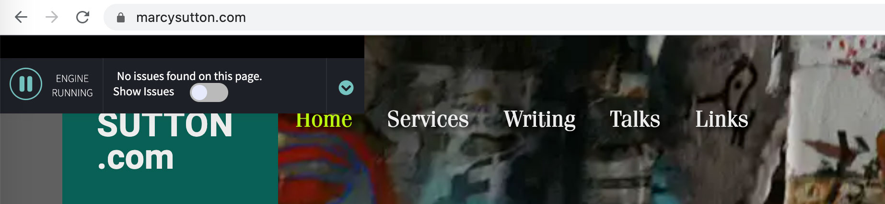
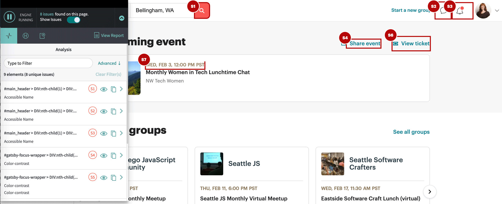
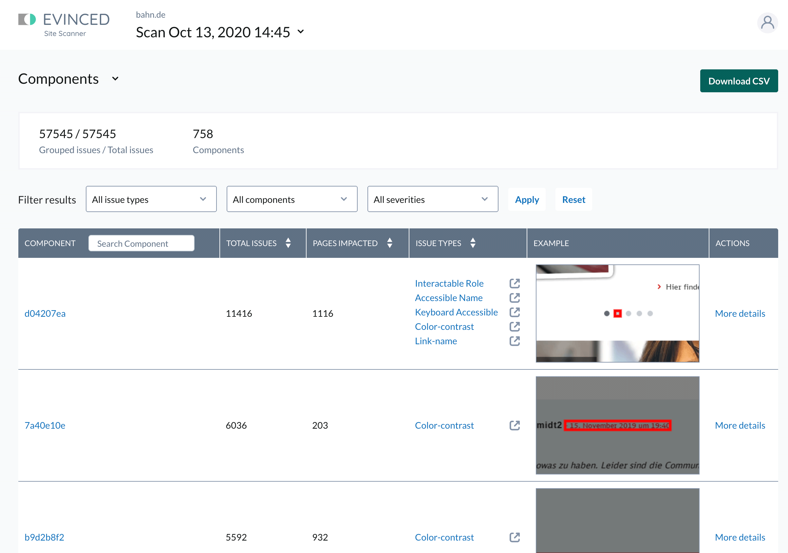

_Disclaimer: I am writing as a paid consultant and advisor for [Evinced](https://evinced.com), a startup building new accessibility testing tools. Read on to find out why I said yes to this engagement and what you should know about their product launch!_

---

<figure>
    
    <figcaption>Evinced's User Flow Analyzer extension</figcaption>
</figure>

As an accessibility advocate and web developer, I've spent a lot of time using and recommending accessibility testing tools. I want the process of developing accessible websites to be as successful and encouraging as possible so we can make the internet a more inclusive place. There are great tools on the market for accessibility testing of websites and web applications. I've worked on multiple in my career including some of the leading ones: [axe-core](https://deque.com/axe), [Accessibility Insights](https://accessibilityinsights.io), [Tenon](https://tenon.io), and [Protractor for Angular](/angular-protractor-accessibility-plugin).

I believe that semi-automated tooling such as browser extensions and fully automated accessibility tests with Cypress, Jest, Selenium, or similar (which I'll group together as "automated checks") are essential to building and sustaining accessible websites. Tooling can help highlight issues in the development process without relying on manual review for absolutely everything. Much progress has been made in this area since I started as a developer in 2009.

However, automated tooling for accessibility can only go so far. In my role as a developer advocate for axe-core, I often stated its JavaScript engine could find only 30-50% of accessibility issues on a page by volume. In fact, it's possible to create a website that passes automated checks while continuing to pose barriers to access for people with disabilities. Developers may not go any deeper than an automated tool result to assess or improve the situation. If you haven't already seen Manuel Matuzovic's post on [building the world's most inaccessible site possible with a perfect Lighthouse score](https://www.matuzo.at/blog/building-the-most-inaccessible-site-possible-with-a-perfect-lighthouse-score/) (Lighthouse uses axe-core), I'd highly recommend a read.

<figure>
    
    <figcaption>Evinced's User Flow Analyzer extension run on Meetup.com</figcaption>
</figure>

## Enter, Evinced

That brings me to the core subject of this post: a startup called [Evinced](https://www.evinced.com/) has [launched](https://www.prnewswire.com/news-releases/evinced-raises-17m-announces-series-a-to-launch-enterprise-digital-accessibility-platform-for-software-development-teams-301220961.html) a suite of new testing tools that I feel are pushing the limits of what's possible to test accessibility automatically by completely rethinking the approach. They've created an entirely new testing engine and growing set of validations (rules) that evaluate webpages using computer vision and Artificial Intelligence to create a semantic structural model of a page partially based on its visual design, rather than relying on JavaScript to evaluate code syntax and functionality rendered in the browser. Evinced's [series of tools](https://www.evinced.com/products/) utilize this new engine, including a Site Scanner (with a free community edition), Dev Debugger extension, User Flow Analyzer extension, SDKs for automated software testing, and a free iOS Debugger application.

Evinced approached me about their project last fall and I tested out some of the tools to see what they could do. I thought they were quite ambitious to tackle problems in an already-crowded space but their revolutionary approach to analyzing webpages filled a gap for me immediately: a way to detect keyboard-inaccessible elements in a browser extension. I knew from experience, there was no clear way to write that rule effectively and cross-platform using JavaScript alone. I also liked their budding site scanner and its component grouping functionality and thought it would solve a need for many teams and independents. 

A reevaluation of how to scan a webpage using computer vision seemed very promising to me in raising the number of possible scanned violations. Some investors had already agreed: Evinced raised a seed round and Series A funding to spend dedicated time and effort pushing through this ceiling.

## I know what you’re going to say...

Finance hasn't historically had the most positive reputation in the accessibility community, with multiple vendors acquired by larger firms (Paciello Group and Level Access) and VC-funded organizations [fighting with each other over patents](https://www.lflegal.com/2020/09/audioeye-vs-accessibe/). AccessiBe in particular has been selling overlay add-on products to site owners that [don't actually solve accessibility problems but attempt to auto-fix them](https://www.lflegal.com/2020/08/quick-fix/) at runtime. Overlays contribute to a culture where site and theme developers aren't notified or required to fix their own code, and the systemic inaccessible cycle continues.

While Evinced is supported by venture capital, they are focused on solving the core problems of inaccessible development with tools that teach developers and other team members how to build more accessible sites and apps. They are eager for feedback from the community and are committed to making their products the most useful and accessible they can be. [As a consultant](/outsider-leverage-accessibility/), I've been transparent with them about what needs to improve in addition to what is working well. Their approach is definitely ambitious, and there are some rough edges in their solutions at the moment. But that also seems expected for a 2-year old company working on multiple solutions at the same time, and I'm encouraged by their work ethic.

I'll be interested to see how Evinced uses their computer vision and AI algorithms to create revolutionary accessibility rules, since they've really opened up what's possible by doing things in a new way. As the Evinced team evolves their prototypes into production-ready validations, there will be more solutions for things that would otherwise require manual or custom automated testing, like tricky color contrast problems and missing keyboard support.

<figure class="border">
    
    <figcaption>Evinced's Site Scanner web application run on Bahn.de</figcaption>
</figure>

I also now have better answers to a couple of questions I've seen floating around the community for the past few years, including:

- **What should I use to crawl or scan a list of webpages for accessibility?** Try the Evinced Site Scanner, with a community free service. There's an enterprise free trial as well where you don't need to speak to a sales person.
- **How can I test a native mobile app for accessibility?** Try the free iOS Debugger, with other native platforms coming soon.

The need for manual accessibility testing will never fully go away. There is simply too much nuance for computers to make websites and apps intuitive and accessible without human review. Pushing the limits of what's possible can bring us closer to an accessible web by making development easier. This launch feels like a step in the right direction.
