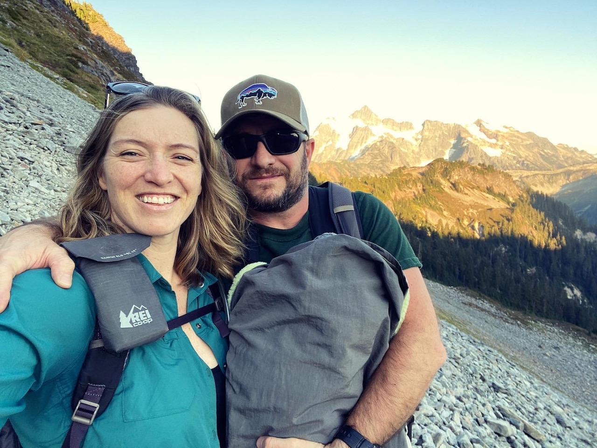
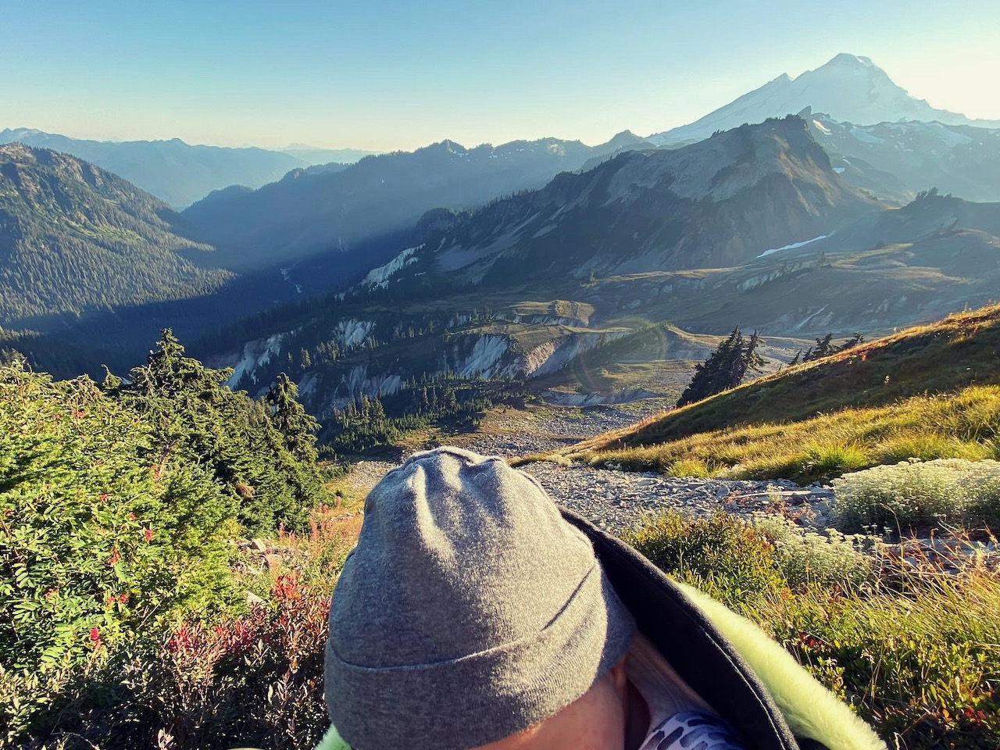

2022 has been a time of major life change for me. In addition to working successfully for the second year as an independent, I got married in January and celebrated two major launches by the end of July: my [Testing Accessibility project](/testing-accessibility) and a new baby, respectively.

This all comes after a turbulent few years in my professional and personal life, with plenty of growth lessons (and lots of therapy). And yet, I’ve moved gracefully through these milestones. I landed on a mantra that kept me centered through it all: **_focus on what matters_**.

<figure>
    
    <figcaption>Our little family hiking in the North Cascades</figcaption>
</figure>

I wish I’d come up with this mantra years ago. It could have saved me a lot of heartache as I chased career ambitions and found myself far off track. I eventually crashed and burned. When I felt the drive to work endlessly, said yes to another trip taking me far away from home (pre-pandemic), and continued to push myself to impress the tech industry at the expense of my health, it would have helped to do regular gut checks and ask, “what’s the most important thing right now?”

Perhaps I might have noticed sooner that things were out of balance. That I was running away from home to bury my feelings. My career was going amazingly well from the outside but tearing me apart on the inside.

My priorities have definitely shifted in the past few years as I’ve grown older. I no longer care about being _seen_ and _heard_ as I once did. I am no longer looking for attention and validation as a content creator and I’m even less excited about doing constant work even if it’s stable and meaningful (I’m too hooked on independence!). I want more time to reflect, breathe, and create. I want to surround myself with nurturing relationships that encourage me to be my best self. It is a noticeable shift to let go of feeling competitive and to focus instead on what matters in my heart: balancing making a positive impact with living a healthy, happy life.

I had the same goal of _work-life balance_ as an accessibility-focused web developer in years past (as noted with my personal interest in bikes, adventure vans and making pies), but the way I lived had a big cost. I never truly refilled my tank when my eye was always on the next talk, the next tweet, or the next pull request. I wasn’t present in the day-to-day moments in my life. Unsurprisingly, trying to please everyone else without focusing on my core needs led me to be a very unhappy person.

This year felt different, though. I worked just enough to get everything done that I needed to and I otherwise took the pressure off to “do more”. I still worked extremely hard ahead of the birth of our baby so I could coast when she was born, including the [Testing Accessibility launch](https://twitter.com/marcysutton/status/1547299758519099393) and a number of client contracts. I ended up getting so much more done in this time period than I had in years of feeling burned out, that I beat my highest annual full-time salary as a freelancer by September. Oh, and did I mention I was _extremely_ pregnant?

I still get anxious and distracted like I used to but now I give myself some grace. I take a break and come back to it. I keep chipping away at my to-do list and prioritize what is the most time sensitive or important thing. It feels good to cross things off my list and achieve major milestones that I’ve accomplished by staying focused yet giving myself lots of rest.

I say all of this for two reasons:

1. To give you a little update for how things have gone this year, since I haven’t prioritized writing on this site (one of the things I let drop, on purpose).
2. To encourage you to do regular gut checks in your life to see if any course corrections are needed. Are you working on the right thing right now? Spending time with the right people? Getting enough rest?

I’ll keep repeating this mantra: what’s the most important thing right now? What’s the next most important thing?

_Focusing on what matters_ has been the most magical, transformative approach to develop in my life in years. I don’t have regrets for how things have gone since it took all of those experiences to get me to this place in life. But I know now that I have a lot of power to keep my life on track in the pursuit of happiness. I also appreciate the privileges involved with being able to nudge my life in the right direction, since there isn’t much interference.

Gratitude is at the core of my practice, both for the important things kept in the queue and the unimportant things I cut loose. It’s like Marie Kondo’s practice of thanking the material possessions she gives away. When you focus on what matters, you spark joy from positive movements and also benefit from the release of tension when letting go.

Thank you, life, for all you have to offer.

<figure>
    
    <figcaption>Family dreams coming true...my baby on trail.</figcaption>
</figure>
