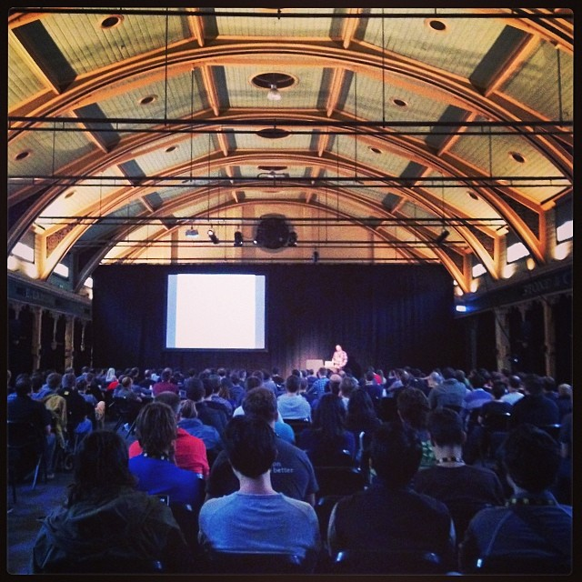

> I presented Accessibility of Web Components at JSConf US in May 2014. Read about that experience on the [Substantial blog](http://substantial.com/blog/2014/06/19/evolution-of-a-jsconf-talk/ "Link opens in a new window").  
> Or [watch the video](http://marcysutton.com/talk/jsconf-2014/) from JSConf.

Every time I attend a conference (and I’ve been to quite a few) I sit in the audience watching people speak and think to myself, “I want to do that. I can do that.” So it’s amazing to say that I was lucky enough to be selected and flown from Seattle to Melbourne for JSConf Australia on April 10. After submitting many unselected conference proposals, each one getting closer, my topic of Accessibility and the Shadow DOM finally broke through to a mainstream conference. I may have gotten a little help from Geoffrey Grosenbach (thanks, Geoff!) but I know my topic deserved to be there. I’ve worked hard [researching Web Components](http://substantial.com/blog/2014/02/05/accessibility-and-the-shadow-dom/ "Link opens in a new window"), experimenting with cutting-edge code, [interviewing people and writing](http://substantial.com/blog/2014/04/09/csun-accessibility-conference-recap/ "Link opens in a new window"). I have a lot to say. \[Update\] Thanks to Jared (@rioter) for the assurance that my talk was selected on its own merits.

## A Little Background

Ever since Clay Johnson’s talk at Webstock where he mentioned people always choose _pizza_ over _broccoli_ when it comes to content on the Internet (ex. Kardashians vs. child hunger), I’ve thought of web accessibility as the _broccoli of web development_. How do you remind people they aren’t good at supporting marginalized members of society when they’d much rather hear about robots or WebSockets? When it’s phrased like that, I totally get it. Conferences are supposed to be fun; they lift you up and give you the inspiration needed for a series of uninterrupted months at work. The thing is, those months at work are the times when we need to remember web accessibility the most. Wouldn’t it be great if the inspiration came from conference talks tying web accessibility to modern code we do want to hear about?

## Speaking at JSConfAU

Speaking to hundreds of people and being videotaped feels a bit like skydiving for 30 minutes. They mic you up, you make some jokes and then you're up there. Some of your intended jokes don't get any laughs, some do. You are responsible for curating the conversation the entire time. I thought teaching experience with Girl Develop It would help: it did help my confidence in getting up there, but I couldn't ask if something made sense and then explain it another way. And 30 minutes goes by _fast_.

Part of the difficulty transitioning from speaking at meetups and code academies to a mainstream conference has to do with the audience. Accessibility and the Shadow DOM, as I initially structured it, began with accessibility background and then went into Shadow DOM. It was too technical for Refresh Seattle but worked great for a code academy. It's pretty obvious to me now that I should have skipped the background for JSConf and focused the entire 30 minutes on Shadow DOM. Fortunately, what seems like a big miss actually did a huge service to the accessibility community so I shouldn't feel bad. I'm still working out how to best structure a modern, mainstream accessibility talk (while trying not to be too hard on myself). JSConfAU felt like the beginning of something big, so I'm making an effort to make my talks more memorable. Here are some notes I made after the experience:

- What's the one thing you want people to take away from your talk?
- Don't hit people over the head with accessibility.
- Really plan your talk for the audience. How technical are they? How much do they already know?
- If you forget something, like introducing yourself, use notes next time.
- Watch your timing. It goes by real fast.
- Don't forget to let non-visual learners in on your jokes (like animated goat gifs).

## JSConf US

Though Accessibility and the Shadow DOM wasn't selected for [JSConf US](http://2014.jsconf.us/schedule.html "Link opens in a new window") (they had a gazillion rad entries), they did offer a self-serve, open track for anyone to give a talk. I was excited to give my restructured talk to this mainstream audience: there were so many cool things about the topic that I wanted to share. Before it all happened, I wrote, "If I do get the chance, I'll make sure to apply what I learned at JSConfAU."
