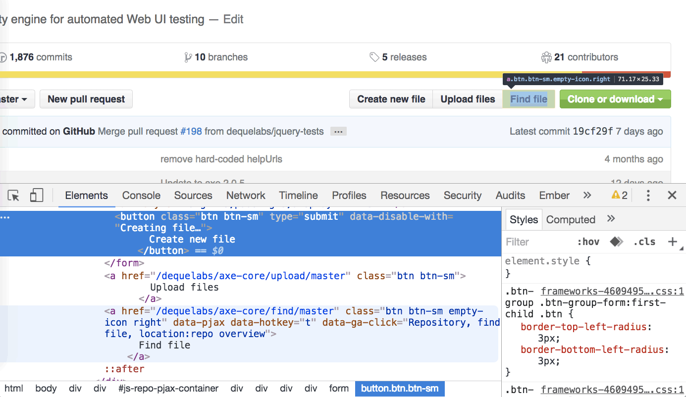

Github: Links or buttons?

Something that comes up again and again in front-end accessibility is the issue of [links](https://developer.mozilla.org/en-US/docs/Web/HTML/Element/a) versus [buttons](https://developer.mozilla.org/en-US/docs/Web/HTML/Element/button). You know, the HTML elements that open links in new windows or submit forms? In JavaScript web applications, it seems we're still confused about which element to choose for user interaction. To try and clarify the haziness, I'll define use cases for links and buttons in client-rendered applications and help you make better UI decisions, from design to development.

## Buttons

Somehow people become web developers without learning about the HTML `<button>` element. (I'll admit it took me a few years before I knew what h1-h6 headings were for, so it happens.) The mighty button is actually really cool. It can do all these things:

- Receive keyboard focus by default
- "Click" with the Space key
- Submit form data to a server
- Reset a form
- Be disabled with the `disabled` attribute
- Instruct a screen reader with the implicit `button` role
- Show :focus, :hover, :active, :disabled

With a little scripting, a button is the perfect element for:

- Opening a modal window
- Triggering a popup menu
- Toggling an interface
- Playing media content
- Inserting with JS if they only work with JS

## Links

Here are a few of the basic features of links, a.k.a. anchors, a.k.a. the foundation of the Web:

- Create hypertext, a network of online resources
- Navigate the user to a new page or view
- Change the URL
- Cause a browser redraw/refresh
- Support page jumps with internal `href` attributes
- Deep-link client-rendered applications
- Are focusable by default with the `href` attribute
- Register a click with the Enter key
- Have the implicit `link` role
- Can't be disabled like buttons but can be made inert with `tabindex="-1"` and `aria-hidden="true"`
- Allow opening in new windows (and back in the day, framesets)
- Show :link, :visited, :focus, :hover, :active

The starkest difference between a link and a button to me is that a link navigates the user to a new resource, taking them away from the current context (internal links are the only wrinkle here). A button toggles something in the interface, like a video player; or triggers new content in that same context, like a popup menu using `aria-haspopup`.

### What is navigation? What is routing?

Changing the URL means a user is navigating to a new page. It refreshes the browser with new resources and redrawn pixels. Navigation can be triggered with form actions, anchor links and JavaScript `location`.

Much like filtering in a mail room, routing is the mechanism for connecting network requests with the appropriate content in an application. Routers are common technology in various web development frameworks–I remember lusting at PHP ones early in my career–by mapping URL fragments with views and subviews. By writing dynamic routes, new content can be created without hard-coding.

### Where does the confusion come from?

In the world of client-rendered web applications built with Angular, Ember or React, a browser redraw can be triggered at any time. It's somewhat hazy which element is right for the job when you can execute the same code as a route but with a button click handler and no URL change. For example, if I open a panel over the existing page content, am I navigating there or toggling the interface? Does it depend if the panel is deep-linked with a URL? Here's some code I saw recently:

```
<a href="#" tabindex="0" ng-click="userPicker.userClicked(true)" aria-label="Some username"></a>
```

My immediate recommendation was to use a button element since there's no `href` value, but there is `tabindex="0"` and an `ng-click` binding. It looks obvious, right? I got a response that it should remain an anchor because "it routes to external page links and re-routes to profile pages." That would only be clear by studying the JavaScript code, which is invoked in many similar instances by `ng-click` bindings on button elements. Should it require such a deep analysis to recommend the right HTML element?

In a client-rendered app with proper focus management, the user may not be impacted by this–a link with `ng-click` and `tabindex` will still have the implicit link role. However, it would be much more declarative to use a populated `href` and routing if an anchor navigates the user to a new resource. Tabindex and click events tacked onto an anchor tag are a markup anti-pattern that will trip up future developers and code reviewers.

Making routing a core part of a web application makes it easier for developers to use links where appropriate and helps to clarify the purpose of buttons. It also makes it easier to create progressively-enhanced, server-rendered JavaScript applications using URL schemes instead of relying on click events.

## The Role of UX in Accessible Development

I'll say it out loud: this confusion often begins with Design and UX. A design comp comes to you with boxy interface buttons, and–because reasons–they have to be coded as links. Where does that become a problem?

If a screen reader user calls tech support and gets instructions to "click the button" in your UI that's really coded as a link, they may have trouble finding it. Also, consider voice interfaces: if you say a command to click a button but it's really coded as a link, you might have problems, no?

Frameworks admittedly blur this line and make it easy to choose the wrong element, like the above `ng-click` example. We can use JavaScript to trigger asynchronous form submissions on any element we want (without a `form` tag, even, but you still need one). Similarly, we can initiate view changes without routing, even if it's best handled with link. Some elements are better for the job than others: it's all about taking advantage of the most native features of that element as possible.


Can you spot the difference?

### What can we do about it?

Push back on Design to make links look like links and buttons look like buttons. Removing the ambiguity makes it easier for developers to code more accessibly and better meet user expectations. _(Can I right-click this boxy button to open in a new window?)_

In development:

- If a screen reader user tabbed onto an interactive element, would its role tell them what to expect? (Would it navigate away from the page? They'd want to know.)
- Suppressing link features like URL changes or right click? Consider a button.
- Encourage routing in your application with `href`, `ng-href`, etc.
- Page navigation deserves title changes and history.

### This isn't over.

I'm sure this conversation will continue to swirl around into eternity, [as it has](https://www.sitepoint.com/community/t/anchors-without-href/6690/7) for [many years](http://www.webaxe.org/proper-use-buttons-links/). Each time you code an interface, you'll have to make a judgment call about which element is the correct one....and there are millions of ways to code the same thing. As long as you're making educated decisions, that's the best you can do.

For developers who work on the code after you, being declarative may help to educate them on this subject. And most importantly, consider your users' interaction expectations rather than getting _Radical™_ with interface design. Making intuitive interfaces reduces friction and keeps users happy.
