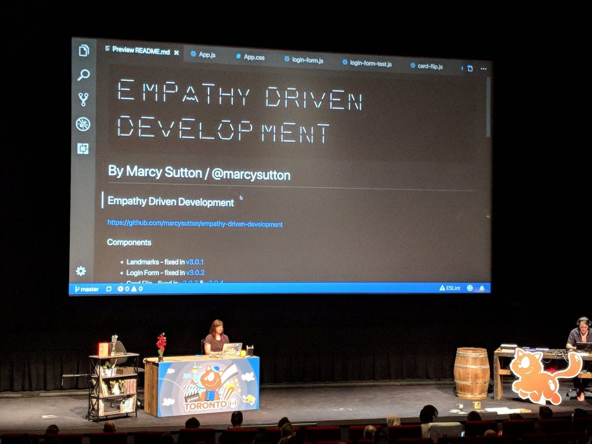
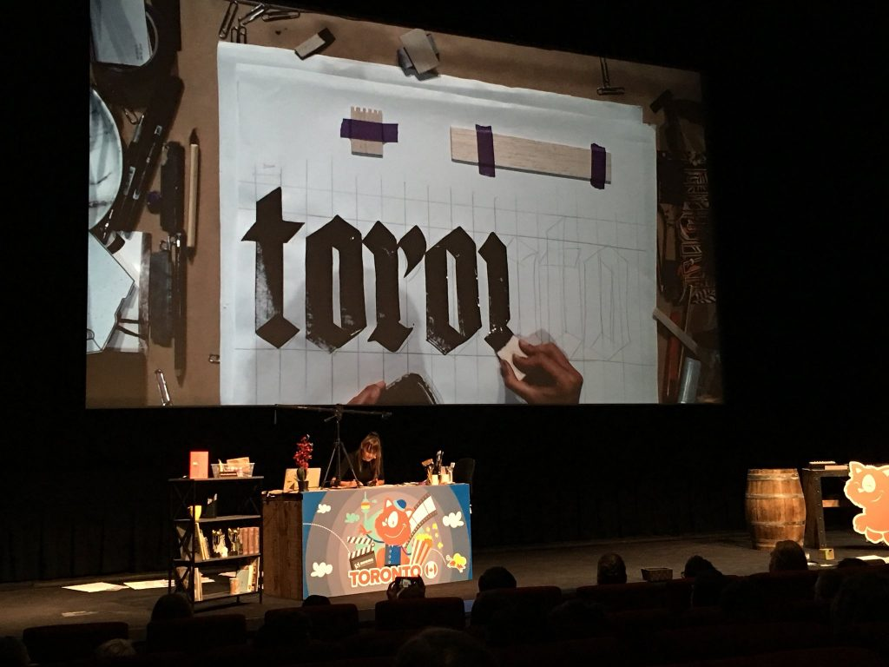

Photo by [Tiho Tadic](https://twitter.com/tihoni/status/1012015009881378817 "Twitter opens in a new window")

This year, I accepted a challenge from [Smashing Conference Toronto](https://smashingconf.com/toronto-2018 "Smashing Conf opens in a new window"): present a talk on live accessibility debugging with no slides. I thought this format sounded fantastic for attendees, as they'd be able to pick up tricks more naturally from industry leaders, seeing how they identify and solve problems in the moment.

It helps to see _how_ something is done to finish watching a talk feeling like: "I can do this, too." For web accessibility in particular, I've gotten feedback that seeing hands-on coding is more helpful than simply hearing about it from a conceptual level. But…

## “Why on Earth did I agree to do that?!”

I accepted speaking at Smashing Toronto without second-guessing it, (incorrectly) assuming it would be less work to create a talk without any slides. In fact, prepping a no slides talk took just as much effort as a traditional presentation, if not more. It was certainly more stressful to prepare than I anticipated (hello, anxiety); however, the delivery was a lot more fun. Using a custom [React demo app](https://github.com/marcysutton/empathy-driven-development "Opens in a new window") for live debugging, in the end I felt like a more active participant going on an adventure with the audience. It was worth the effort and risk taking!

For your benefit as much as my own, I collected some thoughts and takeaways of things I learned from doing a series of live coding talks this year:

## Don't forget the narrative

I presented hybrid live-coding/with slides talks at [dotJS](https://www.youtube-nocookie.com/embed/LdKjS94ugYI "dotJS Youtube: opens in new window"), [Beyond Tellerrand](https://www.youtube-nocookie.com/embed/WTQAI9TzBx0 "BT Conf Youtube: opens in new window") and ScriptConf, before settling on a single no slides/live coding talk for [Uphill Conf](https://www.youtube-nocookie.com/embed/wvGvJemoDHI "Uphill Conf Youtube: opens in new window"), [JSConf EU](https://www.youtube-nocookie.com/embed/l95VFLj3e2w "JS Conf Youtube: opens in new window"), and Smashing Toronto. I learned more each time, but one of the biggest takeaways from all of them was that anything under 40 minutes is extremely difficult for this format.

In general, I like creating talk narratives with three major areas of focus, and that strategy simply falls apart at 18 or even 25 minutes due to the increased cognitive load of live coding. Time seems to get away from you much faster when you're tinkering and explaining things, and it's easy to forget important parts of the narrative.

Two things I noted to improve early on were to introduce myself better and to recap what we learned at the end. I rarely use speaker notes, so for me presentation slides usually act as a device to remember these things. Without them, it's easy to both start coding too fast and end the talk without enough of a summary. I go back and forth on the necessity of introducing myself when an emcee has already done it, especially for shorter talks (<25 minutes)...but if the audience doesn't already know you, it helps to explain who you are and what you do. The wrap-up at the end is critical, though. Restate the main points of your talk, where to find resources, and how to contact you. It helps folks listening to prioritize information and solidify what they learned!

## You can cheat for repeatable success

I don't know about you, but for me it takes a lot more brain power to present 40 minutes of tested coding solutions and anecdotes than it does to tinker on a project in my free time. Maybe it's the time constraint, or maybe it's the stressed human response to being front of a large audience...but if I have to remember a whole project's worth of precise changes to make something accessible up on stage, it's a heavy cognitive load. Some coding tasks also take more time than you can reasonably spend while 300+ people are watching, such as typing out event listeners and boilerplate code.

To make things easier and faster, I found a few techniques for live coding talks that made the cognitive load more manageable, including:

- Code snippets in Sublime Text (or your favorite text editor), where you can start typing and hit TAB to autocomplete the rest of the solution
- Git tags for "staged" code solutions, which have the added benefit of helping people follow along on their own from the demo repository

For talks that are less technical in nature, half-finished materials that you can pick up to complete progress are a great way to go. It reminds me of cooking shows where they'd prep ahead or partially cook a recipe so they could show each step of the process in 22 minutes or whatever.

In [Gemma O'Brien's amazing talk](https://smashingconf.com/speakers/gemma-obrien "Smashing Conf opens in a new window") at Smashing Toronto on lettering and drawing, she had some partially-finished pieces to complete in front of us with ink on paper, which was both soothing and inspiring to watch. She also did a great job of describing how to hold her pens and writing tools, although saying "it's easy" made me chuckle because she was such a natural at it. :)

Gemma O'Brien doing live calligraphy at Smashing Toronto, photo by Patricia Basuel - [@pbasuel](https://twitter.com/pbasuel/status/1012044502574489601)

## Describe your actions in detail

This applies to regular talks and coding screencasts, as well: describe what you're coding or doing on your computer so people can follow along. In a live coding talk you have to fill the time while actively typing or debugging, ideally without periods of silence. Describe your keyboard shortcuts, tools already installed, things you tried previously, etc.

The best reason to do this in any kind of presentation is one that I've considered from day one for accessibility purposes: without saying aloud what's happening on the screen, blind and low vision folks can't follow along. It also helps if a video recording misses what's happening on the screen, like in my [first talk at JSConf](https://marcysutton.com/summing-up-jsconf-eu-2014/).

## Things I wish had gone differently

I wish I'd had more time to show additional techniques, especially in the shorter length versions...but I can appreciate that a 25 minute talk is easier to sit through as an audience member.

I ran into limitations with JavaScript tools for automated accessibility testing, leaving me to wonder if people would actually go the distance to implement it into their own projects. But rather than feel dejected, I decided it would be my mission to make these kinds of things easier by opening issues against testing frameworks and creating snippets for people to get up and running.

### Accessibility testing takeaways for future reference

- Issue 1: you can't trigger a button click with the Enter key in [Enzyme](https://github.com/airbnb/enzyme/issues/441#issuecomment-398278568 "Opens in a new window") like you can in Selenium Webdriver
- Issue 1a: [Simulant](https://github.com/Rich-Harris/simulant "Opens in a new window") wouldn't trigger events in React for me, likely because they were bound to individual DOM nodes and not delegated in the same way as React's Synthetic Event
- Issue 2: focus management in React after a CSS transition requires a setTimeout, and/or some other kind of [wizardry in your test suite](https://twitter.com/brianskold/status/1009383639379922944 "Opens in a new window")
- Issue 3: Selenium Webdriver's JavaScript docs are seriously lacking
    - Promise-based everything is hard to implement when things don't logistically chain (i.e. comparing the activeElement to some other element)
    - This became somewhat easier using async/await in my tests, but that made debugging test failures much more difficult

One other thing I wish I had more time for: multiple versions of my demos in other JS frameworks, or without a JS framework. [Ryan Florence's JSConf talk](https://www.youtube-nocookie.com/embed/CBhDdWY1uv8 "Opens in a new window") comes to mind. I was balancing my job and life with these talks and couldn't even think of doing that…but with more time and a [shift in focus](https://marcysutton.com/chapter-two-at-deque/), perhaps I can recreate them in Angular or Vue.

### Do better

Lastly, this goes beyond live coding talks or even work in general: don't let mistakes or emotions rule so much of my productivity. It's really depressing out there in the world, and sometimes I have conflicts or disagreements with people. If I keep letting self-hate or stuff out of my control slow me to a crawl, I'll never get enough done to feel satisfied. Emotional hijacking gets in the way of my real objectives, like making the web a better place.

Reading The Subtle Art of Not Giving a F\*\*\* really helped me to prioritize better values, and "social media presence" is not one of those. Being helpful, kind and understanding is (even if people don't know the whole story, it doesn't really matter. Yes, I'm being intentionally vague here).

## Thanks for the opportunities & champions

After four solid years of public speaking, I'm taking the rest of this year off for personal growth and recovery. I'm appreciative of all the opportunities I've gotten, even if I couldn't accept every single one. When I look back to [where I started](https://marcysutton.com/jsconf-2014-australia-accessibility-shadow-dom/) as a total newb, completing a series of live coding talks feels like a big achievement.

> If you're a speaker looking to get out there and move the needle on accessibility, [please let me know](https://marcysutton.com/contact/) so I can recommend you!

Each time I hear someone say "I'm more motivated about accessibility now after your talk", or "I never even knew accessibility was a thing before this" it makes me happy beyond belief. More importantly, I've seen a number of new accessibility champions rise up in the past few years after becoming acquainted at mainstream conferences like JSConf, and it brings the biggest smile to my face every single time. To those of you making accessibility efforts large and small, you are making a difference. Thank you!
