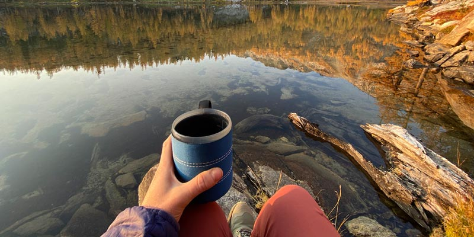

I started a company, Modern Sole Design LLC, [one year ago](https://twitter.com/marcysutton/status/1313576837323186176) to work independently as a web developer and accessibility specialist. I worked with a local attorney to develop my company’s operating agreement and initial annual report in the State of Washington (which I just renewed, one year later). It was a bit scary and took a leap of faith to leave full-time employment behind but I’m happy to report that after a year in business, _Marcy Sutton the freelancer_ is really thriving.

<figure>
    
    <figcaption>Taking time away from the computer in month 1 for a solo backpacking trip.</figcaption>
</figure>

Since September 2020, I’ve worked with numerous clients on projects specific to their needs. I worked on automated accessibility testing for Tenon, accessibility engineering for the open source platform Forem, product consulting and developer relations for Evinced, accessibility office hours for Substantial, accessibility training for Microsoft and Google, as well as accessibility engineering for a meat delivery service.

I love having a focus on accessibility as an independent lead-level web developer with knowledge to share. Over time I’ve fine-tuned my engagements to do more of the work I want to do and less of the stuff I don’t, which is also in my clients’ best interest. Increasingly, by taking an active role in guiding my deliverables toward accessibility engineering, I’ve gotten to work on things I really enjoy. As a result, my career feels healthy and sustainable for the first time in years.

Independence is not without its stresses. It was a lot of work to get a business up and running while contributing new work at the same time during a global pandemic. To be honest, I ran on adrenaline for most of the first year to make sure I could survive. I pondered whether I would ever go back to full-time work on a team as compelling roles came up and contacts reached out. And yet, I kept moving forward. I was challenged, invigorated and empowered to fulfill my own career destiny. My only wish is that I would have done it sooner.

## Pros and cons

The biggest advantage: I am my own boss and I am responsible for my own output and customer satisfaction. I don’t worry about mismanagement, big egos, organizational friction, or any of the expectations or misalignments that contributed to feeling burned out as an idealistic woman in the tech industry.

Another advantage: I love the flexibility of working part time. I no longer feel like my time on this Earth is being wasted when things are a bit slow. I just do something else that day, starting with a workout. Scheduling freedom and a smaller workload have been huge contributors to my improving mental clarity, health, and energy. Life really is short and I am a happier person with a better work-life balance. For real, though.

There are definitely drawbacks, too. Although I got a glimpse on my last contract, I miss the camaraderie of working with teams. I miss people in general and really felt isolated around the holidays last year.

I also pay a lot more in self-employment taxes in the United States than I would pay in taxes as an employee. Still, I chose to create a [single-member LLC](https://www.irs.gov/businesses/small-businesses-self-employed/single-member-limited-liability-companies) to simplify my taxes with a single personal tax return that I file with the help of an accountant. Since I prefer working alone and don’t plan to hire any employees, this made sense. I may shift to an [S-Corp structure](https://www.irs.gov/businesses/small-businesses-self-employed/s-corporations) in the future but that would require monthly or quarterly payroll taxes and a lot more business admin work. For my current part-time effort, it doesn’t seem worth it. But someday it might.

Another drawback: my contracts are hourly so I am probably missing out on some income I could earn on more of a project-basis (I’m open to advice here!). For example, my friend Jason Lengstorf told me he charged a flat fee for a week of work but that sounded like more of a full-time gig in a week-by-week disguise. I am carefully protecting my health and freedom from overwork now that I’m mostly [healed from burnout](https://twitter.com/marcysutton/status/1292971874570256385).

Here’s something I wasn’t expecting: banks require 2 years of tax returns for a mortgage or a mortgage refinance. If you are considering going independent from a full-time gig, it would really help to get a mortgage or other big financial thing lined up first. I did a refinance on my house in 2021 to take advantage of the historically low rates and I had to get my Mom to cosign despite qualifying on my own originally and making the payments myself. I had the privilege of being able to ask for her help and I’m grateful. But it was still unexpected and I’ll have to consider it as long as my partner and I both stay independent. I pay for my own health insurance and business insurance policies, as well.

There has been another great part of starting a consulting business during COVID: I haven’t needed to travel for client work or public speaking at all. It’s had a positive effect on my finances and my mental and physical health as I’m at home every day or traveling for fun instead. I took ample time away from conferences and public speaking to make sure my business was viable and to heal through some major life changes. As I ramp back up with public speaking and upcoming events including [CascadiaJS](https://2021.cascadiajs.com/workshops/marcy-sutton) and [SmashingConf SF](https://twitter.com/marcysutton/status/1452698267586756608), I’m so thankful for the past (nearly) 2 years of rest.

## Moving forward

Looking to the future, I plan to gear my billable projects toward the work I’m best at: accessibility engineering, including tinkering with user interfaces and improving digital access. I want to provide code as deliverables rather than spreadsheets (e.g. not doing accessibility audits). Even though I have zero fear in front of an audience and enjoy presenting, I don’t want to be a "TV personality" that simply hosts events. Instead, I want to use my talents to solve user interface problems and inspire designers and developers to do the same.

For the rest of 2021 and into part of 2022, my focus will be entirely on accessibility workshops including my independent series, Testing Accessibility. The next live workshop on [Automated Accessibility Testing](https://testingaccessibility.com/workshops/automated-accessibility-testing) will occur on November 17. You can view the entire workshop schedule and join my mailing list to receive discounts over on the website as I launch new things: [testingaccessibility.com](https://testingaccessibility.com).

I will be looking for my next billable client by Q2 of 2022. If you have a need for a passionate code expert to work part time on accessible user interfaces, [check out my services page](/services) and [get in touch](/contact)!
