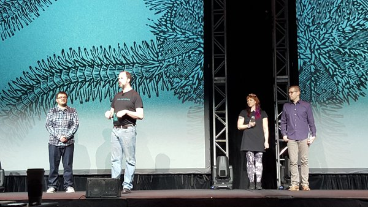

This past week, I experienced something quite remarkable: [O'Reilly](http://www.oreilly.com/ "Link opens in a new window"), the organization known (to me) for web development textbooks with animals on the cover, gave me a [Web Platform Award](https://twitter.com/fluentconf/status/707994740000620544) for my work on accessibility. As if that wasn't breathtaking enough on its own, my fellow award-winners were none other than [Molly Holzschlag](https://about.me/mollydotcom "Link opens in a new window") and [Alex Russell](http://infrequently.org/ "Link opens in a new window"), two web champions I still can't believe are my colleagues.

When I started out in web development after pivoting from photojournalism, I had a fire lit inside that carried me up, and up, and up. At various points along the way I became aware of issues in the industry, including gender imbalance and the need for accessible web interfaces. Being a problem solver, I set out to improve those things in whatever way I could. I questioned wanting to "be the accessibility girl" at one point, however, my [first CSUN conference](/csun-accessibility-conference-recap/) forever changed my outlook. I forged ahead in supporting Girl Develop It to personally encourage more women to join me in this industry. And I [worked accessibility into every project](/how-i-audit-a-website-for-accessibility/) I could, budgeted or not, because I cared about it deeply.

To be recognized by an organization like O'Reilly (despite some rather unfortunate things going on there), I am humbled, strengthened, excited, and honored. I have an extra bounce in my step knowing that my path has been well chosen. I recently changed jobs to follow my heart and passion, and it feels like the right decision ever more. (It feels really good to have [recognition from my employer](https://twitter.com/dylanbarrell/status/708063649902886912 "Link opens in a new window"), too.)

Thank you for your support, web community. I never would have thought my career would be this successful when I was an art student banging my head against the wall learning Actionscript. Staying true to oneself is so important–identify your strengths and follow your heart. With a little bit of luck (and sometimes privilege), the world is your oyster. Give back when you can, and you will be rewarded–I now wake up every day happy, knowing I'm paying it forward. Life is good!

_Photo courtesy [O'Reilly](https://twitter.com/fluentconf/status/707994740000620544 "Link opens in a new window")._
