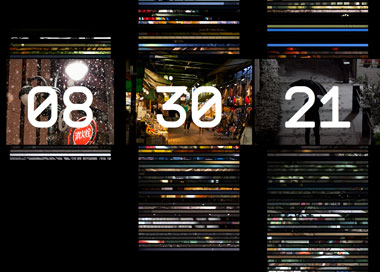

After seeing a few cool web clocks ([Webkit Clock](http://onotakehiko.com/webkitclock/) and the [Hexadecimal Color Clock](http://thecolourclock.co.uk/) in particular), we at POP decided it would be fun to make our own for fun. After a quick discussion, the idea was hatched to hold the first ever POP Clock-Off, a company-wide effort to make web apps that tell time. Since we could write code for modern browsers only (no Internet Explorer, yessss!), my mind ran wild with all the possibilities.

I decided to query the Flickr API and make a location & time-based photo clock. I teamed up with [Nick Thiel](http://twitter.com/nickthiel), former POP Art Director; we brainstormed a bit about how the idea might look, focusing on functional design communication. Nick's design works very well, informing the user of both function of the clock and the relationship of the images.

In just under a week, I coded the Javascript clock logic and layout markup, incorporated the [Flickr API](http://www.flickr.com/services/api/) via JSON-P and used [@font-face](http://www.miltonbayer.com/font-face/) for the first time (so easy & quick to render!). I also got nitty-gritty with jQuery optimization & the prototype design pattern and lastly, I added a city-picker that allows users to choose slideshow destinations. There are so many amazing Flickr photos, I keep checking up on all the cities and trying out new ones. I'd say it was a productive week!

[VIEW POP\_Clock](/pop/clock/)
