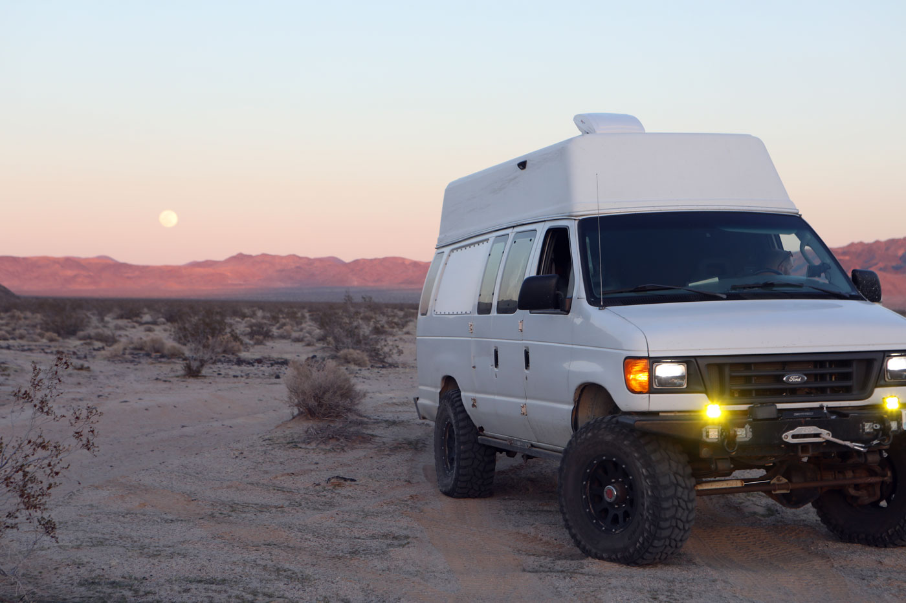
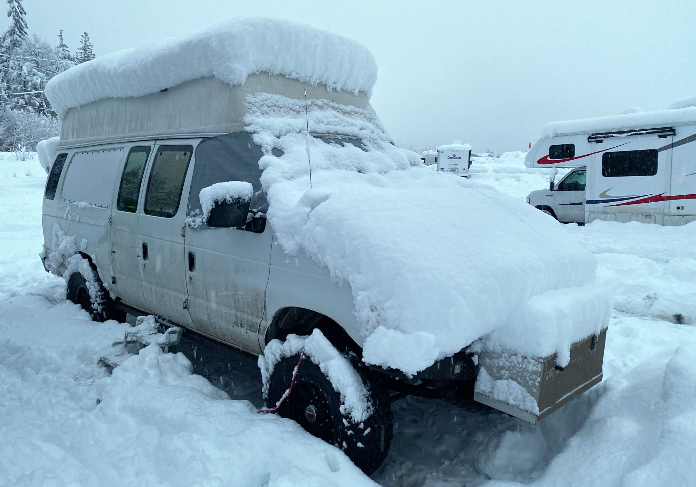
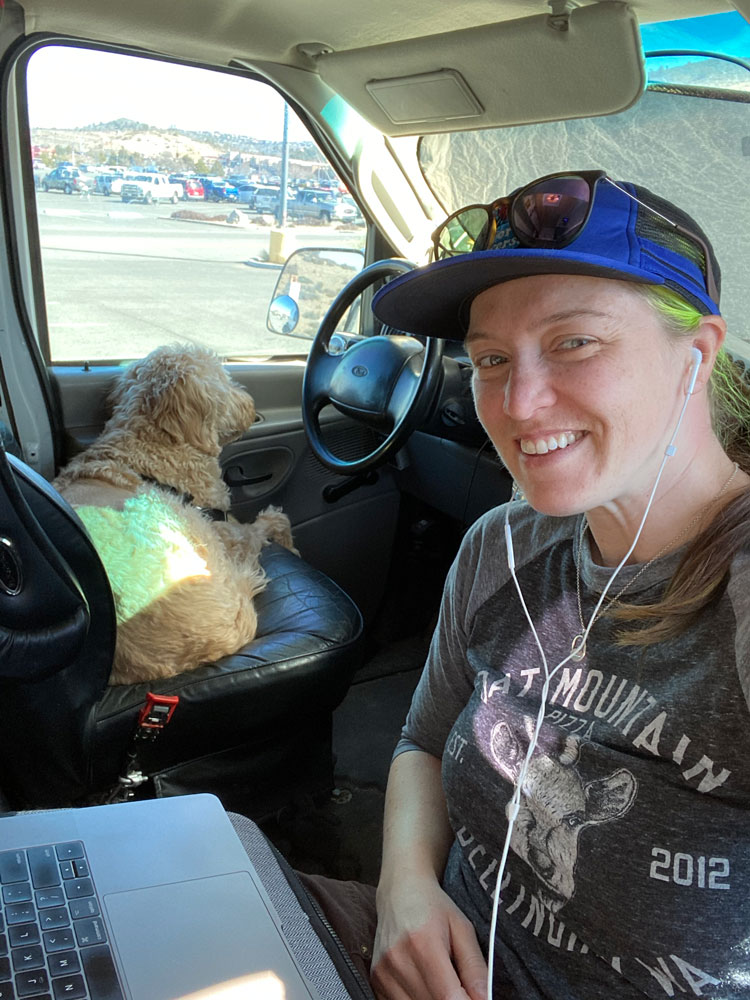
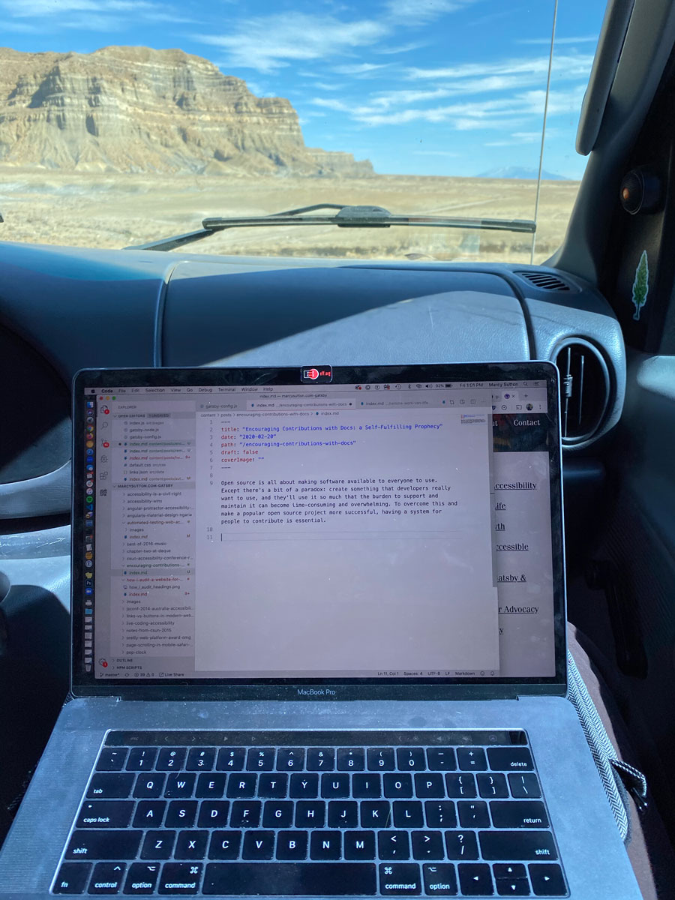
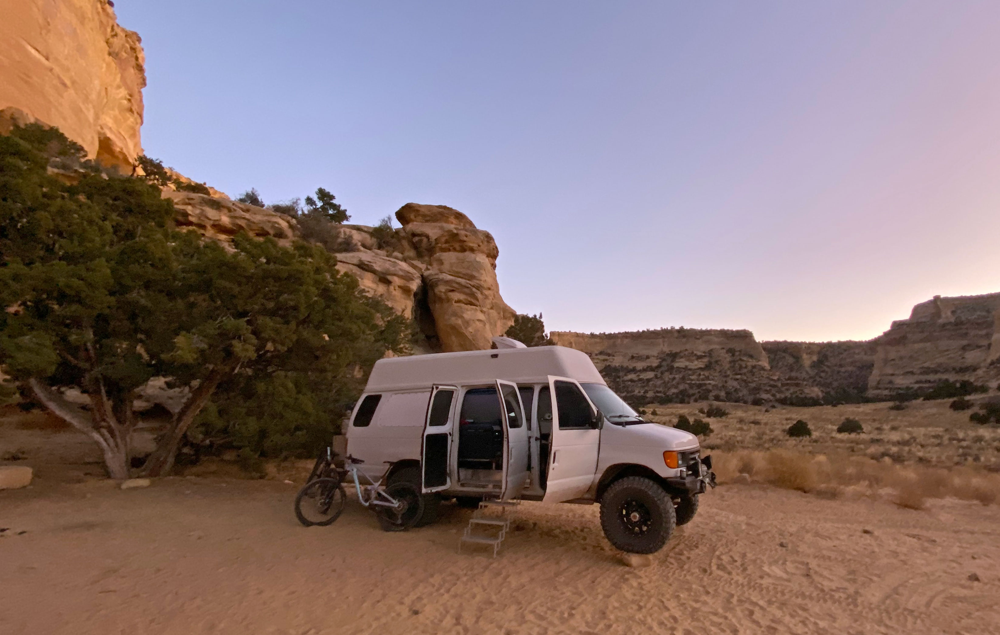
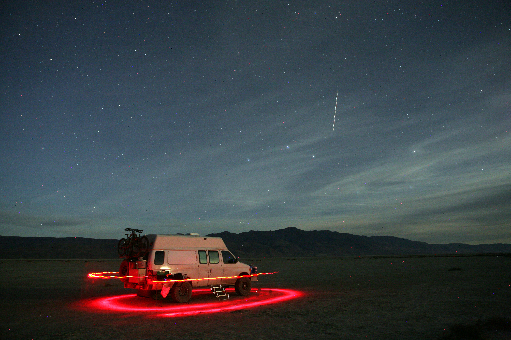
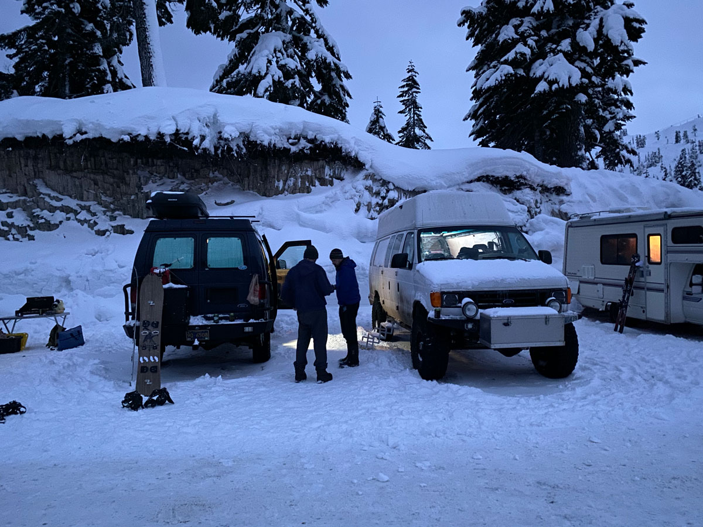
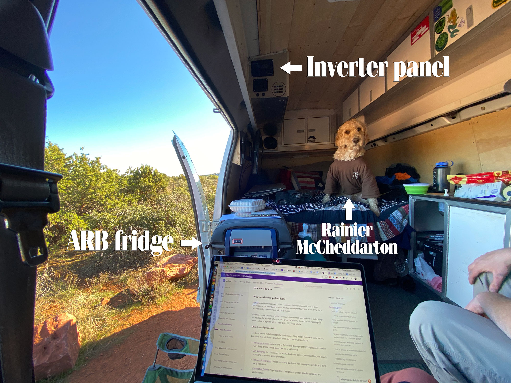
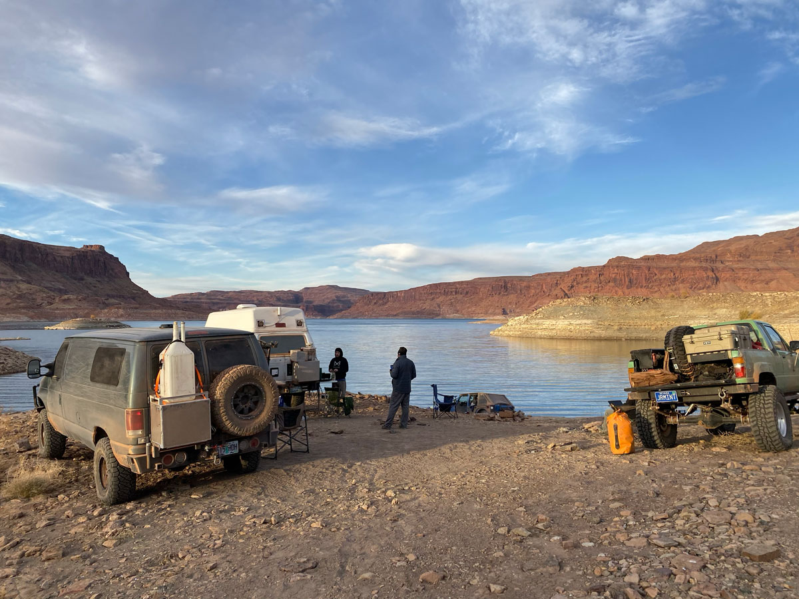
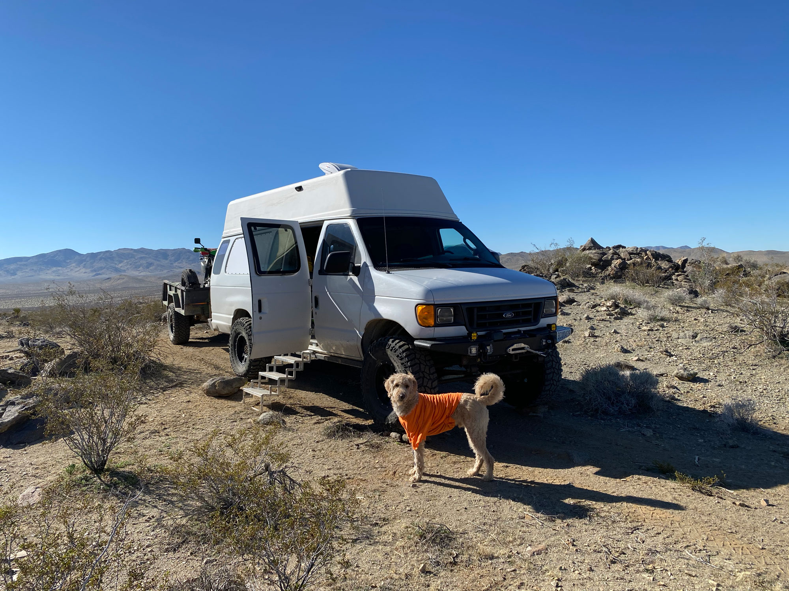

There are many benefits to working a remote job: you don't have to invest time or money in a commute. There's no requirement to work in a distracting open office. You can live where you want within your budget, and do more meaningful activities on your breaks. How about starting a load of laundry? Or going outside for fresh air? Doing office yoga with the dog? Microwaving fish for lunch? You can do all of the above.

In my opinion, the most amazing benefit of remote technology work is the freedom to do your job from anywhere with an internet connection. In the past few years, I've worked remotely for periods of time ranging from a few days to a few weeks in 4x4 vans. They're perfect adventure vehicles.

In this post, I'll share how I made van life work with a full-time job as an engineering manager for a remote website startup. It wasn't always easy, and was very much **not a vacation** during work time. Still, it's a privilege to be able to choose this lifestyle, as not everyone has that luxury. I've gotten to go the back way to places and chase the winter storms and sunny weather I've always dreamed of. With some planning, discipline, and a work/life situation that allows you to get away, it is possible to work remotely on the road and break up your regular routine.

## What prompted this lifestyle?

Ever since a close friend of mine got a 4x4 van (pronounced "four-by-four") and started going on multi-day adventures to ski areas and mountain bike trailheads, I wanted to change my lifestyle of staying in one place or booking hotels for trips. I'd gone camping quite a few times before, but there was something alluring about adventuring in a van; it seemed more my style.

<figure>

<figcaption>I conducted a technical interview for a marketing manager candidate from the Revelstoke, BC parking lot.</figcaption>
</figure>

Snowboarding's been my favorite activity for over 20 years, and having an all-wheel drive vehicle and financial means made that possible. As I got more into cycling in my 20's, I yearned to get out on more trips to places I hadn't been before (Moab, Utah, in particular). I carried a tent in my car and camped for some of those activities, but admittedly not snow camping–I sleep better when I'm not on the edge of freezing all night.

There's endless terrain to ride, hike, and explore around the Pacific Northwest, and I realized that to experience it at the pace I wanted (e.g. arrive in a ski area parking lot the night before a big dump of snow), I'd have to invest in a better camping vehicle and be willing to skip a few showers.

## Making it work

While an absolute joy and a privilege, remote work and van life isn't easy. First of all, I didn't have a toilet inside a van in my earlier life. Or a shower, though we had a completely different setup on our wish list. I always look like a hot mess if I try to call into a video meeting after a few days fully off the grid. I wear hats and don't wear much makeup, but my skin is happier and it's less wasteful anyway. I use a lot of hand sanitizer and have employed a portable toilet with a dedicated outdoor tent, but those were way more difficult to use in crappy weather. I found places to pay for showers every few days, and will always bring thong sandals to wear in the shower.

It's expensive to fuel and maintain an overland vehicle on top of a house, particularly a big custom diesel van that gets wear and tear from constant use. It also costs a lot to use my mobile phone data plan after a couple of weeks on the road, as an average work day for me includes a lot of browser tabs, video calls, and package manager installs. Even so, I choose to spend time on the road and feel fortunate to have that flexibility.

For folks who live in their vans full-time (I don't), there's always a fear that your belongings could be stolen or damaged if you aren't watching them. There are also lots of [people who live in their vehicles](https://www.seattlemet.com/news-and-city-life/2018/11/more-homeless-seattleites-live-in-their-vehicles-than-ever-before) on city streets full-time due to rising housing costs; where I grew up in Seattle comes to mind. Also, if you have to take a vehicle home in for service, you're out of a house until you get it back. If you can work on your own vehicle, you still need shop space to do it, and it can be costly and time-consuming.

Remote work on the road requires a reliable vehicle (and some good luck) to not let you down when you're rushing to find cell reception to meet a virtual commitment or project deadline. I can't take meetings while sitting as a passenger because there's a high probability that my signal will drop, and it's important to avoid disruptions. I only get motion sickness occasionally, but some people can't work in a moving vehicle at all. It's also very sedentary sometimes; that's why bringing bicycles or going on hikes is so nice.

<figure>

<figcaption>A trip where I was notably not working</figcaption>
</figure>

Moving vehicles are also quite loud, particularly beefy Ford vans. So I've stayed stationary while meetings were going on, and increasingly that was a lot of my work week as a manager. I consolidated meetings onto Tuesday-Wednesday-Thursday with scheduled lunch breaks, which required downtime somewhere with decent WIFI for me to do my best work. On a trip to Arizona, I booked 2 affordable Airbnbs for a few days during the week so I could have some quiet and stability and my partner could continue exploring, which made a longer trip possible but definitely added to the cost.

## Our adventure rig setup

When I met my then-partner Marcus in 2015, we talked about the places we wanted to go in the world and went on car/truck camping road trips. He'd built custom offroad rigs and gone overland motorcycling for years, and I happened to have a motorcycle license. We schemed doing longer trips together, but I was traveling a lot as a public speaker (as evidenced by my [talks](/talks) page) and needing downtime at home.

About a year into our relationship he bought a 2-wheel-drive van and converted it to 4x4 himself, making it beefier and more capable with 37" tires and custom front and rear bumpers housing recovery equipment, hitch mounts, furnace and cooking fuel, a full-size spare, generator box, and bike rack. I also put in a queen-size memory foam mattress and a Webasto diesel furnace that made it comfortable.

I came to see a van as a superior overland vehicle compared to motorcycles. I could bring the dog, sleep in comfort all year long, and stow plenty of gear and tools (including a kitchen kit to cook food: I eat pretty well in the middle of nowhere!). I've been able to carry a tripod and camera gear, and rekindle my love for night photography. A van also unlocked the real possibility of remote work for me once I experienced a good "house" electrical setup. I can work on a laptop in the van even when it's raining or snowing outside.

<figure>

<figcaption>Night photography in the Alvord Desert, Oregon</figcaption>
</figure>

### Electrical power and data usage

Iceberg the Beefy's electrical setup included an inverter charger and 3 house batteries that regenerate with an automatic charging relay while driving, or off a generator or solar panel in full sun when parked. It can also plug in to "shore power". This setup enabled me to plug in my laptop and charge devices. Marcus also talked me into getting a TV and DVD player, which ran off the inverter charger and were honestly pretty awesome on dark snowy nights. My friend's van became the dining car and ours became the living room with the front chairs swiveled around: ski area parking lot dreams realized.

Gatsby, my employer at the time, provided a $500 home office credit which I invested into a [WeBoost RV cell booster](https://www.amazon.com/gp/product/B01N705CF3/ref=ppx_od_dt_b_asin_title_s00?ie=UTF8&psc=1) that ran off the inverter and helped with connectivity in the van (but it can't invent a network when there is none or when it's overloaded, like a busy day at Mt. Baker Ski Area). I still use my iPhone as a mobile hotspot and it's enough hardware for me to hold remote meetings from anywhere with a good signal. It can definitely create an expensive AT&T phone bill at the end of the month, especially in Canada or other countries with a $10 a day charge to use a regular plan internationally. So I do that sparingly and work offline, or find WIFI.

I'll probably get a dedicated mobile hotspot like I've heard other full-time van lifers do, so I'm not hammering my phone bill with data usage. I deduct 100% of my phone and internet cost from taxes, and I've had past employers subsidize $100 a month for each of those. Still, when I'm aren't at home, I'm not using the high-performance internet I'm paying for...and it's not good or wise to waste money in the pursuit of freedom. This is where long-term choices are important to sustain my desired lifestyle.

An [ARB fridge](https://arbusa.com/portable-fridge-freezers/) kept food and drinks cold when out in the middle of nowhere, which is great as I love to cook up hot meals. We'd talked about getting a microwave like a friend and his van, but we got by with a Coleman 2-burner propane stove outside and a Jetboil. There was also a stove and sink in that van that weren't fully set up. I couldn't really tell you why other than it wasn't a priority and we didn't want our clothes to smell like onions. I will likely get a microwave or oven in my next rig build, since it can be useful for reheating food. (I still wouldn't force microwaved fish on anyone in a tight space.)

## Dreams

Van life is something I cherish after wanting to go on adventures so badly in years past. Looking to the next 5-10 years of life, I feel committed to building #vanlife even more into my lifestyle because I'm so dang happy when I'm out on the road. Since I have a remote job, I intend to enjoy the opportunity as much as possible.

I haven't prioritized this lifestyle in past life decisions, as evidenced by my home mortgage. To do as much van life-ing as I dream about when the weather sucks locally or I'm on our way home from a great trip and I don't want it to end, it would require some downsizing to my home and financial commitment. That's the beauty of developing life goals and making different choices for a purpose: they give you something to work toward and dream about. So I'll continue going out on the road when I can afford it, and going back to my home base and shop when I need to rebuild and regroup.

<figure>

<figcaption>

Pictured above: a Southern Utah trip led by [Chris Ridgway](https://instagram.com/the_ridge_way) and profiled by [Harry Wagner](https://instagram.com/harrysituations) in [Four Wheeler Magazine: Overlanding and Off-roading in 4x4 conversion vans](https://www.fourwheeler.com/news/features/2001-overlanding-off-roading-4x4-conversion-vans/)

</figcaption>
</figure>

After giving a lot of myself to my career for the past 10 years, including 6 years of international public speaking and accessibility evangelism, it feels amazing to prioritize something else for a change. I traveled a lot as part of my job as Head of Learning at Gatsby, and still remote do talks and workshops from time to time. But after burning out multiple times in my career, my priorities have shifted. I've reclaimed my time in some of the best years of life, and I look forward to an inevitably adventurous future.

Maybe some day I'll get out long enough to drive to other countries, and get all the way down to South America. I'll be in a newer custom rig by then, as that's on my "vision board" so to speak. It's also in reach with some very deliberate choices. I'm a big fan of going the back way to places, like up a mountain on a through-route to the other side, and better facilities and an ergonomic living setup will enable me to go deeper and farther. Sounds like a dream design project to me.

## Got the itch?

Looking to get into overlanding? There's a ton of inspiration out there to be found by searching and perusing Instagram, but it will take research to acquire a setup that's just right for you. Some sites you could check out to learn more:

- [Expedition Portal](https://expeditionportal.com)
- [Overland Journal](https://overlandjournal.com)
- [Overland Kitted](https://overlandkitted.com)
- [Four Wheeler Magazine: Overlanding and Off-roading in 4x4 conversion vans](https://www.fourwheeler.com/news/features/2001-overlanding-off-roading-4x4-conversion-vans/)
- [4X4 7.3 Diesel Campervan Tour](https://www.youtube-nocookie.com/embed/ILy1vpnjkbc)
- [Interview with Egghead.io](https://egghead.io/podcasts/heading-gatsby-s-learning-experience-and-bridging-gaps-with-marcy-sutton)

