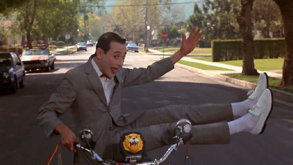
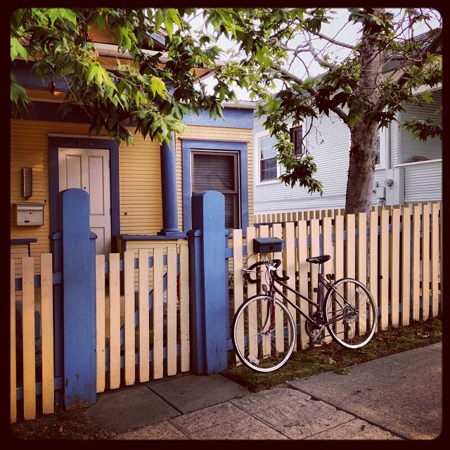

_Originally published on The Pastry Box Project on [February 26, 2015](https://the-pastry-box-project.net/marcy-sutton/2015-february-26 "Link opens in a new window")._

Coming up this week is the [30th Annual(!) International Technology and Persons with Disabilities Conference](http://csunconference.org "Link opens in a new window") put on by the California State University Northridge Center on Disabilities. We'll refer to it as _CSUN_, for short. When I first heard about the conference, I was intrigued to find out it had existed for so many years–I thought it must have quite a legacy. With butterflies in my stomach, I decided to make my first trip to CSUN. Traveling solo and paying my own way, I booked a "bed & bike" on Airbnb that came with access to an older steel bicycle I could ride to the conference each day, a 10 minute ride across downtown. Like a total bike nerd, I brought my own helmet, hand pump, U-lock and lights. I had a delightful time exploring the city by myself. It was warm, as Southern California generally is in February, compared to Seattle where I live. Although I didn't ride far due to the fit and condition of the bike, San Diego was fun to ride. I felt empowered and fulfilled.

At the conference hotel, the Grand Hyatt–where I figured out one could stash a giant bike bag–I spent 4 days learning from experts about one of my passions: accessibility. I made new friends and acquaintances that week, including two blind folks I got to join on walks arm-in-arm down to the hotel coffee shop to chat about web tech: Léonie Watson and Marco Zehe. Hearing their perspectives first-hand blew me away. There were plans for a tandem bike adventure, for which I was enthusiastically ready to pilot visually-impaired people with my helmet. (It didn't happen in 2014, but we're trying again this year.) Each night after way too much fun, I biked back to my cute little house by the downtown freeway, once getting a flat tire that I pumped up just enough to make it home. I was pretty excited about biking in new cities and made a point to do it more often.

> “I rode a bike to the accessibility conference. The seat is up as high as it goes.” #CSUN14

In the year since, I [reflected a lot](http://substantial.com/blog/2014/04/09/csun-accessibility-conference-recap/ "Link opens in a new window") on different parts of that experience, including what I'd learned, how I presented myself, and how I'd like to contribute back to a community that's close to my heart. As it came time to book travel this year, I asked myself a tough question: _is it insensitive to be excited about biking to an accessibility conference?_

I started working in accessibility through my previous job as a front-end developer at [POP](http://popagency.com "Link opens in a new window"), a digital agency. I didn't know anyone with a disability until I became acquainted with Target's accessibility team on client projects. We worked so well together; I learned a lot from them. In 2012, a blind colleague from Target, Steve Sawczyn, started following me on Twitter and after I got over the feeling of _oh geeze...a client is following me,_ we became friends. I thought a lot about what his web browsing experience might be like. “He won't be able to read the text in those silly meme graphics," I thought. “I can't retweet that photo without having to explain the entire joke, thus killing it.” I've never stopped thinking about accessible communication since then. Meeting people with disabilities made me curious and compassionate.

<blockquote class="twitter-tweet" data-conversation="none" data-cards="hidden" lang="en">
<a href="https://twitter.com/steveofmaine">@steveofmaine</a> I had a good chuckle the other day thinking about how to make fartscroll.js accessible to the deaf: <a href="https://t.co/vpH2u54Ry2">https://t.co/vpH2u54Ry2</a>
— Marcy Sutton (@marcysutton) <a href="https://twitter.com/marcysutton/status/333323538574487553">May 11, 2013</a></blockquote>

I became really invested in web accessibility after I realized I could help people with code. I wanted to get past short-lived campaign websites and work on more meaningful projects. In my new job at [Substantial](http://substantial.com "Link opens in a new window"), I took advantage of some downtime and did research on [Accessibility and the Shadow DOM](http://substantial.com/blog/2014/02/05/accessibility-and-the-shadow-dom/ "Link opens in a new window") because I was curious about it. I initially thought it was such a non-issue that Shadow DOM was accessible that I almost didn't publish anything. But I pressed on since there was very little information about Web Components and accessibility at the time. I didn't know if anyone would listen to me, or if I was stating something obvious. But my research began to be quoted and referenced across the web (and is now in the [Polymer FAQ](https://www.polymer-project.org/resources/faq.html#accessibility "Link opens in a new window") on accessibility). 

Before attending CSUN, I was nervous about being an outsider with limited connections to people with disabilities. I was starting to speak at conferences about accessibility. Was I a super-fan, or an impostor? I couldn't just _leave out_ accessibility at work because I cared about designing and building experiences that everyone could use. I thought my heart must be in the right place. I officially learned I'd been saying the right things about accessibility when I heard them echoed by my industry heroes from WebAIM in the first 10 minutes of CSUN. I felt validated and at home. I found my people, actually, and I vowed to fight the good fight for them.

This year when I began planning my trip to CSUN, I [joked publicly](https://twitter.com/marcysutton/status/551492284039307265 "Link opens in a new window") about biking to the conference, and once again, I felt a mixed bag of emotions. On the one hand, I was overjoyed to present my work with Angular.js accessibility and Material Design on my 31st birthday. On the other, I worried it was insensitive to boast about biking to an accessibility conference with a cake on the front rack. But, it was Pee Wee Herman in Pee Wee's Big Adventure that made me feel I was being too hard on myself about the whole thing. Oddly enough, Pee Wee's love for his bicycle and attitude towards life were a way I could gain perspective (the fun/creative art bits, not the movie theater scandal bits). This is where I sorted things out: if you're passionate about something, like biking or accessibility, you should celebrate it. Do as much of the thing that makes you happy as you can. People will respect that. They may even ride on a tandem bike with you.

    <iframe style="position:absolute; top: 0; left: 0; width: 100%; height: 100%" src="https://www.youtube-nocookie.com/embed/vJXU7EVXs2A?rel=0" frameborder="0" title="Pee Wee's Big Adventure - Bike Flip" allowfullscreen></iframe>

