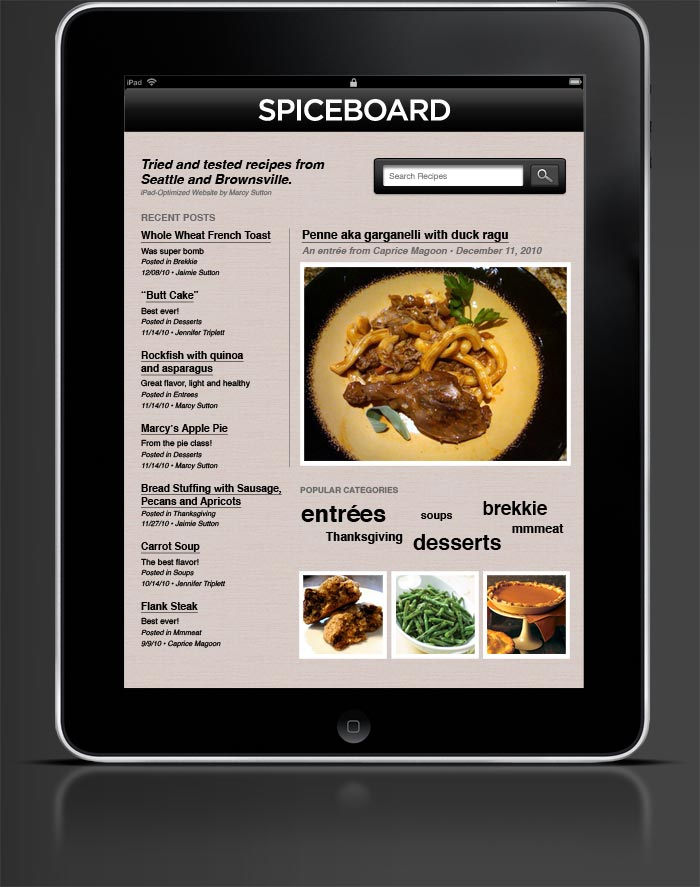

For Christmas this past year I wanted to make gifts for my family using my web skills... what to do? I started thinking: my Mom, sister and sister-in-law all have iPads (I don't), they love to cook (I do too). An idea dawned on me: why not make my own iPad recipe app where we can all contribute content? I surveyed the competition (or inspiration), grappled with web-app vs. native, brainstormed on features and came up with a plan. I decided on the web-app route to leverage my existing skill-set and get this thing done in a reasonable amount of time (I only had a month until Christmas at that point).

I refinined the experience to make our family web-app as useful as possible -- I'm the only web developer in the group, so it was important that both the front-end and admin areas be intuitive and easy to use.

Version 1.0 of Spiceboard includes: (WP = Wordpress-specific)

- Media queries for portrait & landscape layout switching
- Custom tap-to-display navigation menu
- Custom fields for ingredients & preparation (WP)
- Multiple post thumbnails (WP)
- Apple bookmark icon
- Email notification when a new recipe is added (WP)
- Show/hide comments (WP)

Other ideas for the project:

- Custom inline comment plugin similar to Soundcloud that tags a specific part of a recipe (like writing in the margins of a cookbook)
- Swipe navigation, possibly via integration with Sencha Touch
- More content!
