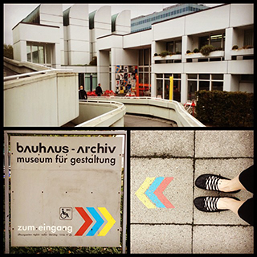
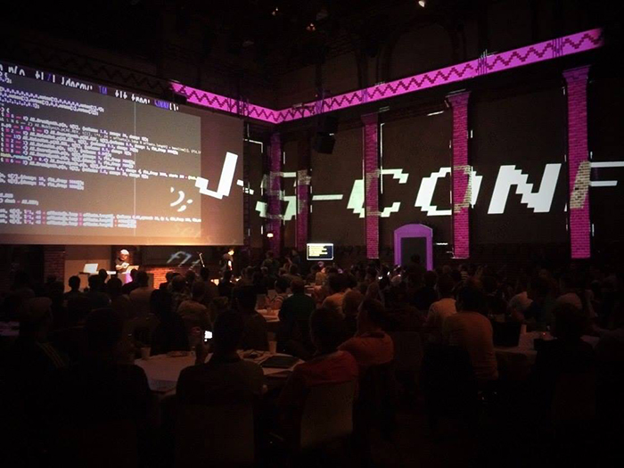
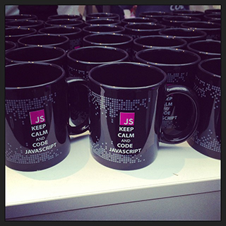
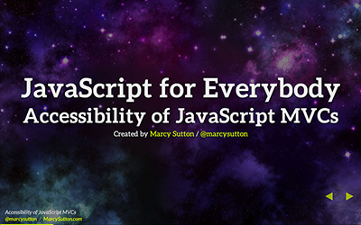
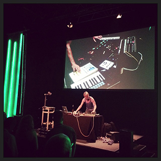

_This post was migrated from its original location on the [Substantial](http://substantial.com) blog._

In 2014 I traveled to Berlin to speak at [JSConf EU](http://2014.jsconf.eu/), a community-run conference for European JavaScript lovers. I'd never been to Berlin before and it was the largest conference so far to accept one of my proposals; I was excited!

## Hello, Berlin

Bauhaus Archive, Berlin

After a couple of days of exploring the city including the [Bauhaus Archive](http://www.bauhaus.de/en/), which is _awesome_, and crashing parties for JSFest Berlin (of which JSConf EU is just a part), it was time to head to Radialsystem V, an arts center in a former pumping station on the Spree River. The opening included impressive visuals on a giant 3D projector and live dance music manipulated with JavaScript ([related reading](https://medium.com/@cramforce/wtf-is-happening-d67a92937584 "Link opens in a new window"))—immediately, I felt at home as a lover of both JavaScript and electronic music.

JSConf EU 2014 opening at Radialsystem V

## The Talks

Here are some of my favorite talks from the conference:

Jake Archibald from Google first spoke about [ServiceWorkers](http://jakearchibald.com/2014/service-worker-first-draft/ "Link opens in a new window"), a new API [implemented in Chrome and Firefox Nightly](https://jakearchibald.github.io/isserviceworkerready/ "Link opens in a new window") with potential to "change the scope of the web more than any feature since XHR." ServiceWorkers provide consistent background processing, enabling better performance, push messaging, offline capabilities, and more. Pretty useful, given JavaScript's single-threaded nature. It was cool hearing about such an important feature that could be usable [soon](http://jakearchibald.com/2014/using-serviceworker-today/ "Link opens in a new window").

I also enjoyed fellow Seattleite and [CascadiaJS](http://2014.cascadiajs.com/) founder Carter Rabasa's talk on the challenge he had sustaining a full-time job while running a conference, Sports Hack Day and a co-working space in the same year. Carter explained how we need to work closer with people in our communities to help produce the best events we can. By not recognizing that people want to help and taking on too much ourselves, everything suffers. As a co-organizer of Girl Develop It Seattle with a full-time job, this resonated quite a bit with me. I've already begun to lean more on members of the GDI community to make our chapter the best it can be.

JSConf EU mug-swag

Another of my favorite talks was by Sara Robinson from [Firebase](https://www.firebase.com/), titled “[What Harry Potter Can Teach Us About JavaScript](https://sarajrobinson.com/jsconfeu/#/ "Link opens in a new window").” She talked about internationalization and how to implement it in a client-side project. Just like accessibility and mobile, internationalization is a lot easier when you plan ahead, especially when dealing with something as intricate as Harry Potter (try translating "Diagon Alley" into 60 languages!). The talk also highlighted something special about European conferences: a focus on multiple nationalities. I would have appreciated more accessible demos and a note or two about performance implications, but it was a cool talk.

Towards the end of day two, Firefox OS contributor Jan Jongboom gave a great talk titled ["Abusing Phones To Make the Internet of Things"](http://www.slideshare.net/janjongboom/jsconf-eu-2014-abusing-phones-to-make-the-internet-of-things "Link opens in a new window") where he hacked a doorbell and created a drunk friend tracker with a $25 Firefox phone, which uses HTML5 and JavaScript. His enthusiasm and curiosity for the subject made it really entertaining. And just a week later [GE announced an interface board](http://makezine.com/2014/09/19/ge-launches-an-interface-board-to-let-you-to-hack-their-appliances/ "Link opens in a new window") you can use to hack your home appliances using Node.js. The future is cool!

I also loved the talks by Brad Bouse, Raquel Velez, Jenna Zeiger, Jan Monschke, and Glen Maddern. I appreciated the wonderfully interesting things people had to say and how they delivered them. I'm excited to see what I missed when the [JSConf EU videos](https://www.youtube-nocookie.com/embed/SmZ9XcTpMS4"Link opens in a new window") roll out any day now.

### My Talk

JavaScript for Everybody title slide

For my European conference debut, I gave a talk titled “JavaScript for Everybody: Accessibility of JavaScript MVCs”, an evolved version of [a talk I gave at CascadiaJS](https://www.youtube-nocookie.com/embed/50o_Ig3lk08"Link opens in a new window"). This time, I delivered it wearing gold pants and sparkles, _because Berlin_. (It was also a device to message accessibility in a less serious way, starting with my own attitude.) The day before the talk, social media buzzed once again about the inaccessibility of VirginAmerica.com, an Angular.js site I've criticized in the past. So, I recorded a new video in my hotel room demoing the site and added it to the talk. When the time came to get up on stage, my nerves were at a minimum, my mind was clear and I got to say everything I wanted to say, including: accessibility is about people; how to understand and utilize ARIA; what to look for in a JavaScript framework; and, how I've made an impact with accessibility on Angular.js Material Design. The demo gods shined that day, as I was able to show off an accessible dance button that played an animated gif with music using Glen Maddern's [x-gif Web Component](http://geelen.github.io/x-gif/ "Link opens in a new window"). I also played a video clip from the inspiration for the gold pants: the German Sparkle Party (they were also paying homage to [Tom Dale and his gold shorts](https://twitter.com/tomdale/status/400980144329728000 "Link opens in a new window")). It went swimmingly, [even without tacos](http://substantial.com/blog/2014/06/19/evolution-of-a-jsconf-talk/)!

For me, a big reason to work hard and travel across the globe for a 30 minute talk is to increase awareness of accessibility amongst people who can make a difference in their daily work. At JSConf EU, it felt successful when people told me things like, "this is what I needed to finally start addressing accessibility" and "I’d never thought of that before." I was especially flattered seeing tweets from influential people like Remy Sharp and Raquel Velez:

> “Partly inspired during [@marcysutton](https://twitter.com/marcysutton "Link opens in a new window")’s [#jsconfeu](https://twitter.com/hashtag/jsconfeu?src=hash "Link opens in a new window") talk and [@karlgroves](https://twitter.com/karlgroves "Link opens in a new window")’ recent open issues, I’ve landed a few aria related fixes to [@js\_bin](https://twitter.com/js_bin "Link opens in a new window").” [@rem](https://twitter.com/rem/status/511087606231474176 "Link opens in a new window")

> “Accessibility is about \*people\* - not thinking about it, and using frameworks that don’t care about it, is irresponsible.” [@rockbot](https://twitter.com/rockbot/status/511080147748143104 "Link opens in a new window")

## The Parties

Ricoloop at JSConf EU

I attended parties for RejectJS and CSSConf EU, which were both lovely. But JSConf EU had two parties that were really freaking cool. [Saturday night](http://2014.jsconf.eu/news/2014/09/01/saturday-night-party.html "Link opens in a new window") at the conference venue, Tim Pietrusky presented "Nerd Disco," and talked about how he’d been inspired by Deadmau5 and started hacking LEDs timed to music. It seemed like a pretty young project, but his excitement was obvious. After Nerd Disco, an artist named Ricoloop got up and did a live set as one-man electronic band. It was awesomely Berlin. Dan Webb from Twitter also got up and played some gritty UK beats, which I loved. We had the whole dance floor to ourselves by that point.

Sunday night, JSConf EU held a party on a boat, the Hoppetosse. Some friends and I walked there after dinner and I got to say most of my goodbyes as I was leaving the next day. (I'm so happy to have made friends in the JavaScript community—conferences have made that possible.) On the way out, I heard an old house song I hadn't heard since going to underground parties back in high school in Seattle. It took some searching, but I found the track: [Pepe Bradock, Deep Burnt](https://www.youtube-nocookie.com/embed/opvopULDhVI "Link opens in a new window"). It will always remind me of the wonderful time I had in Berlin.
