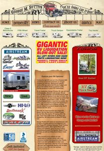
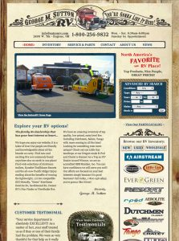

In 2008 I redesigned and built my Dad's RV dealership website, [SuttonRV.com](http://suttonrv.com/). I inherited some cool branding but also some legacy code that went through many hands. Therefore, I decided to start over with a fresh design and build from scratch while also incorporating the existing inventory CMS.

I was responsible for art direction, interface design and development. Because other firms were creating print and online ads, I also created a downloadable brand guide for vendors in order to promote a consistent identity.

See how the design evolved:

Some successes of the project included successful brand communication and a sophisticated user-interface for the RV industry. Most importantly, it provided a robust website during the recent economic crisis, which hit RV dealers particularly hard; online deals helped the company to stay competitive.

Most recently, I handed off full-time production on the site to [Copper Cup Images](http://coppercupimages.com/) in Oklahoma. It's great to see fresh life breathed into the project, including a timely social media campaign. It's important for businesses to increase their exposure and connect with their audiences, and Sutton RV is doing it right.
