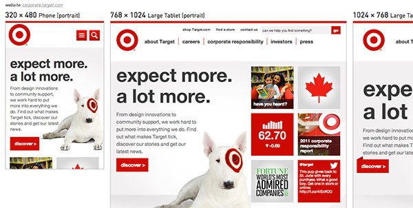
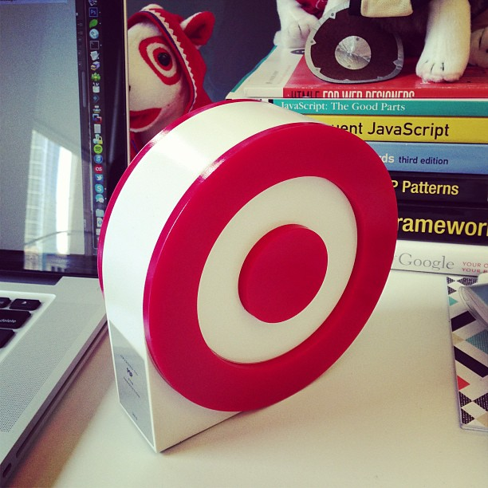

_The Target Corporate Site on Responsivator_

I wrapped up a notable responsive web project in 2012: the [Target Corporate Website](http://web.archive.org/web/20130728214237/https://corporate.target.com/ "Link opens in a new window"), a.k.a. the "best project ever". This project was special because I got to lead front-end development on a redesign for an amazing brand and write modern code that's both responsive & accessible. We also truly had the dream team for a while at POP Agency, showing that harmonious teams produce great work together. In the end, we won Target's Best of the Bullseye Award for innovation for delivering a fresh, functional website our clients loved.



Target's Best of the Bullseye Award for Innovation

> Note: The site has now been replaced by A Bullseye View, which I worked on for a very short time...but it is still nice to be able to revisit the site on the [Internet Archive](http://web.archive.org/web/20130728214237/https://corporate.target.com/).

## Accessible, Responsive UI Patterns

In 2012, responsive web design was just getting started. On this project, I got to work with brilliant designers and the rich Target brand to bring a gorgeous corporate website to life. To shorten the feedback loops between design and development, I got the opportunity to prototype accessible, responsive UI patterns alongside the design team before implementing on the real site with a CMS.

The most notable patterns that we iterated upon before finally implementing included a mobile-friendly and accessible megamenu, and flipping cards on the Target Corporate homepage. I really loved experimenting with those patterns and making sure they were keyboard and screen reader accessible, as well as responsive to various breakpoints.

## Media Queries: Breakpoints Based on Content

For this redesign, there were three sets of comps for the major breakpoints: mobile portrait, tablet portrait and desktop. This kept costs down since it takes time to update every wireframe & comp with client feedback and revisions (holy workload!). Fine, but this required me to make some decisions during the development process: in setting only three breakpoints, I had to account for all of the in-between sizes and orientations beyond what was committed to pixels and shown to the client (this is why developers with an eye for design are so useful).

Some of the specific media queries I used:

```

/* Tablet Portrait */
@media only screen and (min-device-width:1024px) and (max-width:989px),
       screen and (min-device-width:320px) and (max-device-width:1024px) {
   // tablet-specific styles here
}
/* Smartphone Portrait */
@media only screen and (min-device-width:320px) and (max-width:688px),
       screen and (max-device-width:688px) and (orientation:portrait) {
   // phone styles here
}
/* Smartphone Landscape */
@media only screen and (max-width:688px) and (orientation:landscape) {
   // more awesome phone styles here
}

```

During this process I learned the value of designing & developing for mobile first (or content first, even). After a prototype phase focused on responsive navigation, I built the remainder of the chrome for desktop, tablets and phones. The tablet media queries became applicable when scaling to 989 pixels wide—arbitrary, but it worked well across various tablets. Mobile was the environment where screen width and content had to become BFFs: when the main navigation would no longer fit in one row, the whole thing had to collapse into a single menu button (the "hamburger icon") via media queries and JS. This meant that smaller tablets like the Kindle Fire got the mobile layout in portrait mode since they aren't wide enough for the main navigation to fit in a single row. My colleague and I put a lot of effort into making the browser scale up and down fluidly....I call this going after the nerd vote. In modern browsers, drag the screen around and watch it move. Ooooooh, ahhhh. If only all projects had that much time & budget.

## Symbol Fonts for Special Characters

@font-face is awesome. No more cufon, sIFR or settling for Verdana on every website. There are performance implications to replacing all the text on your website but support has come far enough that you can easily use custom fonts in your projects. I prefer to restrict it to headlines but that's just me: I like a snappy-loading site (yet admittedly I have room for improvement around responsive images). Custom fonts aren't just for body copy, however: symbol fonts are totally useful & scalable. Hello, vector icons! Mobile menu & search icons? Sweet!

How do you use a symbol font? You load it with @font-face and type the corresponding character in your markup that gets replaced by the font. This means there are random ô and X characters being indexed and read aloud, however. Solution: specify the character as content in CSS before: and after: pseudo-elements since they are used for display only and not read aloud in screen readers. (Actually, this is no longer true. For more info, read this post on [Bulletproof Accessible Icon Fonts](http://www.filamentgroup.com/lab/bulletproof_icon_fonts.html "Link opens in a new window").)

Here is a CSS code example:

```

/* make the symbol font the default */
    div#menuBtn a {
        color: #fff;
        font-family: 'EntypoRegular';
        display: block;
        font-size: 54px;
        text-decoration: none;
    }
/* put character in :before pseudo-element */
    div#menuBtn a:before {
        content:'i';
        display:block;
    }
/* class set by JS changes display of icon to X (close) */
    div#menuBtn.active a {
        font-family:'Helvetica Neue', Helvetica, Arial, sans-serif;
        font-size:24px;
        height:29px;
        padding-top:5px;
    }
    div#menuBtn.active a:before {
        content:'X';
    }

```

My favorite fonts: [Entypo](http://www.entypo.com/ "Link opens in a new window") and [Symbolset](http://symbolset.com/ "Link opens in a new window"). There are heaps of others. You could also roll your own if you know how to make fonts!

Also note: only Droid fonts come installed on Android phones—even Helvetica would require @font-face. My solution? Just don't tell the Design team!

## Modernizr & Progressive Enhancement

I got to use all the fancy CSS3 and HTML5 I wanted and let IE users get a less-awesome experience since they're using a crappy browser. I set expectations with the client and QA regarding a progressive enhancement policy so they would know that IE8 can't have rounded corners or box shadows. Of course, if rounded corners were the cornerstone of the design and the client used IE8, I would have had to find a way to support them. Modernizr won't solve your problems but it will help you detect feature support in order to provide fallbacks.

## Responsive / Mobile Tools Save the Day

The RWD Responsive Design Bookmarklet by Victor Coulon is extremely useful (though you still need to check on an actual device): [RWD Bookmarklet for Chrome](http://responsive.victorcoulon.fr/ "Link opens in a new window")

You know what else is totally awesome? iOS6's Web Inspector in Safari. Plug in a device to your Mac and open Safari...you can use the console and element inspector just like on your desktop browser!

I also experimented with Adobe Edge Inspect (formerly Shadow) but I had a tough time making it work on an internal network. Most recently I couldn't get any console log statements from a device connected in this way and ditched it. But you may find some value in it.

## Internet buzz

[@RWD shoutout](https://twitter.com/RWD/status/253584501584842753 "Link opens in a new window")  
[Responsivator](http://dfcb.github.com/Responsivator/?site=http://corporate.target.com "Link opens in a new window") (now defunct)
