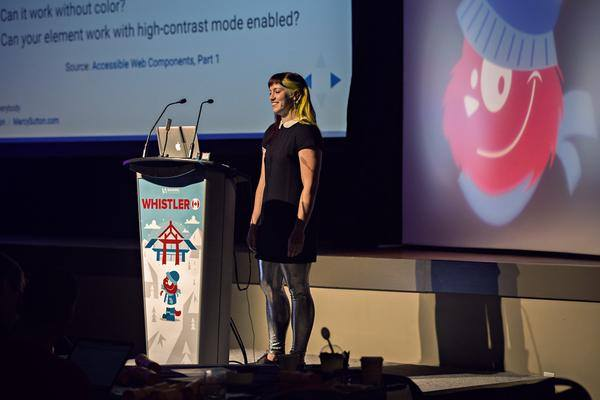

_This post was [originally published](https://the-pastry-box-project.net/marcy-sutton/2015-december-26) on The Pastry Box Project on December 26, 2015._

Have you ever felt excluded at an event even though you were supposed to be there, like a meetup or a conference after-party? Perhaps you gave a conference talk and one or two negative comments ate away at you, making it difficult to socialize. Or maybe someone assumed you were a developer’s spouse, or in another profession entirely, before you were assumed to be a developer.

Even as we are our own worst critics, other peoples’ comments can set doubt into motion. How can we break away from paralyzing sources of doubt and get back to our most brilliant and badass selves? Can you make yourself feel more confident even though you feel the opposite of that and want to run for the hills? This post explores how we can build ourselves up to endure (and hopefully enjoy) social situations in the technology field and beyond.

## Act like you’re supposed to be there.

I’ve often heard the phrase “it’s easier to ask forgiveness than it is to get permission”, attributed to the [celebrated computer programmer Grace Hopper](https://en.wikiquote.org/wiki/Grace_Hopper). I may have taken that advice a bit too far, but I once crashed a giant, lavish party with a friend at a public park. We acted like we were supposed to be there, even though we clearly weren’t, and gained entry to the outdoor event of the decade. Now, I’m definitely not telling you to go party crashing; however, as I became an adult, I saw tangible value in showing up and acting confident. When paired with social awareness, I saw doors open as I navigated situations. (I fully admit to having some privilege here, as well.)

Fast forward a few years to working as a web developer in a male-dominated industry. At times, I was the only female dev on of a team of 25; it was common to feel outnumbered. I wanted to get into public speaking, and local meetups were a place to get started–they were also completely full of men. I remember overcoming nerves when giving my first talk on Accessible JavaScript at "Super Seattle JS", an event for speakers rejected from the CascadiaJS conference. I pushed any feelings of doubt completely out of my mind and tried to bring forward the strongest version of myself. I made some rookie mistakes but I survived–and learned that I could absolutely get up and give a talk in front of hundreds of people. I was supposed to be there.

## Be yourself.

I’ve [heard women say](https://medium.com/@sailorhg/coding-like-a-girl-595b90791cce#.n7zjiids9) they dress down to fit in at meetups or conferences, so other developers will take them seriously. I say forget all that! Celebrate your personal style and wear whatever makes you feel most comfortable. If your style is t-shirts and hoodies, rock a t-shirt and a hoodie. If you sometimes like wearing dresses or skirts, own it and wear them with pride.

<blockquote class="twitter-tweet" lang="en">
<a href="https://twitter.com/marcysutton">@marcysutton</a> <a href="https://twitter.com/KatieK2">@KatieK2</a> <a href="https://twitter.com/helenvholmes">@helenvholmes</a> I started giving all my talks in heels because: A) Stage confidence B) This is what a dev looks like
— Una Kravets (@Una) <a href="https://twitter.com/Una/status/671403745557749760">November 30, 2015</a></blockquote>

As I did more public speaking, my fear of being outnumbered subsided and confidence grew. I started showing up to tech events with the same unabashed confidence I had as a party crasher. While this might not reflect everyone’s personal style, I gave talks in dresses, shiny leggings, and sparkly jackets simply because I love dressing up; speaking was an excuse to do that. When I’m attending an event and not giving a talk, I never choose my attire out of a place of fear. You shouldn’t either, and I’ll tell you why.

Clothing can be used as a device to engineer your mood. Have you ever put on a pair of pants that were too small and you felt terrible? (Hi, I have.) Ever put on your favorite outfit and felt fabulous? Get comfortable so you’re feeling good when you present yourself at an event–your presence will more influential than your attire. You’ll show others that “this is what a developer looks like” as your authentic self, whatever that may be.

<blockquote class="twitter-tweet" lang="en">
Person sat in front of me at <a href="https://twitter.com/hashtag/jsconfeu?src=hash">#jsconfeu</a> has matching streaks in their hair and golden leggings, epic look.
— Rob Ashton (@RobAshton) <a href="https://twitter.com/RobAshton/status/511060979137126400">September 14, 2014</a></blockquote>

## Do a power pose.

“Showing up and acting confident” is easier said than done, I know. As I started writing this post, I thought a lot about people who are more introverted. I’ve also learned personally that extroverts can become introverted under stress: after rough talk feedback, I tend to disappear for alone-time. When I was feeling particularly down after a talk recently, I got some great advice to “do a power pose.” Essentially, trick your mind into feeling more confident by inhabiting a fierce body. Put your arms on your hips like Superwoman and physically feel more powerful.

This advice comes from a great [Ted talk by Amy Cuddy](https://www.ted.com/talks/amy_cuddy_your_body_language_shapes_who_you_are?language=en) a few years ago titled, “Your Body Language Shapes Who you Are”, where she discussed the importance of nonverbal communication in social power dynamics. Her scientific research showed that as little as two minutes spent in a “power pose” can raise testosterone, the hormone affecting confidence, and lower the stress hormone, cortisol. This impacts how others perceive us in all matters of life, from job interviews to conference talks to product pitches. So do yourself a favor and do some power poses if you’re in need of a confidence boost.

## TLDR;

By harnessing our power within, we can impact how others perceive us. But sometimes we need encouragement to show our most confident selves. To feel powerful before a challenging situation, do a power-pose: find your inner strength by “faking it until you become it.” Take pride in your personal style and dress however you feel most confident, not how you think others expect you to be. Act like you’re supposed to be there at meetups and conference events, because you are!
