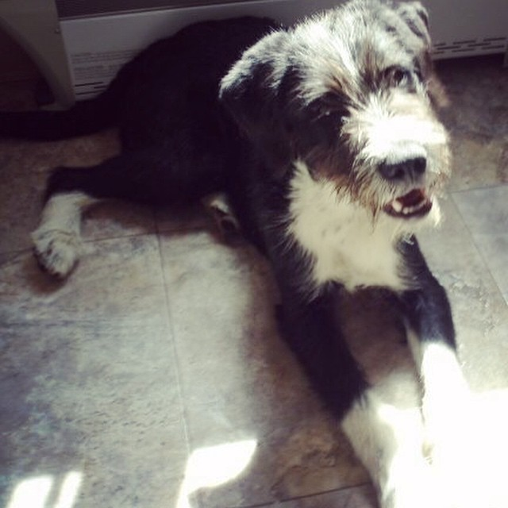
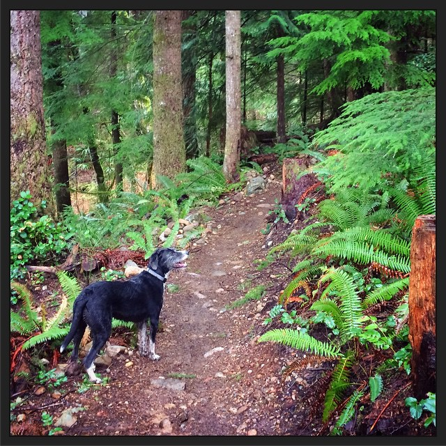
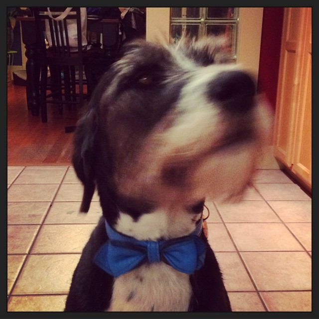
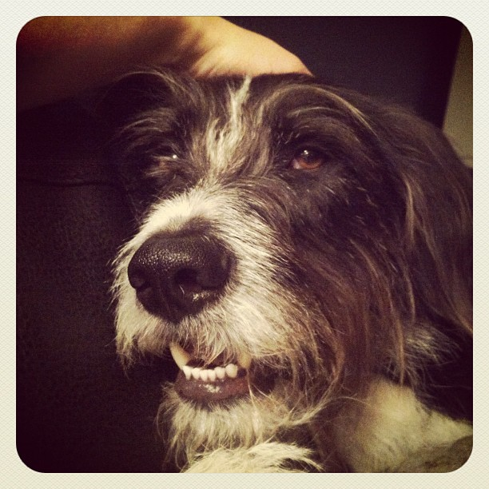
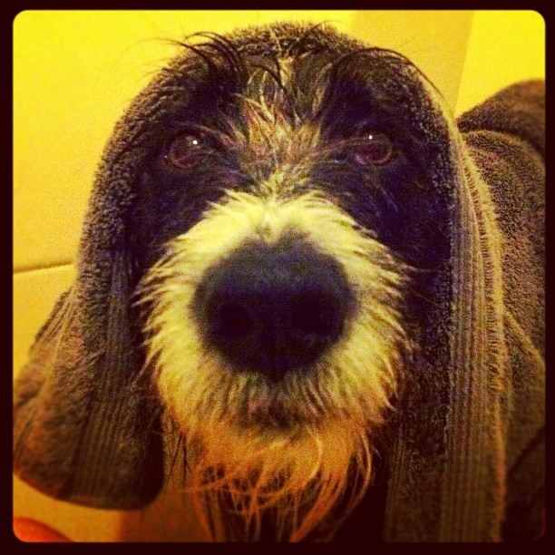
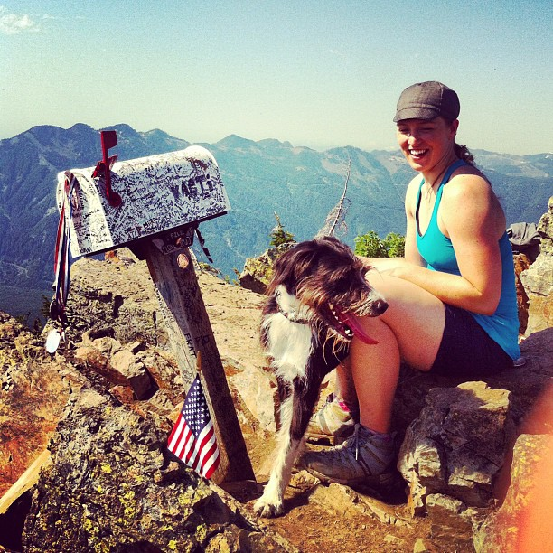
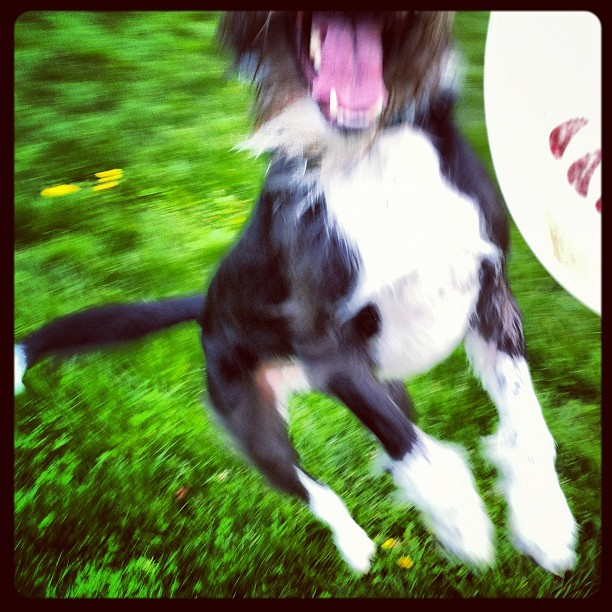
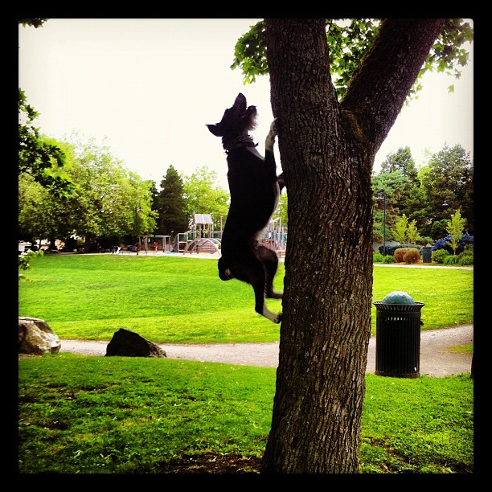

    
    
    

What do you say upon losing a close member of your family? You have to say something to address the loss, and in a way it's healing to talk about it. You also memorialize them with words and pictures: Wally will last forever in my life, whether or not he's around to see it.

This week I took my 7-year-old dog into the vet as he had swollen lymph nodes and poor appetite. He has had trouble cooling down and breathing in the last few weeks, and now we know why: Wally is suffering from lymphosarcoma, a cancer of the lymph nodes that has taken over his body, including his chest. We didn't notice his lymph nodes were that bad until he got a haircut last Sunday. He has lost weight from not eating because of the amount of energy it takes to eat.

I feel terrible I didn't notice his condition sooner, especially after pushing him on a hot, strenuous hike two weeks ago. But if he had to leave us, at least we spent his last weeks together just like normal: enjoying the summer with more time than usual since I took a month off in between jobs.

    
    
    

I keep trying to remind myself, _he's just a dog._ And dogs die. This is life. People lose those closest to them all the time, and they manage. So that's what I'll do. But I'll always remember the dog who transitioned with me into adulthood, who was there through all the relationships and the snow days and the bike rides and hikes. He loved climbing trees and laying in the muddiest of puddles. He would spoon with me on the couch when I was hungover on Saturday, and force me to go play on Sunday. I finally got to take him to the office at Substantial for two years, and he loved it. He got the zoomies in the office one time and everyone stood up, going, "what is he doing??"

I got teased for taking "too many selfies" with him, and I don't care. If it's foolish to love a dog this much, then I'm fine with being a fool. He taught me about unconditional love and that it's okay to be vulnerable. I'd do it all over again the exact same way.

Wally is Mr. Personality, the dog that people said "could have been in the movies" with his beard and eyebrows and his tuxedo. I never got tired of saying what kind of dog he is, because everyone wanted to know; he's Border Collie and German Wirehaired Pointer, and I love him. I fought to keep him years ago, and it wasn't my finest moment. But I feel lucky I got to spend 6 years and 4 months with my superboy, my Wally.

    
    
    

