On a Saturday morning in December 2012, I was at home reading Twitter when I came across [this tweet](https://twitter.com/kissane/status/277478603816587265 "Link opens in a new window") from @Kissane about how fondly she remembered [Webstock](http://www.webstock.org.nz/13/ "Link opens in a new window"). I had never heard of the annual conference before but when I looked at the website, I knew immediately that it looked very special (and was fast approaching in February). My mind started racing and I decided right then-and-there that I was going. With butterflies in my stomach, I asked my boss Dave at POP if he would support the conference registration and guess what: HE DID! My mom booked airfare with air miles and the next thing I knew, I was going to Webstock!

## Hello, Wellington!

[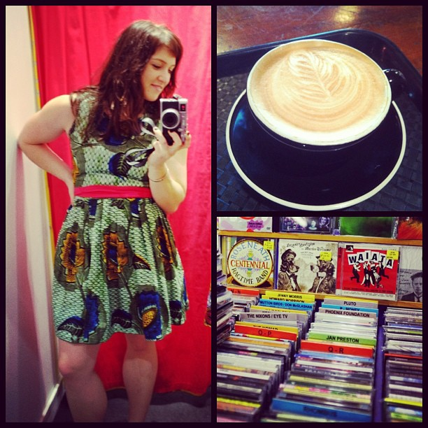](http://instagram.com/p/VqfbmtSXpA/ "Day One in Welly: Link opens in a new window")[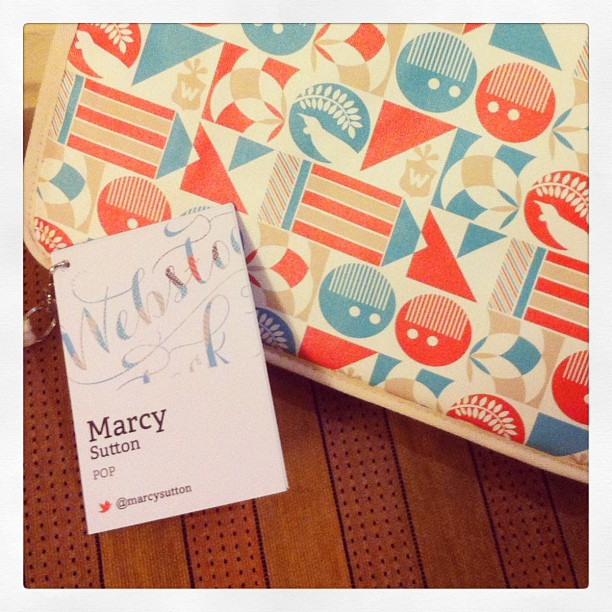](http://instagram.com/p/Vrp1YwSXvz/ "Webstock swag: Link opens in a new window")[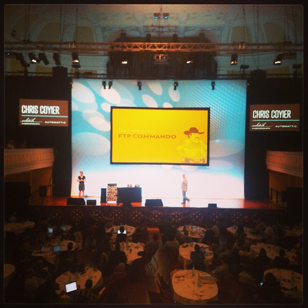](http://instagram.com/p/VsVzzWyXh4/ "Chris Coyier at Webstock: Link opens in a new window")

Sometimes you just have to align yourself with where you want to be by showing up and acting like you're supposed to be there (because you ARE supposed to be there). On the morning of day one of Webstock, I accidentally sat at a speaker's table and started talking with Chris Coyier and Jeremy Ashkenas, happily telling them about some of the accessibility stuff I've learned from working on the Target account. I was pretty embarrassed once I discovered what I'd done but I ended up having great conversations with two of my web development idols. I got to talk with quite a few of the speakers and met tons of wonderful people as the conference went on. When folks repeatedly asked me if I was speaking because I came all the way from Seattle, I realized that I do want to start speaking at conferences (and I'm working on my first proposal on JS & Accessibility). I have Webstock to thank for that great opportunity and boost in confidence.

My slides & notes from presenting on Webstock back home at POP:  
[Image Slides](/stuff/MarcySutton-Webstock.pdf "Link opens in a new window") (PDF, 3.5MB)  
[Conference Notes](/stuff/MarcySutton-Webstock-2013.txt "Link opens in a new window") (TXT, 24kb)

[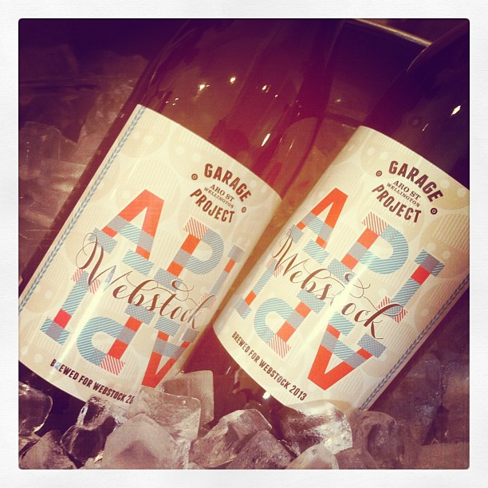](http://instagram.com/p/VseUlXSXtg/ "The Webstock API: Link opens in a new window")[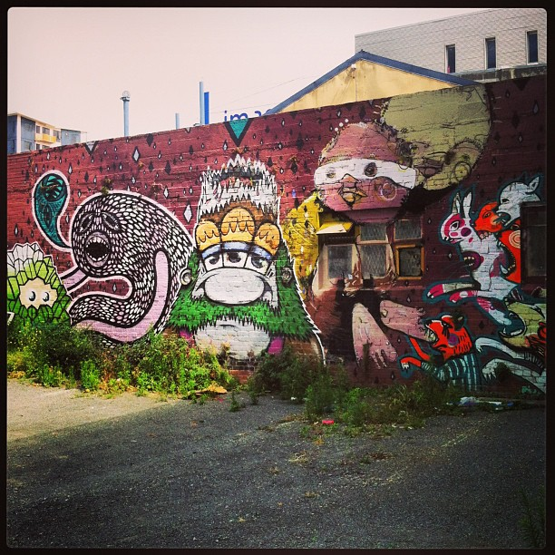](http://instagram.com/p/VxPskeyXly/ "Street art in Wellington: Link opens in a new window")[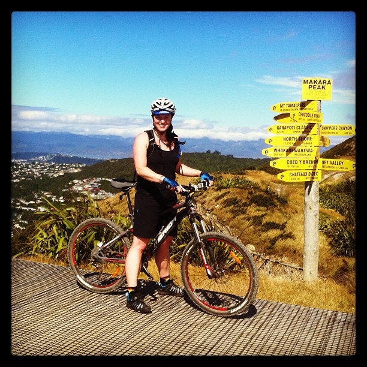](http://instagram.com/p/V0bOehSXhR/ "Mountain biking at Makara Peak: Link opens in a new window")

I don't think the conference could have been any more successful. I met speakers & peers from around the world, heard amazing talks, got crazy excited about my craft and felt myself grow as an individual. The swag was pretty kickass, too.

To top it all off, after two days of Webstock I picked up a rental car, went mountain biking at Makara Peak in Wellington and then hopped on a ferry to the South Island where I explored for nearly two weeks all by myself. I hiked, ate, drank, mountain biked, photographed, danced and explored. I picked up hitchhikers (safely) and talked with people I met in hostels. [I met up with Jeremy Ashkenas](http://ashkenas.com/day-42-flock-hill/ "Link opens in a new window") at a mountain bike race where he rode proper trails for the first time and then we hiked in the most amazing spot at Arthur's Pass. Though I wished my boyfriend Erik could have joined me, I never really felt lonesome because there was always something magnificent to do. My legs were practically falling off by the end of it–what an adventure! Hopefully I'll make it back to NZ for Webstock again in the future...it is a dream of mine to go back and speak there some day. But I definitely maximized my time spent there, returning home fulfilled, refreshed and excited.

» [More photos on Flickr](http://www.flickr.com/photos/59136411@N04/sets/72157632782630459/ "Link opens in a new window")

[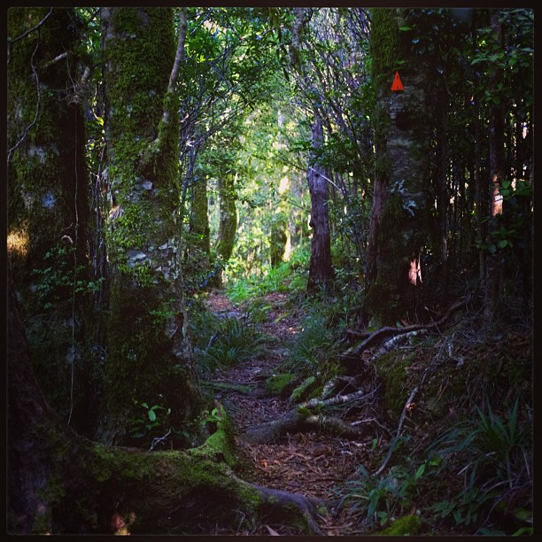](http://instagram.com/p/V6K-OQyXk9/ "Mt. Stokes Hike: Link opens in a new window")[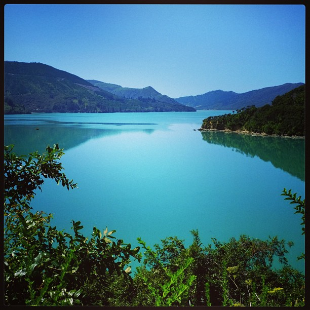](http://instagram.com/p/V5zKXcyXrJ/ "Marlborough Sounds: Link opens in a new window")[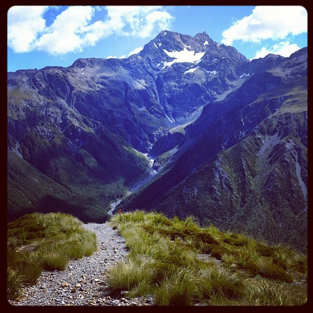](http://instagram.com/p/WBbBxByXin/ "Temple Basin Hike: Link opens in a new window")

[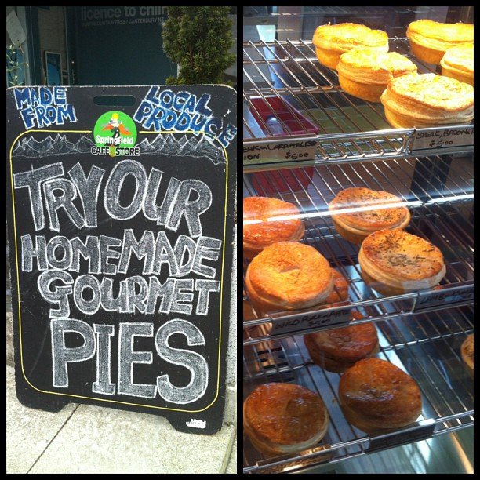](http://instagram.com/p/WAsYe5yXo3/ "Delicious meat pies: Link opens in a new window")[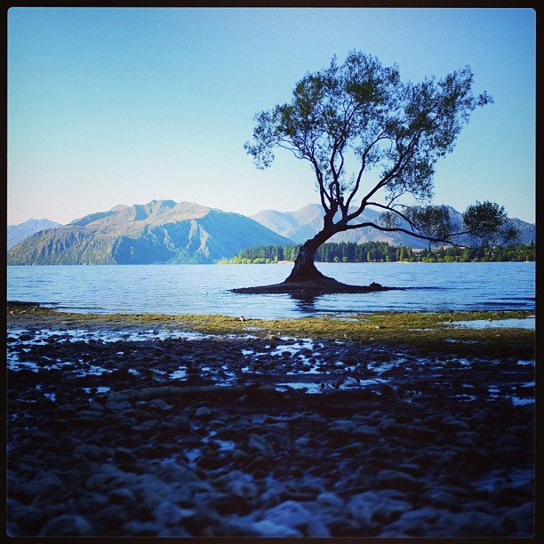](http://instagram.com/p/WGpb9HSXqu/ "Magical Lake Wanaka: Link opens in a new window")[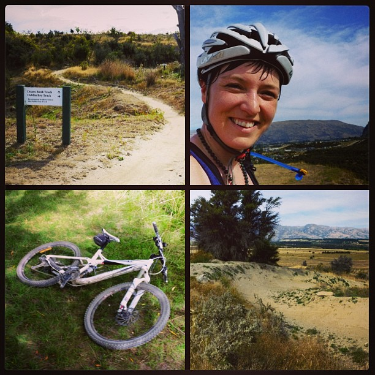](http://instagram.com/p/WI9iDCyXgy/ "Deans Bank Track: Link opens in a new window")

<blockquote class="twitter-tweet">
Two weeks, 1755 km driving, 160 km pedaling on 6 mtn bike rides &amp; 1 race, 3 hikes, 1 <a href="https://twitter.com/search/%23Webstock" target="_blank" title="Link opens in a new window">#Webstock</a>! Thanks New Zealand for a wonderful time!
— Marcy Sutton (@marcysutton) <a href="https://twitter.com/marcysutton/status/306563547310215168" target="_blank" title="Link opens in a new window">February 27, 2013</a></blockquote>

