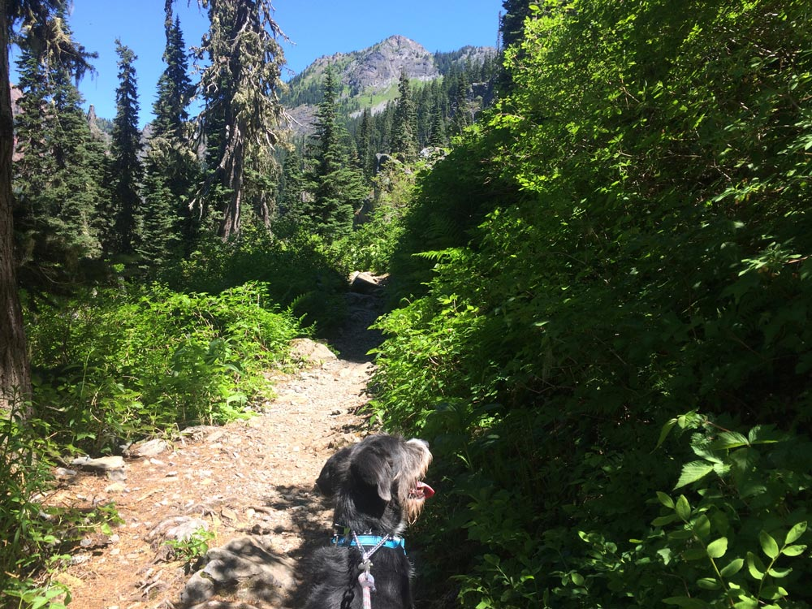
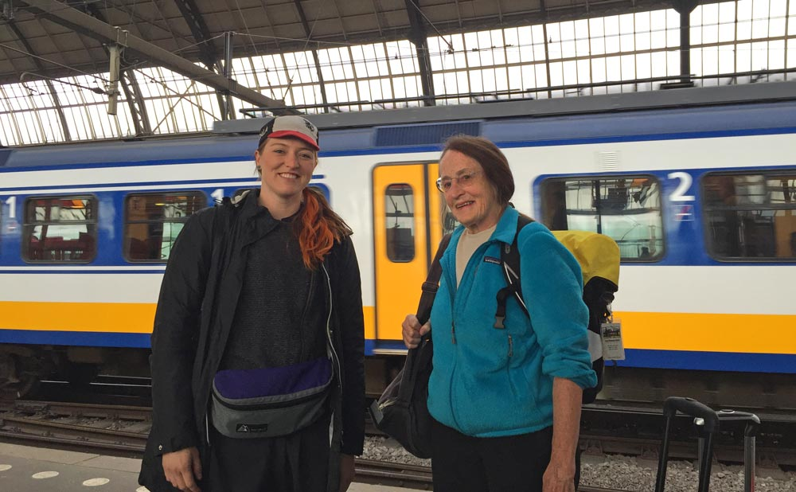

_This post originally appeared on [The Pastry Box Project](https://the-pastry-box-project.net/marcy-sutton/2015-august-26) on August 26, 2015._

Rest-in-peace Wally, my beloved dog, seen here pulling me up a mountain trail in Washington State this summer.

How will people remember you when you’re gone? Will they say, “she contributed a lot”, or “he was a nice man”, or “she was a helpful mentor”? Increasingly, I feel, it’s how people describe you when you’re not around that means the most.

I remember being inspired as a kid by a female photojournalist from a local newspaper who came to my class. Every time I interact with a kid these days (I don’t have any of my own, yet), I think about how their experiences send them off in different directions...like my niece going to circus camp, or a high schooler attending [Girls Who Code](http://girlswhocode.com/) for the summer. As little as 30 minutes of your time spent with someone could dramatically impact their future. That we can inspire the next generation fills me with hope, lifting us above election seasons, wildfires, income inequality, gun violence and rampant misogyny.

## Who inspires you, and why?

This summer, I spoke at a software development conference in Amsterdam and took my own bike, making a vacation out of it (I’m a bike nerd). At the speakers’ canal cruise around Amsterdam, I became acquainted with one of the keynote speakers, Mary Shaw, from Pittsburgh, PA. We discovered nearly identical plans to ride our bikes in Belgium later in the week. Not familiar with Mary’s work at Carnegie Melon University before meeting her in person, I was floored to find out I’d spent time with a recipient of the [National Medal for Science and Technology](http://www.cmu.edu/news/stories/archives/2014/october/october3_shawwinsnationalmedal.html), presented by President Obama, for her research on software architecture.

It’s not often that I feel starstruck…but I was so honored to speak at the same conference as Mary Shaw. She even came to my talk on Accessibility in Angular! It meant a lot to have her there, no matter how I performed. The next day, I saw Mary’s keynote, _Progress toward an Engineering Discipline of Software_. I loved her meta look at engineering–a job title growing in popularity in software–comparing it to arch and bridge design, from craft to industry. Definitions taken from civil engineering provided a lens for comparison with engineering of software:

**“Creating cost-effective solutions...to practical problems...by applying scientific knowledge…building things...in the service of mankind."**

Returning home after the trip to a new job and title, Accessibility Engineer at Adobe, I wondered how my work stacked up against those definitions. After her talk, I got to ask Mary’s take on it directly: she recalled, “building things in the service of mankind” and it was pretty clear that yes, engineering applies to accessibility.

The day after the conference, my travel partner and I sat drinking tiny cups of espresso with our bikes and backpacks on the platform at Amsterdam’s Centraal Station. And who did we happen to see? Mary Shaw and her partner, Roy, with their tandem bike packed in two suitcases, lining up for the fast train to Belgium. Despite feeling starstruck, I felt compelled to tell Mary and Roy about an experience I’d had speaking to an elementary school science class.

Me and Mary Shaw on a rail platform at Amsterdam Centraal

## Make time for those coming after you; you might inspire someone.

Last summer, I was invited to speak to a 4th and 5th grade science class in rural Oregon via Google Hangouts. I prepared a [small slide deck](https://marcysutton.github.io/how-did-i-get-here/#/) and spent 30 minutes explaining how I got to that place in my career. The kids came prepared some great questions; I talked with them how I would with my 8-year-old niece and 11-year-old nephew. It was a fun experience and the class seemed to enjoy it, even if they looked ready to run outside for recess. A few months later, I got an email from the teacher:

> Marcy,
> 
> I just wanted to let you know about Tyler. She is a student in my class. I had her as a student last year as well. She has always been a little bit behind in her level and struggled with confidence issues. Ever since your talk earlier this year, I noticed a distinct change in her attitude in class. All of a sudden she started working harder, got excited about learning, wanting to do better all the time. A few months ago I noticed she kept making references to your talk and about how she wants to be a programmer like you. She even helped me do a presentation about STEM to another school district talking about how influential you were to her and how you helped her realize that she could do that as well. I think she really connected with you. You have made a difference in the lives of my students and I really appreciate that.

When I told Mary Shaw this story on the rail platform, she said, “YES!!”, complete with a fist pump. She seemed excited to hear of another female software engineer in the making. I felt whole in that moment, simultaneously looking up to Mary Shaw and realizing how I had impacted the next generation.

## Becoming part of the cycle of life

Have you noticed how time seems to fly by? In writing this piece, someone told me, “how we affect the next generation makes us immortal.” What are you doing to positively impact someone in your life with the time you have?

Being a mentor requires putting your own ego aside and wanting others to succeed. Once I grew more comfortable with myself and less competitive with others, I found I had more room in my heart to cheer them on. Being a mentor means listening to what people want to do and encouraging them, while being strategic. It’s delightful and rewarding to see something positive develop from time spent together.

## Make a difference.

As our careers mature, it’s important that we to contribute back to the world. Do work that matters, and you’ll make a difference every day. Or, if your job is sustainable but not as fulfilling, you could spend some of your time helping and connecting with others: volunteering with local youth groups, mentoring someone getting started in your industry, or teaching for a nonprofit. Organizations like [Girl Develop It](https://www.girldevelopit.com/) provide learning and career development opportunities to women and newcomers in technology–they often need teaching assistants and instructors. Other groups to check out: [Nodeschool](http://nodeschool.io/), [Coder Dojo](https://coderdojo.com/), or a local meetup.

There are many places in and outside of tech where you could give your time and expertise. Looking for some variety in your life? Contributions to organizations like the Humane Society or a local trail association would be just as appreciated. Find something that matters to you.

Coming from a place of privilege–like, being further along in a well-paying career–means you have something to offer those coming after you. Trend on positive, meaningful outcomes for others with the time you spend. Every little bit helps to make our world a better place. In nature terms, did you leave the trail in a better condition than you found it?
