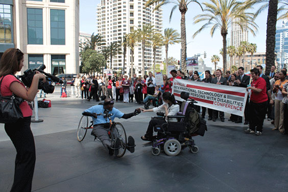
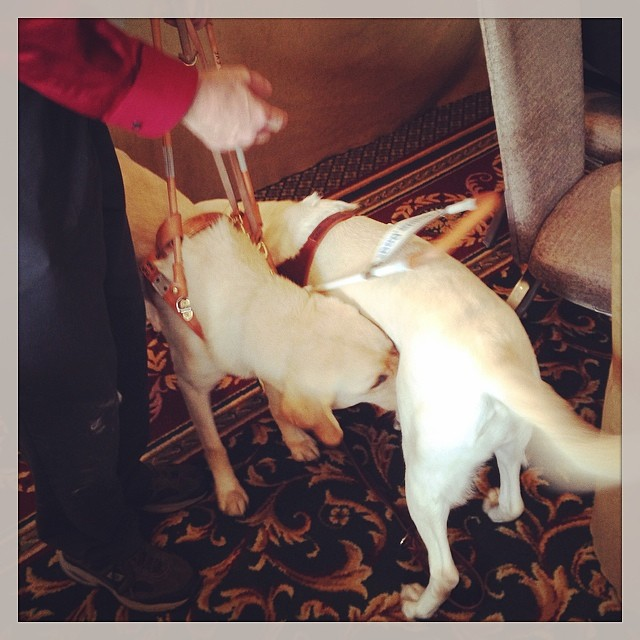

_This post was migrated from its original location on the [Substantial](http://substantial.com) blog._

A few months ago I saw many of my accessibility heroes RSVPing for an event called the "CSUN Tweetup." When I looked into the Tweetup, I found it was part of a larger event and I realized I'd been living in a cave for my entire career: The CSU Northridge’s Center on Disabilities had put on a conference for TWENTY-NINE YEARS and this was the first I'd heard of it. [The 29th Annual International Technology and Persons with Disabilities Conference](http://www.csun.edu/cod/conference/2014/sessions/ "Link opens in a new window") (to which I'll refer as _CSUN_) was happening very soon in San Diego, California. After talking with my coworkers and family, I decided I really wanted to be there since web accessibility has added so much purpose to my work. So I booked a flight and a "Bed & Bike" on AirBnB and made my way to the conference for four days of learning, networking and career growth.

## The Workshops

While there were other workshops going on, my first day at CSUN '14 was spent learning about [ARIA (Accessible Rich Internet Applications)](http://www.w3.org/TR/aria-in-html/ "Link opens in a new window") from my heroes at WebAIM and the Paciello Group. ARIA was created to expand HTML's semantic vocabulary by providing developers with a way to add accessibility information where elements lack state or purpose. At CSUN, I got the chance to learn about ARIA from people who know it best. It was a fantastic learning opportunity that gave me the level of understanding I desired.

Guide dogs will be dogs.

### Technical things I learned at the CSUN ARIA Workshops

- Always use native, accessible HTML first, then use ARIA to enhance or fill in gaps
- When using ARIA roles, states and properties in our HTML code, there is a sweet spot we should try to find: not too much, not too little
- ARIA does not change browser functionality; it only affects users of assistive technology
- Be very careful with `role="application"` if you use it, since it requires you to recreate every detail of native functionality you have taken away from the user ([More about the application role](http://developer.yahoo.com/blogs/ydn/aria-role-application-53608.html "Link opens in a new window"))
- The Paciello Group’s [aViewer tool for Windows](http://www.paciellogroup.com/resources/aviewer "Link opens in a new window") will show you the Accessibility Tree as a screen reader sees it

_Interested in learning more about ARIA? Check out this post by Marco Zehe: [What is WAI-ARIA, what does it do for me, and what not?](http://www.marcozehe.de/2014/03/27/what-is-wai-aria-what-does-it-do-for-me-and-what-not/ "Link opens in a new window")_

I felt validated within ten minutes of the first workshop on multiple usability issues I've encountered in my career. I met some very awesome people, who I respect and admire not just as accessibility advocates but as inspiring and hilarious individuals. I'm glad I wrote down my favorite moments from that first day, because they immediately take me back:

### Favorite Moments

- Hearing [Léonie Watson](http://tink.co.uk/ "Link opens in a new window") and [Lucy Greco](https://twitter.com/accessaces "Link opens in a new window") talk about the debate over screen reader detection
- Sitting next to Léonie in the afternoon workshop and walking arm-in-arm to get tea and talk about Shadow DOM
- [Karl Groves's](http://www.karlgroves.com/ "Link opens in a new window") mention of wedgies as a way to convince developers to change divs to buttons
- [Steve Faulkner's](http://blog.paciellogroup.com/author/admin/ "Link opens in a new window") exhaustive exploration into the HTML5 details/summary elements
- Meeting the architect of ARIA, [Aaron Leventhal](http://accessgarage.wordpress.com/ "Link opens in a new window"), at a party and being told I'm "on the bleeding edge" with my Shadow DOM research
- Karl Groves saying he once saw a tabIndex value of 32,000 in a codebase (which is insane)

Blind human to robot communication

## The Conference

I took [John Foliot's advice for newbies](http://john.foliot.ca/csun-for-newbies/ "Link opens in a new window") and planned out my entire conference schedule in advance. It took a few hours but was totally worth it since I could make quicker decisions about where to go and not feel like I missed out on anything (there were too many sessions to even count them all).

Rather than detail every session, I've written about the major breakthroughs I had at CSUN. The experience enabled me to see a bigger picture that practically brings a tear to my eye, it's so beautiful. The following are the most significant things I took away from this year's conference:

### #AUX: Accessible User Experience

_Influences: Billy Gregory, “Things I Wish I Knew When I Started Working in Digital Accessibility” & Whitney Quesenbery, “Accessibility as Innovation: Creating Accessible User Experiences”_

I'd like to propose an acronym, hashtag or idea. It already exists, but I'd like to see it more widely adopted in our industry: AUX, or _Accessible_ User Experience, aims to bring accessibility awareness to earlier phases of digital design. Despite the mention of _persons_ in most User Experience definitions, UX commonly leaves out persons with disabilities from research and deliverables, such as personas. This has potential to negatively impact accessibility throughout a project and, arguably, the rest of the industry because "everyone keeps forgetting."

Although I'd love for the term we already have, _UX_, to regard people of all abilities, I feel the extra letter in _AUX_ may remind us of our friends with varied abilities. Accessibility as a core principle, from the top-down, is the most effective way to improve usability and accessibility on a project. It's a lot easier to make your work accessible from the very beginning than it is to clean it up later; the same could be said for mobile. Accessibility should accompany a multi-screen strategy from the very beginning. Less pain, more inclusive fun. AUX!

Google’s CSUN Party at The Prado, Balboa Park

### Why I went to CSUN: To learn how browsers and screen readers work together

Part of my desire to attend CSUN was to engage with browser & screen reader implementers on how the Shadow DOM works. I'd learned a lot by [doing my own research](http://substantial.com/blog/2014/02/05/accessibility-and-the-shadow-dom/ "Link opens in a new window") and reading [all](http://www.w3.org/TR/shadow-dom/ "Link opens in a new window") the [things](http://www.html5rocks.com/en/tutorials/internals/howbrowserswork/ "Link opens in a new window") but I thought I could gain a deeper understanding from people who make it all possible.

On Day 2, I attended _Accessibility and the Power of CSS: Disparities between Ideals and Reality_ by Takekshi Kurosawa from Mitsue-Links in Japan. Naturally, the title made me think it would be about CSS. It wasn't. Rather, it was about the subject for which I came: browsers and assistive technologies working together. Although Takeshi struggled through the presentation, I was excited to broaden my understanding on the subject. Some highlights:

- CSS can override the semantics of HTML (such as `display: block` on a table)
- DOM (Document Object Model) + Style Rules = “Rendering Tree”
- The Rendering Tree represents the visual layout of a document: position, dimensions, colors, etc.
- Browsers and assistive technology communicate through [Accessibility APIs](http://www.w3.org/TR/wai-aria/terms#def_accessibility_api "Link opens in a new window")
- An [Accessibility Tree](http://www.w3.org/WAI/PF/aria-implementation/#intro_treetypes "Link opens in a new window") is created from the rendered DOM and utilized by assistive technology
- An Accessibility Object is a single node in the Accessibility Tree
- Hidden HTML elements don’t have Accessibility Objects, so they are skipped by screen readers (using `display: none`)
- The Accessibility Tree can be inspected with several tools: aViewer for Windows, DOM Inspector for Firefox

#### Bonus: Shadow DOM Interview with Marco from Mozilla

After some prompting by my acquaintance [Pratik Patel](https://twitter.com/ppatel "Link opens in a new window"), I also interviewed [Marco Zehe](http://www.marcozehe.de/ "Link opens in a new window"), Accessibility QA Engineer from Mozilla, about the Shadow DOM. It was a fun experience talking to Marco over a white chocolate mocha. His explanation of Firefox's transformation of HTML into something assistive technologies can use was very informative and it rounded out my understanding of the process. Particularly, I got a lot of value out of Marco's details about Web Components creating "a container and subtree" (like a video tag) and how screen readers transform that data structure into text that is then read aloud.

As a result of these experiences, I learned a _ton_ about the Document Object Model, a cornerstone concept for any web developer. This prompted me to read up on tree structures and I'm now more informed when speaking about Accessibility & the Shadow DOM. I'm continuing to work on my ability to explain document trees to non-technical folks, which is challenging but interesting.

### Crowdsourcing the Accessibility Awareness Problem

One of the most impactful sessions I attended, _Crowdsourcing the Accessibility Awareness Problem_, was a panel led by [Sassy Outwater](https://twitter.com/SassyOutwater "Link opens in a new window"), [Sina Bahram](http://www.sinabahram.com/ "Link opens in a new window") and [Billy Gregory](https://twitter.com/thebillygregory "Link opens in a new window"). Some of the brightest minds in accessibility were in attendance. Sassy blindly (but accurately) threw chocolate bars to participants and I desperately hoped a guide dog wouldn't eat one. As part of this discussion, we talked about getting the accessibility message heard by a wider audience. Everyone there already knew the importance of it, so the question became: how do we not preach to the choir? It was an entertaining and enlightening discussion that transcended simply being a code monkey.

Who is more disabled: Revolutionary Physicist Stephen Hawking or Toronto Mayor Rob Ford?

#### Why isn't accessibility known to everyone?

- Lack of mass-media exposure
- User fatigue: users give up on a service without providing feedback when something is inaccessible
- Developers only like the shiny new thing
- Developers develop for themselves
- Businesses see it as costly and time consuming, with little ROI
- Poor knowledge of audience

We talked about the problem and brainstormed solutions for getting the message out, such as: use a positive message, don't rely on fear. Make it marketable. Play with the titles and make talks you give at conferences available for people on the Web. Sina proposed creating a website for people to crowdshare accessibility topics, which I hope to see in the future.

#### Accessible Robots™

In my quest to become a public speaker, I've been told “no” many times. I've been told that "accessibility has been solved." People have essentially said they want more talks about _robots_ than _accessibility_ (noted). So I suggested to the panel that we instead talk about _accessible robots_. I’m still brainstorming possibilities for this idea, but it seemed to [hit](https://twitter.com/dalecruse/status/448890729210060801 "Link opens in a new window") [a nerve](https://twitter.com/marcysutton/status/448146165800771584 "Link opens in a new window"). My awesome new friend [Dale Cruse](https://twitter.com/dalecruse "Link opens in a new window") even talked about it on [The Web Ahead Podcast (00:56:40)](http://5by5.tv/webahead/64 "Link opens in a new window"). This warm welcome encouraged me to keep submitting proposals I care about: modern technology alongside accessibility. It's a departure from my previous feeling that "maybe I shouldn't submit _another_ accessibility talk." In fact, I am now more empowered to focus on accessibility. To me, that is the holy grail of public speaking–to help an underserved community while learning new technology. It's exciting, shiny, and the right thing to do.

### Increasing Accessibility Awareness Through Modern Code

_Influences: Greg Kraus, "Better Text Contrast Through Browser-Based Image Analysis" and Ian Kelly, "Accessibility with Angular JS"_

Some of my favorite sessions at CSUN discussed–surprise–accessible JavaScript. I absolutely loved Greg Kraus's talk about a [Color Contrast Analyzer extension for Chrome](https://chrome.google.com/webstore/detail/color-contrast-analyzer/dagdlcijhfbmgkjokkjicnnfimlebcll?hl=en-US "Link opens in a new window"); he created it using Web Workers in order to prevent the UI from locking up. Not only was it a cool topic, but I've also used the tool to show designer colleagues the impact of their color choices.

Ian Kelly's talk on _Accessibility with Angular JS_ got me thinking a lot about the accessibility of JavaScript MVC frameworks. I had the right amount of experience with Angular and knowledge of the Accessibility Tree to ask educated questions about the accessibility situation, and I left quite intrigued.

Using modern code topics such as these to get the accessibility conversation in front of a wider audience is a great approach to advocacy, as we concluded in the crowdsourcing panel. Accessible AngularJS has become my _Accessible Robots_ for the time being. I plan to do some research on my own and I've submitted it as a topic to CascadiaJS, a JavaScript conference here in the Pacific Northwest.

## Conclusion: People are awesome.

I met so many fantastic people at CSUN, all with varied abilities. They talked about their interests, how they use technology and told stories about their lives that made me proud to be an accessibility advocate. I left San Diego inspired, informed, networked, exhausted, and maybe a little hungover. :) I already have three talk ideas for next year, which will be the _30th year_. Hopefully we'll be on a _boat_! I say we, because I am now hooked on CSUN. It was one of the most rewarding experiences of my life.

Accessibility adds so much meaning to our work as designers, developers, testers, managers, students, and so on. It means that we understand and accept that our users are a diverse bunch. It means that when we meet people with or without disabilities, we can say _"I care about you."_ I guess CSUN made me aware of how much I care about people and how that care has become intertwined in my work. Thank you, CSUN, for that humbling experience–I'll see you again next year with a lot more to learn and talk about.

_Interested in learning more about the 2014 CSUN International Technology & Persons with Disabilities Conference? Cheers to Billy Gregory for pointing me to this great list of resources: [http://curbcut.net/events/csun-disabilities-technology2014/](http://curbcut.net/events/csun-disabilities-technology2014/ "Link opens in a new window")_
