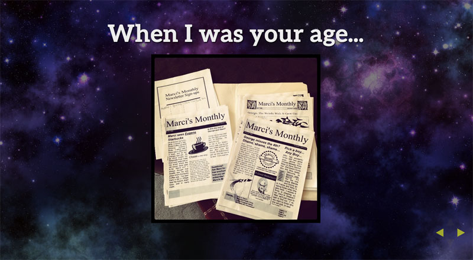

Last summer, a 4th and 5th grade science teacher from rural Oregon emailed me to ask if I would speak to his class over a Google Hangout. The goal was to increase awareness about STEM opportunities for all of his students, but particularly the girls. By introducing them to a female role model, perhaps they would be inspired to pursue careers as computer programmers. (When I was in 7th grade, a photojournalist came to one of my classes. I was so intrigued I got my first college degree in photojournalism.)

At my desk on a Google Hangout (Thanks Jennifer Hayes for the photo)

I spoke with Dylan McCann's class for 30 minutes from my stand-up desk at Substantial. I'd put together a short [slide deck](http://marcysutton.github.io/how-did-i-get-here/#/) to provide visuals with some information about my background, starting with my earliest creative spark: a family newsletter I made with Microsoft Publisher called _Marci's Monthly_ (back when I spelled my name with an _i_). The students came very prepared with questions and we had a great time exchanging ideas.

When I was your age...I had a newsletter called Marci's Monthly

I kept in touch with the teacher, Dylan McCann, who is doing a great job educating his students about rewarding career opportunities. I try to make time for things like school talks because of the potential to positively impact even just one student. This weekend, I received the following email from Dylan:

> Marcy,
> 
> I just wanted to let you know about Tyler. She is a student in my class. I had her as a student last year as well. She has always been a little bit behind in her level and struggled with confidence issues. Ever since your talk earlier this year, I noticed a distinct change in her attitude in class. All of a sudden she started working harder, got excited about learning, wanting to do better all the time. A few months ago I noticed she kept making references to your talk and about how she wants to be a programmer like you. She even helped me do a presentation about STEM to another school district talking about how influential you were to her and how you helped her realize that she could do that as well. I think she really connected with you. You have made a difference in the lives of my students and I really appreciate that.

Wow. To hear that I impacted someone's life in such a positive way brought tears to my eyes. It is really worth taking time out of our regular work schedules to give back to those coming after us. You never know who you'll meet that will grow up to start a company, do important research, or save the world.
