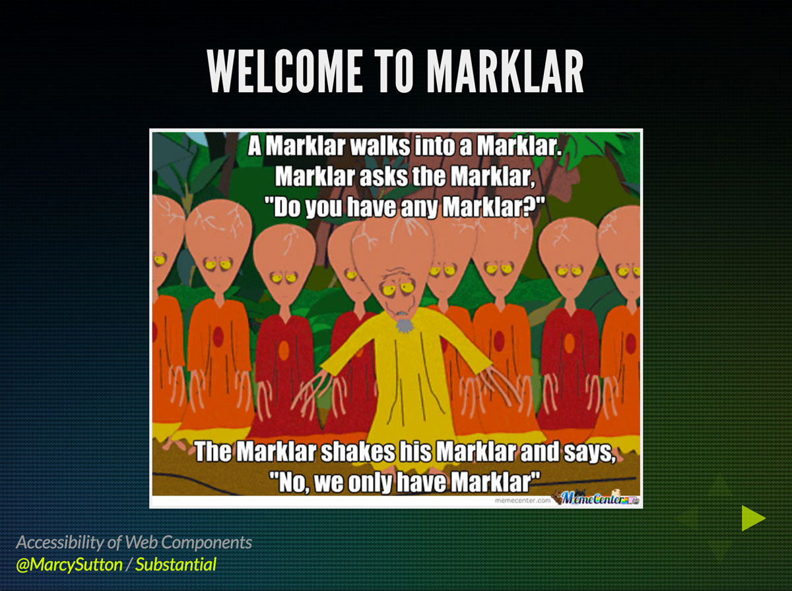
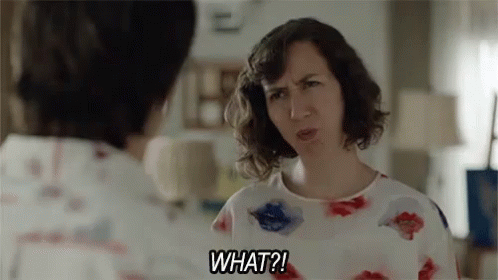
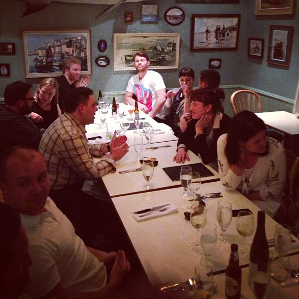

Do you want to speak at conferences more? Do you submit to CFPs but struggle to have your proposals accepted? Perhaps writing an abstract puts you off from submitting entirely...? Let's change that.

I want to help because there are countless conferences and speaking opportunities around the world just waiting for you. There's also a real need to spread the word about accessibility to keep improving the Web for people with disabilities; I'm but one public speaker. We need more voices and a stream of new ideas to keep improving accessibility awareness as our industry grows.

## What qualifies me to say?

I've done my [fair share of public speaking](/talks/) in the past few years, with many of those talks originating as CFPs (Calls for Papers); but increasingly, as invited keynotes. I've learned some things along the way that increase the likelihood that one of my proposals will be accepted when I do submit a CFP, and I'd like to share them with you. Please recognize that these are just starting points, and your mileage may vary. However, if you want to be a public speaker, submitting a winning abstract is key to breaking in.

## Turning speaker excitement into reality

Earlier in my career, I attended a few tech conferences and experienced an adrenaline rush sitting in the audience. I wanted to get into public speaking _really bad_. I had things to say, and I was excited about getting up in front of people for a bit of show-and-tell. To be honest, I was also psyched about the travel. I couldn't afford to travel without it being subsidized by work or a conference in some way, and I saw a big opportunity there.

If you have that excitement, put it to work! Raise your profile by producing blog content that means something to you and will also provide value to your readers; there has to be something in it for them to want to listen to you.

Writing about your work or side projects can give you material for talks, so it's less of a strain to come up with a topic. It also gives your name credibility if that content starts to make the rounds on social media and industry newsletters.

## Do your homework

### Picking the right event

A big part of public speaking success is setting your sights on gigs that are actually attainable. Some events hold CFPs, while some are invite-only: whether you are invited depends entirely on your career, experience, and who you know. Are you going to start out speaking at An Event Apart? Most likely not, but there are plenty of other events that welcome talk submissions and promote new speakers.

When submitting to conference CFP's, whether you are local, regional or international will impact your chances of being accepted. You may have to adjust your expectations of where you expect to speak versus where you actually are in your career (see a bonus embarrassing story at the [end of this blog post](#end-of-post)).

Submit to local events first to gain experience and exposure, and you can gradually build up to bigger events once you've proven yourself as a speaker. You can also benefit at any point in your speaking career by practicing talks at local meetups before taking them to larger conferences. Local meetups are awesome!

### Research on the event

Before submitting a proposal you must do some research on your chosen conference to know how your talk might fit in. What were the talks about in previous years? Is the audience design-focused, or are they mostly developers? Will an in-the-weeds technical talk go over best for the audience or will they benefit from a high-level, over-arching talk? A winning proposal will identify how your topic fits in with the overall conference agenda, highlighting who stands to benefit from learning from you; and, what they'll get out of it.

### Becoming a part of the community

If you're in a position to attend an event before submitting a talk, you can gain insight and experience to use to your advantage; i.e. which talks went well? How would my take on a subject fit in to the talk schedule? By experiencing an event before you submit a talk, you can also potentially network with the very people who will approve your proposal. Admittedly, this is easier and cheaper to do at local conferences, but it's worth a shot.

It can improve your speaker mojo to attend happy hours and tech conference after-hours events with established speakers when they're in town–even if you feel like a groupie. These are valuable opportunities to make industry connections that lead to things later on: perhaps the person you met organizes an event in their own city and they have a CFP? Give them your business card and submit a proposal!

#### It helps to attend conferences if you want to speak at said conferences

After getting turned down as a speaker at JSConf US, I finally "broke in" after:

1. Buying a ticket and going anyway
2. Doing a [talk in the open B track](/talk/jsconf-2014/)
3. Submitting to the CFP again the next year

By showing up to the event even though my proposal didn't get accepted, I learned a lot about JavaScript and expanded my network. I met people who were on the speaker committee without realizing it, and I even made a few rad friends! I made an investment in my career that year by taking time off and paying my own way to the conference. When I submitted again the next year, I finally made it into the A track where they paid for speaker travel. I worked hard to get there, so when it finally happened I'd earned it.

My JSConf B-Track Debut. There was IRL taco delivery involved

## Writing the best proposal ever

A proposal is a teaser for your talk. It should tell the reader what they will learn but leave them wanting more. What's the hook that makes your talk different so it stands out from the rest, without trying too hard?

You don't have to know everything about the topic when you write the abstract; in fact, you should leave some mystery for the talk itself! You have time to research and fill in the details after you submit the abstract. If that conference says no, try to find a similar one and submit again.

Encourage organizers from afar who may not know you to say yes by writing a blog post expanding further on your proposed topic. It helps to establish credibility and your level of interest in that subject if you don't already have a body of work on it.

### Ask for feedback on your proposals

After you've done your homework and decided on a topic, write a proposal and get feedback on it. Ask a colleague or a mentor who has done public speaking for peer review to get a second opinion: even better if you find someone who's spoken at that event before. This is especially important when you're just getting started, as you calibrate your "idea generator" and learn to write for maximum impact.

## Accessibility at Mainstream Conferences

Repeat after me: accessibility talks can be accepted at mainstream conferences. Write a competitive abstract that's so good and relevant, they can't say no! But, recognize your proposal has to make it through the selection process along with everyone else's, with or without your name on it (depending on the selection process).

Your proposal should be able to win on its own merits. It is possible! If you're having to ask for favors to get in as a speaker, maybe your abstracts could use bolder ideas and more polish.

Here's one way to think about it: what would be the freshest take on accessibility at that particular point in time, and how to propose that topic? What would be the most relevant for that event? Start with a big idea and work back from there to fill in the details.

> ### “WebVR & Accessibility would be pretty current in 2017. Free idea for someone”
> 
> –Me

Sidebar: Is it sad that there aren't always accessibility talks at conferences? Yes. Did you see a conference that needed more inclusive talks? Sounds like a great target for submitting to a CFP next year! Conferences are interested in accessibility talks, in my experience, especially if you tailor your story to their audience. Make it compelling with a single paragraph abstract, and you're bound to see better acceptance rates. Don't expect a generic talk or an old repeat to win everyone over; that's not accessibility's fault!

### They said no. What now?

I got a lot of "no"s when I was starting out. Someone said I should ask for feedback, so that's what I did. The first "no" I actually benefited from was for a brand-new conference in San Francisco, and I was in Seattle. I emailed to ask why my proposal wasn't accepted, and their response altered my approach to public speaking forever:

> #### “Accessibility has been solved. We want more original topics.”

I changed my approach to accessibility talks after that. I started focusing on the accessibility implications of newer technologies, like Shadow DOM or client-rendered JavaScript frameworks, illustrating how that conference had it wrong. Accessibility hasn't been "solved", because people with disabilities are still presented with barriers on the web all the time. I see that as incentive to keep speaking, keep working, and keep contributing to accessibility. We need all the help we can get.

The next "no" I got was for an international conference in Europe. I asked again why I didn't get accepted, and they said "we really liked your proposal, but we're out of budget for international speakers. If you can get yourself here, you can speak." I couldn't afford it, so I declined. But that feedback was HUGE! I went from thinking my proposal was a failure to learning that they were out of budget, so I knew I was close: that proposal may have been accepted closer to home. All it took was emailing them to solicit feedback! That was an important part of developing my skills.

**Update 4/25/17:** Since I wrote this post, I received a "no" on one of my talk proposals to DinosaurJS. In fact, I am a bit relieved because I want to take the summer off from speaking. But I wanted to point out a key line in their response email, highlighted in bold:

> Hello. We’re sorry that your proposal was not selected for DinosaurJS 2017.... **If you have any questions or concerns, please don’t hesitate to contact us.**

That's your cue to kindly ask for feedback, if you need it! Now you know.

## Be an accessible, persuasive speaker

Public speakers should leave the audience feeling good. The purpose of getting up in front of a conference (usually) is to spread awareness about a new technology or initiative, teach people something, and entertain them. As an audience member, I value when speakers are approachable and bring me along, rather than making me feel bad because I'm not on their level yet. If they show a bit of vulnerability by saying how they failed before getting it right, even better.

When I first got into accessibility, I felt like established people in the industry wagged their fingers a lot and talked about the problems but didn't offer many solutions. I decided to contribute my own take on it by writing about new technologies and their impact on accessibility, which created great material for public speaking.

It's partly about your chosen topic, but also largely how you present yourself. People will want to learn more if you don't make them feel bad for skipping out on your topic before at work (I had to learn that as a speaker, myself). Persuade the audience to follow your position, even if they have to gain empathy or do actual work to get there. _"Just learning about accessibility? Here's how you can start today!"_

## Resources

Many great public speakers have written about these topics. If you want to learn more, I highly recommend learning from these experts:

- [We Are All Awesome](http://weareallaweso.me/ "Link opens in a new window")
- Karolina Szczur: [How to Write a Successful Conference Proposal](https://medium.com/@fox/how-to-write-a-successful-conference-proposal-4461509d3e32 "Link opens in a new window")
- Lara Hogan: [Demystifying Public Speaking](https://abookapart.com/products/demystifying-public-speaking "Link opens in a new window")
- Brenna O'Brien: [Coaching for Public Speakers](http://brennaobrien.com/coaching/ "Link opens in a new window")
- Jenn Lukas: [A Formula for Speaking Fees](http://www.thenerdary.net/post/84544230452/a-formula-for-speaking-fees "Link opens in a new window")

Hopefully this is helpful to you. I really enjoy public speaking and I hope that everyone who wants to do it gets the chance. There are opportunities out there to make an impact on any topic you choose, provided you convince people to listen. What's your next move?

## And now for that bonus embarrassing story

I once attended a conference in New Zealand where I met a speaker who suggested "maybe you can email the organizers and get in, I think they may have room." I did, feeling in the moment like I didn't have much to lose by asking, and their "bless your heart" response was more than kind. But no. After attending and looking back on it years later, I know that particular event is invite-only and highly coveted among established public speakers. I had zero chance and put myself out there for no reason, although my networking drive at that time was extremely pivotal in my career. I still dream about speaking there some day.

Crashing a speaker dinner in New Zealand
